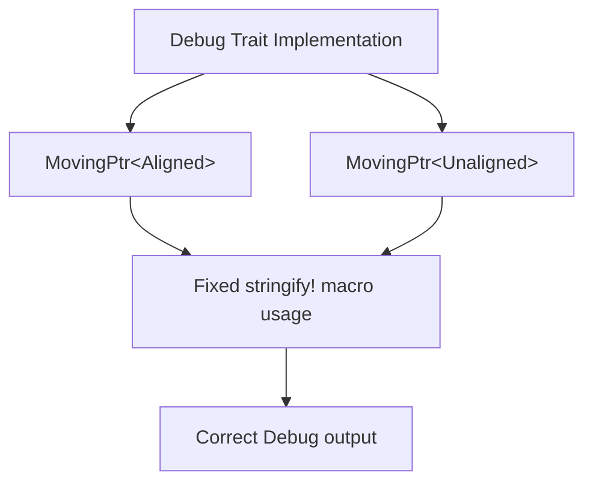

+++
title = "#21040 fix(bevy_ptr): correct Debug impl for MovingPtr"
date = "2025-09-15T00:00:00"
draft = false
template = "pull_request_page.html"
in_search_index = false

[extra]
current_language = "zh-cn"
available_languages = {"en" = { name = "English", url = "/pull_request/bevy/2025-09/pr-21040-en-20250915" }, "zh-cn" = { name = "中文", url = "/pull_request/bevy/2025-09/pr-21040-zh-cn-20250915" }}
labels = ["C-Bug", "D-Trivial", "C-Code-Quality", "A-Pointers"]
+++

# Title

## Basic Information
- **Title**: fix(bevy_ptr): correct Debug impl for MovingPtr
- **PR Link**: https://github.com/bevyengine/bevy/pull/21040
- **Author**: Mysvac
- **Status**: MERGED
- **Labels**: C-Bug, D-Trivial, C-Code-Quality, S-Ready-For-Final-Review, A-Pointers
- **Created**: 2025-09-14T21:50:07Z
- **Merged**: 2025-09-15T00:38:16Z
- **Merged By**: alice-i-cecile

## Description Translation
# Objective

1. 修复 Debug 实现中的错误宏用法。
2. (次要) 强制 unsafe 块的一致格式化。

## Solution

1. 我不确定为什么 `$ptr` 会出现在 `MovingPtr` 的 `Debug` 实现中，因为这不在宏上下文中。我认为这是一个错误，所以将 `stringify!($ptr)` 改为 `"MovingPtr"`。

2. 如果函数没有返回值（返回 `()`），最后一条语句应以分号结尾。（至少保持一致的风格。）因此，将 `unsafe { ... };` 和 `unsafe { ... }` 统一改为 `unsafe { ...; }`。

## Testing

- `cargo test -p bevy_ptr` 通过。
- 几个示例运行正常。
- 无需更多测试。

## The Story of This Pull Request

这个 PR 解决了一个在 Bevy 指针库中发现的小但重要的错误。问题出现在 `MovingPtr` 类型的 `Debug` 实现中，其中错误地使用了宏语法。

**问题发现与背景**
在代码审查或日常开发过程中，开发者注意到 `MovingPtr` 类型的 `Debug` 实现使用了 `stringify!($ptr)`，这是一个明显的错误。`stringify!` 宏通常用于宏上下文中将标识符转换为字符串字面量，但这里并不是在宏定义内部。这导致 Debug 输出会显示字面量的 `"$ptr"` 而不是预期的类型名称 "MovingPtr"。

**解决方案实施**
修复方案很直接：将错误的宏用法替换为正确的字符串字面量。对于 `Aligned` 和 `Unaligned` 两种变体，分别将 `stringify!($ptr)` 替换为 `"MovingPtr"`。

此外，PR 作者还注意到代码库中 `unsafe` 块的格式化不一致问题。虽然这不是功能性问题，但保持代码风格一致对长期维护很重要。作者统一了 `unsafe` 块的格式，确保所有没有返回值的 `unsafe` 块都以分号结尾。

**技术细节与考量**
这个修复虽然简单，但体现了良好的代码质量实践：
1. **正确的宏使用**：明确了宏只能在宏定义上下文中使用
2. **一致性格式化**：统一的代码风格减少了认知负荷
3. **最小化变更**：只修改必要部分，避免不必要的改动

**影响与意义**
这个修复确保了：
- Debug 输出正确显示类型信息，便于调试
- 代码风格一致，提高可维护性
- 为其他开发者提供了正确使用宏的示例

虽然这是一个小修改，但它防止了潜在的混淆和调试困难，体现了对代码质量的关注。

## Visual Representation



## Key Files Changed

### `crates/bevy_ptr/src/lib.rs` (+8/-4)

这个文件包含了所有的修改，主要涉及两个方面的改进：

1. **修复 Debug 实现中的宏错误**
```rust
// Before:
impl<T> Debug for MovingPtr<'_, T, Aligned> {
    #[inline]
    fn fmt(&self, f: &mut Formatter<'_>) -> fmt::Result {
        write!(f, "{}<Aligned>({:?})", stringify!($ptr), self.0)
    }
}

// After:
impl<T> Debug for MovingPtr<'_, T, Aligned> {
    #[inline]
    fn fmt(&self, f: &mut Formatter<'_>) -> fmt::Result {
        write!(f, "MovingPtr<Aligned>({:?})", self.0)
    }
}
```

2. **统一 unsafe 块的格式化风格**
```rust
// Before:
unsafe { ptr::drop_in_place(ptr) };

// After:
unsafe {
    ptr::drop_in_place(ptr);
}
```

这些修改确保了代码的正确性和一致性，虽然改动很小，但对代码质量和可维护性有积极影响。

## Further Reading

- [Rust 宏指南](https://doc.rust-lang.org/book/ch19-06-macros.html)
- [Rust Debug Trait 文档](https://doc.rust-lang.org/std/fmt/trait.Debug.html)
- [Bevy 指针系统文档](https://docs.rs/bevy_ptr/latest/bevy_ptr/)
- [Rust Unsafe 代码指南](https://doc.rust-lang.org/nomicon/unsafe.html)

# Full Code Diff
```diff
diff --git a/crates/bevy_ptr/src/lib.rs b/crates/bevy_ptr/src/lib.rs
index 1d6e43fcf1f9b..3a69d3c94b51f 100644
--- a/crates/bevy_ptr/src/lib.rs
+++ b/crates/bevy_ptr/src/lib.rs
@@ -105,7 +105,9 @@ impl IsAligned for Aligned {
         //  - The caller is required to ensure that `ptr` points must be valid for dropping.
         //  - The caller is required to ensure that the value `ptr` points must not be used after this function
         //    call.
-        unsafe { ptr::drop_in_place(ptr) };
+        unsafe {
+            ptr::drop_in_place(ptr);
+        }
     }
 }
 
@@ -145,7 +147,9 @@ impl IsAligned for Unaligned {
         //  - The caller is required to ensure that `ptr` points must be valid for dropping.
         //  - The caller is required to ensure that the value `ptr` points must not be used after this function
         //    call.
-        unsafe { drop(ptr.read_unaligned()) }
+        unsafe {
+            drop(ptr.read_unaligned());
+        }
     }
 }
 
@@ -734,14 +738,14 @@ impl<T, A: IsAligned> Pointer for MovingPtr<'_, T, A> {
 impl<T> Debug for MovingPtr<'_, T, Aligned> {
     #[inline]
     fn fmt(&self, f: &mut Formatter<'_>) -> fmt::Result {
-        write!(f, "{}<Aligned>({:?})", stringify!($ptr), self.0)
+        write!(f, "MovingPtr<Aligned>({:?})", self.0)
     }
 }
 
 impl<T> Debug for MovingPtr<'_, T, Unaligned> {
     #[inline]
     fn fmt(&self, f: &mut Formatter<'_>) -> fmt::Result {
-        write!(f, "{}<Unaligned>({:?})", stringify!($ptr), self.0)
+        write!(f, "MovingPtr<Unaligned>({:?})", self.0)
     }
 }
```