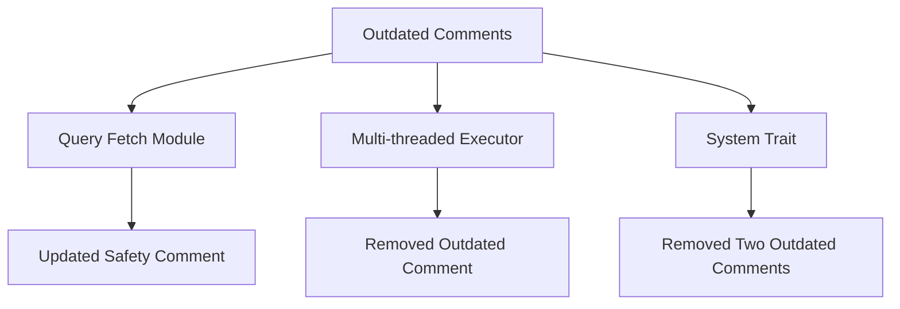

+++
title = "#21043 Clean up mentions to update_archetype_component* functions"
date = "2025-09-15T00:00:00"
draft = false
template = "pull_request_page.html"
in_search_index = true

[taxonomies]
list_display = ["show"]

[extra]
current_language = "en"
available_languages = {"en" = { name = "English", url = "/pull_request/bevy/2025-09/pr-21043-en-20250915" }, "zh-cn" = { name = "中文", url = "/pull_request/bevy/2025-09/pr-21043-zh-cn-20250915" }}
labels = ["D-Trivial", "A-ECS", "C-Code-Quality"]
+++

# Clean up mentions to update_archetype_component* functions

## Basic Information
- **Title**: Clean up mentions to update_archetype_component* functions
- **PR Link**: https://github.com/bevyengine/bevy/pull/21043
- **Author**: james7132
- **Status**: MERGED
- **Labels**: D-Trivial, A-ECS, C-Code-Quality, S-Ready-For-Final-Review
- **Created**: 2025-09-15T01:16:04Z
- **Merged**: 2025-09-15T02:01:26Z
- **Merged By**: alice-i-cecile

## Description Translation
# Objective
There are still mentions of `update_archetype_component*` functions in a few
places.

## Solution
Yeet.

## The Story of This Pull Request

This PR addresses a straightforward cleanup task in the Bevy ECS codebase. The core issue was that several comments still referenced `update_archetype_component*` functions that had been previously removed or renamed during earlier refactoring work. These outdated comments created potential confusion for developers working with the codebase, as they referenced functionality that no longer existed.

The changes focus on three specific areas where these outdated references remained:

1. In the query fetch implementation, a safety comment incorrectly mentioned both `update_component_access` and `update_archetype_component_access` methods, when only the former was relevant
2. In the multi-threaded executor, a safety comment included an unnecessary reference to `update_archetype_component_access` being called
3. In the system trait implementation, two safety comments contained similar outdated references

The solution was simple and direct: remove the incorrect or unnecessary comments. This cleanup improves code clarity and maintains accurate documentation for the unsafe code blocks, which is critical for future maintenance and development.

The changes don't affect any actual functionality - they only improve documentation accuracy. This type of cleanup is important in large codebases like Bevy where outdated comments can mislead developers and potentially lead to incorrect assumptions about how unsafe code should be implemented.

## Visual Representation



## Key Files Changed

### `crates/bevy_ecs/src/query/fetch.rs`
Updated a safety comment in test code to remove reference to non-existent function.

```rust
// Before:
/// SAFETY:
/// `update_component_access` and `update_archetype_component_access` do nothing.

// After:
/// SAFETY:
/// `update_component_access` do nothing.
```

### `crates/bevy_ecs/src/schedule/executor/multi_threaded.rs`
Removed an outdated comment line about `update_archetype_component_access`.

```rust
// Removed line:
// - `update_archetype_component_access` has been called for condition.
```

### `crates/bevy_ecs/src/system/system.rs`
Removed two outdated comment lines about `update_archetype_component_access`.

```rust
// Removed lines:
// - `update_archetype_component_access` has been called.
```

## Further Reading

- [Bevy ECS Documentation](https://docs.rs/bevy_ecs/latest/bevy_ecs/)
- [Rust Safety Comments Guidelines](https://rust-lang.github.io/rfcs/2585-unsafe-code-guidelines.html)
- [Code Commenting Best Practices](https://github.com/rust-lang/api-guidelines/blob/master/src/comments.html)

# Full Code Diff
```diff
diff --git a/crates/bevy_ecs/src/query/fetch.rs b/crates/bevy_ecs/src/query/fetch.rs
index ec7d7d87015f1..7b1ff2387f1d4 100644
--- a/crates/bevy_ecs/src/query/fetch.rs
+++ b/crates/bevy_ecs/src/query/fetch.rs
@@ -3036,7 +3036,7 @@ mod tests {
         struct NonReleaseQueryData;
 
         /// SAFETY:
-        /// `update_component_access` and `update_archetype_component_access` do nothing.
+        /// `update_component_access` do nothing.
         /// This is sound because `fetch` does not access components.
         unsafe impl WorldQuery for NonReleaseQueryData {
             type Fetch<'w> = ();
diff --git a/crates/bevy_ecs/src/schedule/executor/multi_threaded.rs b/crates/bevy_ecs/src/schedule/executor/multi_threaded.rs
index c1ed3ff73bd44..497b937c31f51 100644
--- a/crates/bevy_ecs/src/schedule/executor/multi_threaded.rs
+++ b/crates/bevy_ecs/src/schedule/executor/multi_threaded.rs
@@ -849,7 +849,6 @@ unsafe fn evaluate_and_fold_conditions(
                     // SAFETY:
                     // - The caller ensures that `world` has permission to read any data
                     //   required by the condition.
-                    // - `update_archetype_component_access` has been called for condition.
                     unsafe {
                         __rust_begin_short_backtrace::readonly_run_unsafe(&mut **condition, world)
                     }
diff --git a/crates/bevy_ecs/src/system/system.rs b/crates/bevy_ecs/src/system/system.rs
index 177d056e48cfd..8986ec812a462 100644
--- a/crates/bevy_ecs/src/system/system.rs
+++ b/crates/bevy_ecs/src/system/system.rs
@@ -135,7 +135,6 @@ pub trait System: Send + Sync + 'static {
         unsafe { self.validate_param_unsafe(world_cell) }?;
         // SAFETY:
         // - We have exclusive access to the entire world.
-        // - `update_archetype_component_access` has been called.
         unsafe { self.run_unsafe(input, world_cell) }
     }
 
@@ -241,7 +240,6 @@ pub unsafe trait ReadOnlySystem: System {
         unsafe { self.validate_param_unsafe(world) }?;
         // SAFETY:
         // - We have read-only access to the entire world.
-        // - `update_archetype_component_access` has been called.
         unsafe { self.run_unsafe(input, world) }
     }
 }
```