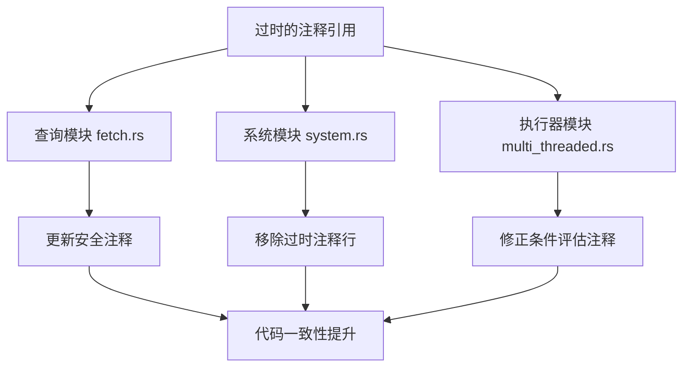

+++
title = "#21043 Clean up mentions to update_archetype_component* functions"
date = "2025-09-15T00:00:00"
draft = false
template = "pull_request_page.html"
in_search_index = false

[extra]
current_language = "zh-cn"
available_languages = {"en" = { name = "English", url = "/pull_request/bevy/2025-09/pr-21043-en-20250915" }, "zh-cn" = { name = "中文", url = "/pull_request/bevy/2025-09/pr-21043-zh-cn-20250915" }}
+++

# Clean up mentions to update_archetype_component* functions

## 基本信息
- **标题**: Clean up mentions to update_archetype_component* functions
- **PR链接**: https://github.com/bevyengine/bevy/pull/21043
- **作者**: james7132
- **状态**: 已合并
- **标签**: D-Trivial, A-ECS, C-Code-Quality, S-Ready-For-Final-Review
- **创建时间**: 2025-09-15T01:16:04Z
- **合并时间**: 2025-09-15T02:01:26Z
- **合并人**: alice-i-cecile

## 描述翻译
# Objective
在一些地方仍然有对 `update_archetype_component*` 函数的提及。

## Solution
删除。


## 这个Pull Request的故事

这个PR是一个典型的代码维护任务，涉及到清理过时的代码注释。故事开始于开发者注意到在Bevy ECS代码库中，尽管相关的 `update_archetype_component*` 函数已经被移除或重构，但仍然有几个地方保留着对这些函数的引用注释。

问题的核心在于代码注释与实际实现之间的不一致性。在之前的某个重构中，`update_archetype_component_access` 相关的功能已经被整合或替换，但相关的安全注释和文档没有同步更新。这种不一致可能会给后续开发者带来困惑，特别是在处理unsafe代码时，准确的安全注释至关重要。

开发者采取的解决方案很直接：找到所有残留的 `update_archetype_component*` 引用并删除它们。这个处理方式被作者幽默地称为"Yeet" - 一个编程俚语，表示快速而果断地移除不需要的东西。

从技术角度看，这些修改主要集中在三个关键区域：

1. **查询获取机制**（fetch.rs）：更新了WorldQuery trait实现的安全注释，移除了对已不存在函数的引用。

2. **系统执行器**（multi_threaded.rs）：修正了条件评估函数中的安全注释，这些注释提到了不再相关的函数调用要求。

3. **系统trait**（system.rs）：清理了两处系统运行方法中的过时注释，这些注释原本指示需要调用某个已经不存在的函数。

这些修改虽然看似简单，但对于维护代码库的清晰度和准确性很重要。准确的安全注释对于使用unsafe代码的ECS框架尤为关键，因为它们帮助开发者理解哪些安全条件必须被满足。

值得注意的是，所有这些修改都只涉及注释和文档的清理，没有改变任何实际的功能代码。这体现了良好的代码维护实践：在重构功能后，确保相关的文档和注释也保持同步。

从工程角度看，这种清理工作虽然琐碎，但对于项目的长期健康很有价值。它减少了认知负荷，让新开发者更容易理解代码，并降低了因误解注释而导致错误的风险。

## 视觉表示



## 关键文件变更

### `crates/bevy_ecs/src/query/fetch.rs` (+1/-1)
**变更描述**: 更新了WorldQuery trait实现的安全注释，移除了对已删除函数的引用。

```rust
// 修改前:
/// SAFETY:
/// `update_component_access` and `update_archetype_component_access` do nothing.

// 修改后:
/// SAFETY:
/// `update_component_access` do nothing.
```

### `crates/bevy_ecs/src/system/system.rs` (+0/-2)
**变更描述**: 移除了两处关于`update_archetype_component_access`的过时注释。

```rust
// 移除的注释行:
// - `update_archetype_component_access` has been called.
```

### `crates/bevy_ecs/src/schedule/executor/multi_threaded.rs` (+0/-1)
**变更描述**: 修正了条件评估函数中的安全注释，移除了不再相关的函数调用要求。

```rust
// 移除的注释行:
// - `update_archetype_component_access` has been called for condition.
```

## 扩展阅读

- [Bevy ECS 架构指南](https://bevyengine.org/learn/ecs/)
- [Rust unsafe代码安全指南](https://doc.rust-lang.org/nomicon/meet-safe-and-unsafe.html)
- [代码注释最佳实践](https://github.com/rust-dev-tools/fmt-rfcs/blob/master/guide/guide.md#comments)

# 完整代码差异
```
diff --git a/crates/bevy_ecs/src/query/fetch.rs b/crates/bevy_ecs/src/query/fetch.rs
index ec7d7d87015f1..7b1ff2387f1d4 100644
--- a/crates/bevy_ecs/src/query/fetch.rs
+++ b/crates/bevy_ecs/src/query/fetch.rs
@@ -3036,7 +3036,7 @@ mod tests {
         struct NonReleaseQueryData;
 
         /// SAFETY:
-        /// `update_component_access` and `update_archetype_component_access` do nothing.
+        /// `update_component_access` do nothing.
         /// This is sound because `fetch` does not access components.
         unsafe impl WorldQuery for NonReleaseQueryData {
             type Fetch<'w> = ();
diff --git a/crates/bevy_ecs/src/schedule/executor/multi_threaded.rs b/crates/bevy_ecs/src/schedule/executor/multi_threaded.rs
index c1ed3ff73bd44..497b937c31f51 100644
--- a/crates/bevy_ecs/src/schedule/executor/multi_threaded.rs
+++ b/crates/bevy_ecs/src/schedule/executor/multi_threaded.rs
@@ -849,7 +849,6 @@ unsafe fn evaluate_and_fold_conditions(
                     // SAFETY:
                     // - The caller ensures that `world` has permission to read any data
                     //   required by the condition.
-                    // - `update_archetype_component_access` has been called for condition.
                     unsafe {
                         __rust_begin_short_backtrace::readonly_run_unsafe(&mut **condition, world)
                     }
diff --git a/crates/bevy_ecs/src/system/system.rs b/crates/bevy_ecs/src/system/system.rs
index 177d056e48cfd..8986ec812a462 100644
--- a/crates/bevy_ecs/src/system/system.rs
+++ b/crates/bevy_ecs/src/system/system.rs
@@ -135,7 +135,6 @@ pub trait System: Send + Sync + 'static {
         unsafe { self.validate_param_unsafe(world_cell) }?;
         // SAFETY:
         // - We have exclusive access to the entire world.
-        // - `update_archetype_component_access` has been called.
         unsafe { self.run_unsafe(input, world_cell) }
     }
 
@@ -241,7 +240,6 @@ pub unsafe trait ReadOnlySystem: System {
         unsafe { self.validate_param_unsafe(world) }?;
         // SAFETY:
         // - We have read-only access to the entire world.
-        // - `update_archetype_component_access` has been called.
         unsafe { self.run_unsafe(input, world) }
     }
 }
```