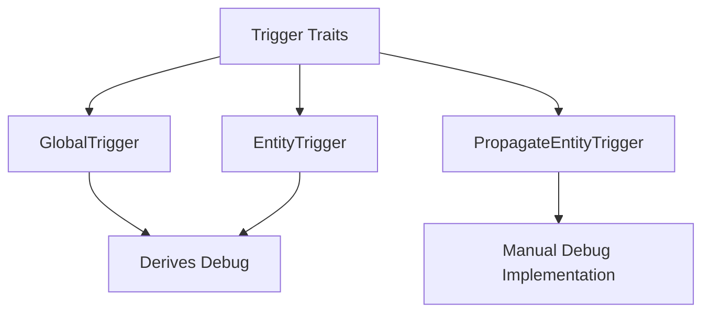

+++
title = "#21045 Impl Debug for triggers"
date = "2025-09-15T00:00:00"
draft = false
template = "pull_request_page.html"
in_search_index = true

[taxonomies]
list_display = ["show"]

[extra]
current_language = "en"
available_languages = {"en" = { name = "English", url = "/pull_request/bevy/2025-09/pr-21045-en-20250915" }, "zh-cn" = { name = "中文", url = "/pull_request/bevy/2025-09/pr-21045-zh-cn-20250915" }}
labels = ["A-ECS", "C-Usability"]
+++

# Title
Impl Debug for triggers

## Basic Information
- **Title**: Impl Debug for triggers
- **PR Link**: https://github.com/bevyengine/bevy/pull/21045
- **Author**: akimakinai
- **Status**: MERGED
- **Labels**: A-ECS, C-Usability, S-Ready-For-Final-Review
- **Created**: 2025-09-15T03:07:49Z
- **Merged**: 2025-09-15T06:36:39Z
- **Merged By**: james7132

## Description Translation
# Objective

- Debug-printing `Trigger` (now `On`) was handy for debugging events. It becomes an error in 0.17-rc due to triggers not implementing `Debug`.

## Solution

- Impl `Debug` for triggers

## The Story of This Pull Request

This PR addresses a straightforward but important usability issue in Bevy's ECS event system. The problem emerged when developers tried to use debug printing (`{:?}`) on trigger types during event debugging sessions. While this worked in previous versions, the upcoming 0.17 release introduced a breaking change where triggers no longer implemented the `Debug` trait, causing compilation errors.

The core issue was that three trigger types (`GlobalTrigger`, `EntityTrigger`, and `PropagateEntityTrigger`) lacked proper `Debug` implementations. The solution involved two complementary approaches:

1. For simple structs (`GlobalTrigger` and `EntityTrigger`), the PR added `Debug` to their derive macros
2. For the more complex `PropagateEntityTrigger` with generic parameters and internal state, a manual `Debug` implementation was provided

The implementation follows Rust's standard debugging conventions. For `PropagateEntityTrigger`, the debug output includes:
- The original event target
- Propagation status
- Type marker information

These changes maintain backward compatibility while restoring essential debugging functionality. The manual implementation for `PropagateEntityTrigger` carefully handles the generic parameters while providing meaningful debug output that includes the struct's relevant internal state.

The fix is minimal and focused - it doesn't alter any functionality beyond adding debugging capabilities. This approach ensures that developers can continue using standard Rust debugging techniques while working with Bevy's event system, which is particularly valuable when troubleshooting complex event interactions.

## Visual Representation



## Key Files Changed

### `crates/bevy_ecs/src/event/trigger.rs` (+15/-3)

This file contains the core implementation of Bevy's event trigger system. The changes add `Debug` implementations to three trigger types.

**Key changes:**

1. Added `Debug` derive to `GlobalTrigger` and `EntityTrigger`:
```rust
// Before:
#[derive(Default)]
pub struct GlobalTrigger;

// After:
#[derive(Default, Debug)]
pub struct GlobalTrigger;
```

2. Added manual `Debug` implementation for `PropagateEntityTrigger`:
```rust
// New implementation:
impl<const AUTO_PROPAGATE: bool, E: EntityEvent, T: Traversal<E>> fmt::Debug
    for PropagateEntityTrigger<AUTO_PROPAGATE, E, T>
{
    fn fmt(&self, f: &mut fmt::Formatter<'_>) -> fmt::Result {
        f.debug_struct("PropagateEntityTrigger")
            .field("original_event_target", &self.original_event_target)
            .field("propagate", &self.propagate)
            .field("_marker", &self._marker)
            .finish()
    }
}
```

3. Added necessary import for `fmt` module:
```rust
// Added import:
use core::{fmt, marker::PhantomData};
```

These changes ensure all trigger types can be properly formatted for debugging purposes, resolving the compilation errors that would occur in Bevy 0.17.

## Further Reading

- [Rust Debug Trait Documentation](https://doc.rust-lang.org/std/fmt/trait.Debug.html)
- [Bevy Event System Documentation](https://bevyengine.org/learn/books/0.17/programming/events/)
- [Derive Macros in Rust](https://doc.rust-lang.org/reference/procedural-macros.html#derive-macros)

## Full Code Diff
```diff
diff --git a/crates/bevy_ecs/src/event/trigger.rs b/crates/bevy_ecs/src/event/trigger.rs
index 45b5e52b06b7b..9492380b63159 100644
--- a/crates/bevy_ecs/src/event/trigger.rs
+++ b/crates/bevy_ecs/src/event/trigger.rs
@@ -7,7 +7,7 @@ use crate::{
     world::DeferredWorld,
 };
 use bevy_ptr::PtrMut;
-use core::marker::PhantomData;
+use core::{fmt, marker::PhantomData};
 
 /// [`Trigger`] determines _how_ an [`Event`] is triggered when [`World::trigger`](crate::world::World::trigger) is called.
 /// This decides which [`Observer`](crate::observer::Observer)s will run, what data gets passed to them, and the order they will
@@ -57,7 +57,7 @@ pub unsafe trait Trigger<E: Event> {
 /// that matches the given [`Event`].
 ///
 /// The [`Event`] derive defaults to using this [`Trigger`], and it is usable for any [`Event`] type.
-#[derive(Default)]
+#[derive(Default, Debug)]
 pub struct GlobalTrigger;
 
 // SAFETY:
@@ -127,7 +127,7 @@ impl GlobalTrigger {
 /// The [`EntityEvent`] derive defaults to using this [`Trigger`], and it is usable for any [`EntityEvent`] type.
 ///
 /// [`Observer`]: crate::observer::Observer
-#[derive(Default)]
+#[derive(Default, Debug)]
 pub struct EntityTrigger;
 
 // SAFETY:
@@ -251,6 +251,18 @@ impl<const AUTO_PROPAGATE: bool, E: EntityEvent, T: Traversal<E>> Default
     }
 }
 
+impl<const AUTO_PROPAGATE: bool, E: EntityEvent, T: Traversal<E>> fmt::Debug
+    for PropagateEntityTrigger<AUTO_PROPAGATE, E, T>
+{
+    fn fmt(&self, f: &mut fmt::Formatter<'_>) -> fmt::Result {
+        f.debug_struct("PropagateEntityTrigger")
+            .field("original_event_target", &self.original_event_target)
+            .field("propagate", &self.propagate)
+            .field("_marker", &self._marker)
+            .finish()
+    }
+}
+
 // SAFETY:
 // - `E`'s [`Event::Trigger`] is constrained to [`PropagateEntityTrigger<E>`]
 unsafe impl<
```