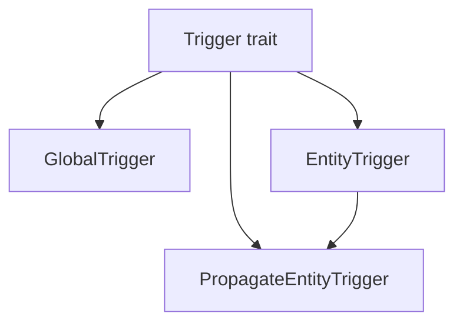

+++
title = "#21045 Impl Debug for triggers"
date = "2025-09-15T00:00:00"
draft = false
template = "pull_request_page.html"
in_search_index = false

[extra]
current_language = "zh-cn"
available_languages = {"en" = { name = "English", url = "/pull_request/bevy/2025-09/pr-21045-en-20250915" }, "zh-cn" = { name = "中文", url = "/pull_request/bevy/2025-09/pr-21045-zh-cn-20250915" }}
+++

# Impl Debug for triggers

## 基本信息
- **标题**: Impl Debug for triggers
- **PR 链接**: https://github.com/bevyengine/bevy/pull/21045
- **作者**: akimakinai
- **状态**: 已合并
- **标签**: A-ECS, C-Usability, S-Ready-For-Final-Review
- **创建时间**: 2025-09-15T03:07:49Z
- **合并时间**: 2025-09-15T06:36:39Z
- **合并者**: james7132

## 描述翻译
### Objective
- 在调试事件时，能够打印 `Trigger`（现称为 `On`）的信息非常有用。由于触发器未实现 `Debug`，这在 0.17-rc 版本中会报错。

### Solution
- 为触发器实现 `Debug`

## 这个 Pull Request 的故事

这个 PR 源于一个实际开发中的调试需求。在 Bevy 0.17 发布候选版本中，开发者发现之前可以正常工作的调试打印功能突然报错，原因是触发器类型缺少 Debug trait 实现。

问题的核心在于，当开发者尝试使用 `dbg!()` 或 `println!()` 来输出触发器信息时，由于这些类型没有实现 std::fmt::Debug，编译器会报错。这在调试事件系统时尤其不便，因为触发器是事件系统的核心组件。

解决方案相当直接：为三个关键的触发器类型实现 Debug trait。对于简单的结构体 GlobalTrigger 和 EntityTrigger，直接通过 derive 宏添加 Debug 实现即可。但对于更复杂的 PropagateEntityTrigger，由于它包含泛型参数和特定字段，需要手动实现 Debug trait 来确保输出信息的有用性。

具体实现上，作者首先添加了对 core::fmt 的导入，然后为前两个结构体添加了 Debug derive，最后为 PropagateEntityTrigger 手动实现了 Debug trait，确保输出包含所有相关字段的信息。

这个修改虽然代码量不大，但对开发体验有显著提升。现在开发者可以方便地打印触发器状态来调试事件流，而不会遇到编译错误。这种类型的修改体现了对开发者体验的重视，即使是在看似小的细节上。

从技术角度看，这个实现遵循了 Rust 的最佳实践：对于简单结构使用 derive，对于复杂结构手动实现以确保输出信息的清晰性和实用性。手动实现中还特别处理了标记字段（_marker），虽然它是 PhantomData 类型，但仍然在调试输出中显示，这有助于理解结构体的完整状态。

## 视觉表示



## 关键文件更改

### `crates/bevy_ecs/src/event/trigger.rs` (+15/-3)

这个文件包含了所有触发器类型的定义。修改主要为三个触发器类型添加了 Debug 实现。

**主要变更：**

1. 添加了 fmt 模块的导入：
```rust
use core::{fmt, marker::PhantomData};
```

2. 为 GlobalTrigger 添加 Debug derive：
```rust
#[derive(Default, Debug)]
pub struct GlobalTrigger;
```

3. 为 EntityTrigger 添加 Debug derive：
```rust
#[derive(Default, Debug)]
pub struct EntityTrigger;
```

4. 为 PropagateEntityTrigger 手动实现 Debug：
```rust
impl<const AUTO_PROPAGATE: bool, E: EntityEvent, T: Traversal<E>> fmt::Debug
    for PropagateEntityTrigger<AUTO_PROPAGATE, E, T>
{
    fn fmt(&self, f: &mut fmt::Formatter<'_>) -> fmt::Result {
        f.debug_struct("PropagateEntityTrigger")
            .field("original_event_target", &self.original_event_target)
            .field("propagate", &self.propagate)
            .field("_marker", &self._marker)
            .finish()
    }
}
```

## 进一步阅读

- [Rust Debug trait 文档](https://doc.rust-lang.org/std/fmt/trait.Debug.html)
- [Bevy 事件系统指南](https://bevyengine.org/learn/books/0.17/programming/events)
- [派生宏与手动实现 Debug 的权衡](https://doc.rust-lang.org/rust-by-example/trait/derive.html)

## 完整代码差异
```diff
diff --git a/crates/bevy_ecs/src/event/trigger.rs b/crates/bevy_ecs/src/event/trigger.rs
index 45b5e52b06b7b..9492380b63159 100644
--- a/crates/bevy_ecs/src/event/trigger.rs
+++ b/crates/bevy_ecs/src/event/trigger.rs
@@ -7,7 +7,7 @@ use crate::{
     world::DeferredWorld,
 };
 use bevy_ptr::PtrMut;
-use core::marker::PhantomData;
+use core::{fmt, marker::PhantomData};
 
 /// [`Trigger`] determines _how_ an [`Event`] is triggered when [`World::trigger`](crate::world::World::trigger) is called.
 /// This decides which [`Observer`](crate::observer::Observer)s will run, what data gets passed to them, and the order they will
@@ -57,7 +57,7 @@ pub unsafe trait Trigger<E: Event> {
 /// that matches the given [`Event`].
 ///
 /// The [`Event`] derive defaults to using this [`Trigger`], and it is usable for any [`Event`] type.
-#[derive(Default)]
+#[derive(Default, Debug)]
 pub struct GlobalTrigger;
 
 // SAFETY:
@@ -127,7 +127,7 @@ impl GlobalTrigger {
 /// The [`EntityEvent`] derive defaults to using this [`Trigger`], and it is usable for any [`EntityEvent`] type.
 ///
 /// [`Observer`]: crate::observer::Observer
-#[derive(Default)]
+#[derive(Default, Debug)]
 pub struct EntityTrigger;
 
 // SAFETY:
@@ -251,6 +251,18 @@ impl<const AUTO_PROPAGATE: bool, E: EntityEvent, T: Traversal<E>> Default
     }
 }
 
+impl<const AUTO_PROPAGATE: bool, E: EntityEvent, T: Traversal<E>> fmt::Debug
+    for PropagateEntityTrigger<AUTO_PROPAGATE, E, T>
+{
+    fn fmt(&self, f: &mut fmt::Formatter<'_>) -> fmt::Result {
+        f.debug_struct("PropagateEntityTrigger")
+            .field("original_event_target", &self.original_event_target)
+            .field("propagate", &self.propagate)
+            .field("_marker", &self._marker)
+            .finish()
+    }
+}
+
 // SAFETY:
 // - `E`'s [`Event::Trigger`] is constrained to [`PropagateEntityTrigger<E>`]
 unsafe impl<
```