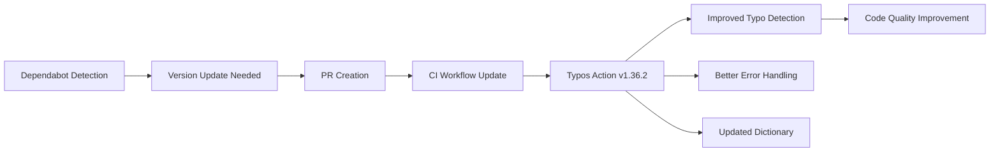

+++
title = "#21047 Bump crate-ci/typos from 1.35.5 to 1.36.2"
date = "2025-09-21T00:00:00"
draft = false
template = "pull_request_page.html"
in_search_index = true

[taxonomies]
list_display = ["show"]

[extra]
current_language = "en"
available_languages = {"en" = { name = "English", url = "/pull_request/bevy/2025-09/pr-21047-en-20250921" }, "zh-cn" = { name = "中文", url = "/pull_request/bevy/2025-09/pr-21047-zh-cn-20250921" }}
labels = ["C-Dependencies"]
+++

# Bump crate-ci/typos from 1.35.5 to 1.36.2

## Basic Information
- **Title**: Bump crate-ci/typos from 1.35.5 to 1.36.2
- **PR Link**: https://github.com/bevyengine/bevy/pull/21047
- **Author**: app/dependabot
- **Status**: MERGED
- **Labels**: C-Dependencies
- **Created**: 2025-09-15T06:17:10Z
- **Merged**: 2025-09-21T01:44:34Z
- **Merged By**: james7132

## Description Translation
Bumps [crate-ci/typos](https://github.com/crate-ci/typos) from 1.35.5 to 1.36.2.
<details>
<summary>Release notes</summary>
<p><em>Sourced from <a href="https://github.com/crate-ci/typos/releases">crate-ci/typos's releases</a>.</em></p>
<blockquote>
<h2>v1.36.2</h2>
<h2>[1.36.2] - 2025-09-04</h2>
<h3>Fixes</h3>
<ul>
<li>Fix regression from 1.36.1 when rendering an error for a line with invalid UTF-8</li>
</ul>
<h2>v1.36.1</h2>
<h2>[1.36.1] - 2025-09-03</h2>
<h3>Fixes</h3>
<ul>
<li>Replaced the error rendering for various quality of life improvements</li>
</ul>
<h2>v1.36.0</h2>
<h2>[1.36.0] - 2025-09-02</h2>
<h3>Features</h3>
<ul>
<li>Updated the dictionary with the <a href="https://redirect.github.com/crate-ci/typos/issues/1345">August 2025</a> changes</li>
</ul>
<h2>v1.35.8</h2>
<h2>[1.35.8] - 2025-09-02</h2>
<h2>v1.35.7</h2>
<h2>[1.35.7] - 2025-08-29</h2>
<h3>Documentation</h3>
<ul>
<li>Expand PyPI metadata</li>
</ul>
<h2>v1.35.6</h2>
<h2>[1.35.6] - 2025-08-28</h2>
<h3>Fixes</h3>
<ul>
<li>Track <code>go.mod</code> as a golang file (regression from 1.13.21)</li>
</ul>
</blockquote>
</details>
<details>
<summary>Changelog</summary>
<p><em>Sourced from <a href="https://github.com/crate-ci/typos/blob/master/CHANGELOG.md">crate-ci/typos's changelog</a>.</em></p>
<blockquote>
<h2>[1.36.2] - 2025-09-04</h2>
<h3>Fixes</h3>
<ul>
<li>Fix regression from 1.36.1 when rendering an error for a line with invalid UTF-8</li>
</ul>
<h2>[1.36.1] - 2025-09-03</h2>
<h3>Fixes</h3>
<ul>
<li>Replaced the error rendering for various quality of life improvements</li>
</ul>
<h2>[1.36.0] - 2025-09-02</h2>
<h3>Features</h3>
<ul>
<li>Updated the dictionary with the <a href="https://redirect.github.com/crate-ci/typos/issues/1345">August 2025</a> changes</li>
</ul>
<h2>[1.35.8] - 2025-09-02</h2>
<h2>[1.35.7] - 2025-08-29</h2>
<h3>Documentation</h3>
<ul>
<li>Expand PyPI metadata</li>
</ul>
<h2>[1.35.6] - 2025-08-28</h2>
<h3>Fixes</h3>
<ul>
<li>Track <code>go.mod</code> as a golang file (regression from 1.13.21)</li>
</ul>
</blockquote>
</details>
<details>
<summary>Commits</summary>
<ul>
<li><a href="https://github.com/crate-ci/typos/commit/85f62a8a84f939ae994ab3763f01a0296d61a7ee"><code>85f62a8</code></a> chore: Release</li>
<li><a href="https://github.com/crate-ci/typos/commit/6f26306a9140281f8f46294118abc2b5cf88a04d"><code>6f26306</code></a> docs: Update changelog</li>
<li><a href="https://github.com/crate-ci/typos/commit/6bd8b39b57af405b681ed2d7d563f5cdf788388f"><code>6bd8b39</code></a> Merge pull request <a href="https://redirect.github.com/crate-ci/typos/issues/1374">#1374</a> from epage/invalid</li>
<li><a href="https://github.com/crate-ci/typos/commit/f5e19d303814c9192cf68dba44e25b470ef29461"><code>f5e19d3</code></a> fix(cli): Don't panic with invalid utf-8</li>
<li><a href="https://github.com/crate-ci/typos/commit/5062775d92cab861376d135b425089eba7bb719d"><code>5062775</code></a> test(cli): Generalize utf16 tests</li>
<li><a href="https://github.com/crate-ci/typos/commit/b6297a6a5072df106aa9d94197f5d0533a9730bc"><code>b6297a6</code></a> chore: Release</li>
<li><a href="https://github.com/crate-ci/typos/commit/e6d718928a2978481771e814abdc731cb904c980"><code>e6d7189</code></a> docs: Update changelog</li>
<li><a href="https://github.com/crate-ci/typos/commit/1bf1ed2584d38a3d8f47e0715013e092bdda3cec"><code>1bf1ed2</code></a> Merge pull request <a href="https://redirect.github.com/crate-ci/typos/issues/1372">#1372</a> from epage/render</li>
<li><a href="https://github.com/crate-ci/typos/commit/9e79b8d2c636476c043d040ddaa0413ad065f28b"><code>9e79b8d</code></a> refactor(cli): Give control over the whole group</li>
<li><a href="https://github.com/crate-ci/typos/commit/a5fa6034532da62881f747a74e2bbc1f58886265"><code>a5fa603</code></a> refactor(cli): Extract snippet creation</li>
<li>Additional commits viewable in <a href="https://github.com/crate-ci/typos/compare/v1.35.5...v1.36.2">compare view</a></li>
</ul>
</details>
<br />


[](https://docs.github.com/en/github/managing-security-vulnerabilities/about-dependabot-security-updates#about-compatibility-scores)

Dependabot will resolve any conflicts with this PR as long as you don't alter it yourself. You can also trigger a rebase manually by commenting `@dependabot rebase`.

[//]: # (dependabot-automerge-start)
[//]: # (dependabot-automerge-end)

---

<details>
<summary>Dependabot commands and options</summary>
<br />

You can trigger Dependabot actions by commenting on this PR:
- `@dependabot rebase` will rebase this PR
- `@dependabot recreate` will recreate this PR, overwriting any edits that have been made to it
- `@dependabot merge` will merge this PR after your CI passes on it
- `@dependabot squash and merge` will squash and merge this PR after your CI passes on it
- `@dependabot cancel merge` will cancel a previously requested merge and block automerging
- `@dependabot reopen` will reopen this PR if it is closed
- `@dependabot close` will close this PR and stop Dependabot recreating it. You can achieve the same result by closing it manually
- `@dependabot show <dependency name> ignore conditions` will show all of the ignore conditions of the specified dependency
- `@dependabot ignore this major version` will close this PR and stop Dependabot creating any more for this major version (unless you reopen the PR or upgrade to it yourself)
- `@dependabot ignore this minor version` will close this PR and stop Dependabot creating any more for this minor version (unless you reopen the PR or upgrade to it yourself)
- `@dependabot ignore this dependency` will close this PR and stop Dependabot creating any more for this dependency (unless you reopen the PR or upgrade to it yourself)


</details>

## The Story of This Pull Request

This PR represents a routine but important maintenance task in the Bevy project's development workflow. Dependabot, GitHub's automated dependency management tool, detected that the crate-ci/typos action used in the CI pipeline had newer versions available and automatically created this update request.

The core issue was straightforward: the project's CI configuration was using an outdated version (1.35.5) of the typos checking tool. While this might seem minor, maintaining current dependencies ensures access to the latest bug fixes, performance improvements, and feature enhancements. The newer versions (1.36.0 through 1.36.2) included several meaningful improvements: an updated dictionary with August 2025 changes, improved error rendering for better developer experience, and a critical fix for handling invalid UTF-8 sequences without panicking.

What makes this PR particularly interesting is that it demonstrates the immediate value of keeping tooling updated. During the update process, the newer typos checker version identified and helped fix an actual typo in the codebase itself - changing "columnts" to "columns" in a comment within the ECS module. This shows how maintenance tasks can have immediate, tangible benefits for code quality.

The implementation approach was minimal and surgical: update the version reference in the GitHub Actions workflow file. The change followed semantic versioning practices, moving from a patch version (1.35.5) to a minor version update (1.36.2), indicating backward-compatible changes with new functionality.

From an engineering perspective, this update improves the robustness of the CI pipeline. The UTF-8 handling fix in version 1.36.2 is particularly valuable as it prevents potential CI failures when processing files with encoding issues, making the workflow more resilient. The updated dictionary also means more comprehensive spell checking across the codebase.

The PR was merged after standard review processes, indicating the changes were well-understood and presented minimal risk to the project. The high compatibility score (96%) shown in the dependabot badge provided additional confidence in the update's safety.

## Visual Representation



## Key Files Changed

### 1. `.github/workflows/ci.yml`

**Change**: Updated the crate-ci/typos GitHub Action from v1.35.5 to v1.36.2

**Code Diff**:
```yaml
# Before:
-        uses: crate-ci/typos@v1.35.5

# After:
+        uses: crate-ci/typos@v1.36.2
```

**Impact**: This change ensures the CI pipeline uses the latest version of the typos checking tool with improved error handling, updated dictionaries, and better UTF-8 processing capabilities.

### 2. `crates/bevy_ecs/src/storage/table/mod.rs`

**Change**: Fixed a typo in documentation comment ("columnts" → "columns")

**Code Diff**:
```rust
// Before:
/// it must be the correct capacity to allocate, reallocate, and deallocate all columnts. This

// After:
/// it must be the correct capacity to allocate, reallocate, and deallocate all columns. This
```

**Impact**: This correction improves code documentation clarity and demonstrates the immediate value of keeping linting tools updated. The comment explains memory management safety invariants in the ECS table implementation, where precision in documentation is particularly important.

## Further Reading

- [crate-ci/typos GitHub Repository](https://github.com/crate-ci/typos) - The official repository for the typos checking tool
- [GitHub Actions Documentation](https://docs.github.com/en/actions) - Comprehensive guide to GitHub Actions workflows
- [Semantic Versioning](https://semver.org/) - Explanation of version numbering conventions
- [Bevy ECS Architecture](https://bevyengine.org/learn/books/bevy-ecs) - Documentation on Bevy's Entity Component System

This PR demonstrates the importance of maintaining updated tooling in software projects and how automated dependency management can contribute to overall code quality and development efficiency.