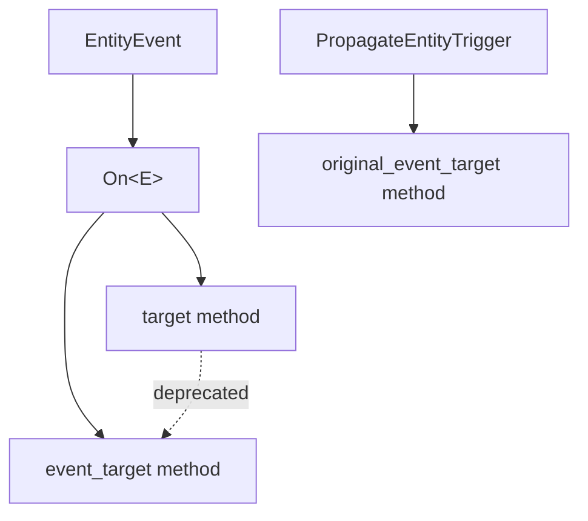

+++
title = "#21049 Fix `On::target` not being implemented for an `EntityEvent` without propagation"
date = "2025-09-15T00:00:00"
draft = false
template = "pull_request_page.html"
in_search_index = true

[taxonomies]
list_display = ["show"]

[extra]
current_language = "en"
available_languages = {"en" = { name = "English", url = "/pull_request/bevy/2025-09/pr-21049-en-20250915" }, "zh-cn" = { name = "中文", url = "/pull_request/bevy/2025-09/pr-21049-zh-cn-20250915" }}
labels = ["C-Bug", "D-Trivial", "A-ECS", "P-Regression"]
+++

# Fix `On::target` not being implemented for an `EntityEvent` without propagation

## Basic Information
- **Title**: Fix `On::target` not being implemented for an `EntityEvent` without propagation
- **PR Link**: https://github.com/bevyengine/bevy/pull/21049
- **Author**: greeble-dev
- **Status**: MERGED
- **Labels**: C-Bug, D-Trivial, A-ECS, S-Ready-For-Final-Review, P-Regression
- **Created**: 2025-09-15T08:01:38Z
- **Merged**: 2025-09-15T19:09:20Z
- **Merged By**: alice-i-cecile

## Description Translation
Before #20731, `On::target` was implemented for any `EntityEvent`. After that PR, it's only implemented for events with `#[entity_event(propagate)]`.

```rust
entity.observe(|scene_ready: On<SceneInstanceReady>| {
    // Error: "the method `target` exists but its trait bounds were not satisfied".
    info!("Scene entity {} is ready", scene_ready.target()); 
})
```

I suspect the change wasn't intentional. This PR restores the old behaviour and adds a regression test.

Note that `On::target` is deprecated, but without the fix users will get an error instead of a deprecation warning.

<details>
<summary>Full error message:</summary>

```
error[E0599]: the method `target` exists for struct `observer::systemparam::On<'_, '_, EntityEventA>`, but its trait bounds were not satisfied
    --> crates\bevy_ecs\src\observer\mod.rs:1129:34
     |
285  |     struct EntityEventA(Entity);
     |     ------------------- doesn't satisfy `<_ as Event>::Trigger<'a> = PropagateEntityTrigger<_, EntityEventA, _>`
...
1129 |                 assert_eq!(event.target(), event.event_target());
     |                                  ^^^^^^
     |
    ::: crates\bevy_ecs\src\observer\system_param.rs:38:1
     |
38   | pub struct On<'w, 't, E: Event, B: Bundle = ()> {
     | ----------------------------------------------- method `target` not found for this struct
     |
note: trait bound `<EntityEventA as event::Event>::Trigger<'a> = trigger::PropagateEntityTrigger<_, EntityEventA, _>` was not satisfied
    --> crates\bevy_ecs\src\observer\system_param.rs:153:40
     |
153  |         E: EntityEvent + for<'a> Event<Trigger<'a> = PropagateEntityTrigger<AUTO_PROPAGATE, E, T>>,
     |                                        ^^^^^^^^^^^^^^^^^^^^^^^^^^^^^^^^^^^^^^^^^^^^^^^^^^^^^^^^^^ unsatisfied trait bound introduced here
...
156  |     > On<'w, 't, E, B>
     |       ----------------
```

</code>
</details>

## Testing

Hacked `animated_mesh` example to use `On::target`, confirming it worked and reported the deprecation warning.

## The Story of This Pull Request

This PR addresses a regression introduced by PR #20731 that broke the `On::target` method for entity events without propagation. The issue was straightforward but significant: after the previous changes, `On::target` was only available for events marked with `#[entity_event(propagate)]`, causing compilation errors for code that previously worked.

The problem manifested when users tried to call `target()` on `On<T>` where T was an `EntityEvent` without propagation. Instead of getting the expected deprecation warning (since `target()` is deprecated in favor of `event_target()`), they received a confusing trait bound error suggesting the method didn't exist at all.

The fix involved restructuring the trait implementations in `system_param.rs`. The key insight was that the `target()` method doesn't actually depend on propagation behavior - it simply calls `event_target()` on the underlying event, which is available for all `EntityEvent` types. The implementation was moved from the propagation-specific trait bound to a more general one that only requires `E: EntityEvent`.

A regression test was added to ensure this functionality doesn't break again. The test uses the `#[expect(deprecated)]` attribute to acknowledge that we're testing deprecated functionality while ensuring it remains available until properly removed.

The changes are minimal and surgical:
1. The `target()` method implementation was moved to a more general trait bound
2. The propagation-specific methods remain in their original implementation
3. A test verifies the method works for non-propagating events

This approach maintains backward compatibility while fixing the regression, allowing users to migrate from the deprecated `target()` method to `event_target()` at their own pace without breaking existing code.

## Visual Representation



## Key Files Changed

### `crates/bevy_ecs/src/observer/system_param.rs` (+11/-9)

This file contains the core fix by restructuring the trait implementations for the `On` system parameter.

**Key changes:**
```rust
// Before: target() was only available for events with propagation
impl<
        'w,
        't,
        const AUTO_PROPAGATE: bool,
        E: EntityEvent + for<'a> Event<Trigger<'a> = PropagateEntityTrigger<AUTO_PROPAGATE, E, T>>,
        B: Bundle,
        T: Traversal<E>,
    > On<'w, 't, E, B>
{
    #[deprecated]
    pub fn target(&self) -> Entity {
        self.event.event_target()
    }
    
    pub fn original_event_target(&self) -> Entity {
        self.event.original_event_target()
    }
}

// After: target() is available for all EntityEvent types
impl<'w, 't, E: EntityEvent, B: Bundle> On<'w, 't, E, B> {
    #[deprecated]
    pub fn target(&self) -> Entity {
        self.event.event_target()
    }
}

// original_event_target() remains only for propagating events
impl<
        'w,
        't,
        const AUTO_PROPAGATE: bool,
        E: EntityEvent + for<'a> Event<Trigger<'a> = PropagateEntityTrigger<AUTO_PROPAGATE, E, T>>,
        B: Bundle,
        T: Traversal<E>,
    > On<'w, 't, E, B>
{
    pub fn original_event_target(&self) -> Entity {
        self.event.original_event_target()
    }
}
```

### `crates/bevy_ecs/src/observer/mod.rs` (+13/-0)

This file adds a regression test to ensure the fix works correctly.

**Key addition:**
```rust
#[test]
#[expect(deprecated, reason = "We still need to test `On::target`")]
fn observer_target() {
    let mut world = World::new();
    let entity = world
        .spawn_empty()
        .observe(|event: On<EntityEventA>| {
            assert_eq!(event.target(), event.event_target());
        })
        .id();
    world.trigger(EntityEventA(entity));
}
```

## Further Reading

- [Bevy ECS Observer System Documentation](https://docs.rs/bevy_ecs/latest/bevy_ecs/observer/index.html)
- [Entity Events and Observers Guide](https://bevyengine.org/learn/advanced-topics/observers/)
- [Rust Trait Bounds and Generic Implementations](https://doc.rust-lang.org/book/ch10-02-traits.html)