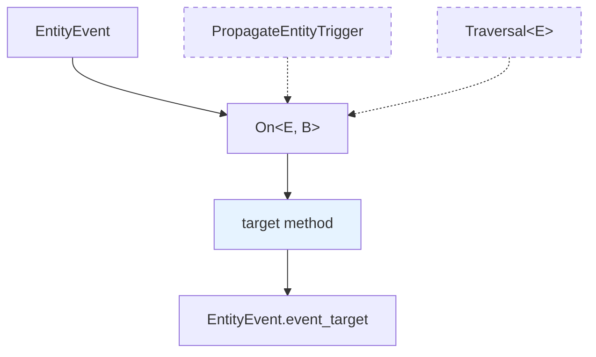

+++
title = "#21049 Fix `On::target` not being implemented for an `EntityEvent` without propagation"
date = "2025-09-15T00:00:00"
draft = false
template = "pull_request_page.html"
in_search_index = false

[extra]
current_language = "zh-cn"
available_languages = {"en" = { name = "English", url = "/pull_request/bevy/2025-09/pr-21049-en-20250915" }, "zh-cn" = { name = "中文", url = "/pull_request/bevy/2025-09/pr-21049-zh-cn-20250915" }}
+++

# 修复 `On::target` 在无传播 `EntityEvent` 上的实现问题

## 基本信息
- **标题**: Fix `On::target` not being implemented for an `EntityEvent` without propagation
- **PR 链接**: https://github.com/bevyengine/bevy/pull/21049
- **作者**: greeble-dev
- **状态**: 已合并
- **标签**: C-Bug, D-Trivial, A-ECS, S-Ready-For-Final-Review, P-Regression
- **创建时间**: 2025-09-15T08:01:38Z
- **合并时间**: 2025-09-15T19:09:20Z
- **合并者**: alice-i-cecile

## 描述翻译
在 #20731 之前，`On::target` 对所有 `EntityEvent` 都有实现。在该 PR 之后，它只对带有 `#[entity_event(propagate)]` 的事件有实现。

```rust
entity.observe(|scene_ready: On<SceneInstanceReady>| {
    // 错误: "the method `target` exists but its trait bounds were not satisfied"
    info!("Scene entity {} is ready", scene_ready.target()); 
})
```

我怀疑这个变化不是故意的。这个 PR 恢复了旧的行为并添加了一个回归测试。

注意 `On::target` 已被弃用，但如果没有这个修复，用户会得到一个错误而不是弃用警告。

<details>
<summary>完整错误信息:</summary>

```
error[E0599]: the method `target` exists for struct `observer::system_param::On<'_, '_, EntityEventA>`, but its trait bounds were not satisfied
    --> crates\bevy_ecs\src\observer\mod.rs:1129:34
     |
285  |     struct EntityEventA(Entity);
     |     ------------------- doesn't satisfy `<_ as Event>::Trigger<'a> = PropagateEntityTrigger<_, EntityEventA, _>`
...
1129 |                 assert_eq!(event.target(), event.event_target());
     |                                  ^^^^^^
     |
    ::: crates\bevy_ecs\src\observer\system_param.rs:38:1
     |
38   | pub struct On<'w, 't, E: Event, B: Bundle = ()> {
     | ----------------------------------------------- method `target` not found for this struct
     |
note: trait bound `<EntityEventA as event::Event>::Trigger<'a> = trigger::PropagateEntityTrigger<_, EntityEventA, _>` was not satisfied
    --> crates\bevy_ecs\src\observer\system_param.rs:153:40
     |
153  |         E: EntityEvent + for<'a> Event<Trigger<'a> = PropagateEntityTrigger<AUTO_PROPAGATE, E, T>>,
     |                                        ^^^^^^^^^^^^^^^^^^^^^^^^^^^^^^^^^^^^^^^^^^^^^^^^^^^^^^^^^^ unsatisfied trait bound introduced here
...
156  |     > On<'w, 't, E, B>
     |       ----------------
```

</code>
</details>

## 测试
修改了 `animated_mesh` 示例以使用 `On::target`，确认它正常工作并报告了弃用警告。

## 这个 PR 的故事

这个 PR 解决了一个回归问题，该问题在 Bevy 的观察者系统中意外地破坏了向后兼容性。问题的核心是 `On::target` 方法在某些情况下无法使用，尽管它应该对所有实体事件都可用。

### 问题背景
在 PR #20731 之后，开发者发现 `On::target` 方法只能在具有传播属性 (`#[entity_event(propagate)]`) 的实体事件上使用。对于没有传播属性的事件，调用 `target()` 方法会导致编译错误，提示特质约束不满足。

这是一个回归问题，因为在此之前的版本中，`On::target` 对所有 `EntityEvent` 类型都可用。虽然这个方法已经被标记为弃用，但用户应该看到的是弃用警告而不是编译错误。

### 解决方案
问题的根本原因在于特质约束过于严格。在 `system_param.rs` 中，`target()` 方法的实现被限制在具有特定特质约束的事件类型上：

```rust
impl<
        'w,
        't,
        const AUTO_PROPAGATE: bool,
        E: EntityEvent + for<'a> Event<Trigger<'a> = PropagateEntityTrigger<AUTO_PROPAGATE, E, T>>,
        B: Bundle,
        T: Traversal<E>,
    > On<'w, 't, E, B>
{
    pub fn target(&self) -> Entity {
        self.event.event_target()
    }
}
```

这个实现要求事件必须具有传播特性，但 `target()` 方法本身并不依赖于传播功能 - 它只是返回事件的目标实体。

### 实现细节
修复方法是将 `target()` 方法的实现移动到更通用的特质约束中：

```rust
// 修复前：只在具有传播特性的事件上实现
impl<
        'w,
        't,
        const AUTO_PROPAGATE: bool,
        E: EntityEvent + for<'a> Event<Trigger<'a> = PropagateEntityTrigger<AUTO_PROPAGATE, E, T>>,
        B: Bundle,
        T: Traversal<E>,
    > On<'w, 't, E, B>
{
    pub fn target(&self) -> Entity {
        self.event.event_target()
    }
}

// 修复后：在所有实体事件上实现
impl<'w, 't, E: EntityEvent, B: Bundle> On<'w, 't, E, B> {
    pub fn target(&self) -> Entity {
        self.event.event_target()
    }
}
```

这样，`target()` 方法现在对所有实现了 `EntityEvent` 特质的事件类型都可用，无论它们是否具有传播特性。

### 回归测试
为了确保这个问题不会再次出现，PR 添加了一个测试用例：

```rust
#[test]
#[expect(deprecated, reason = "We still need to test `On::target`")]
fn observer_target() {
    let mut world = World::new();
    let entity = world
        .spawn_empty()
        .observe(|event: On<EntityEventA>| {
            assert_eq!(event.target(), event.event_target());
        })
        .id();
    world.trigger(EntityEventA(entity));
}
```

这个测试创建了一个简单的实体事件 `EntityEventA`（没有传播特性），然后验证 `target()` 方法能够正常工作。使用 `#[expect(deprecated)]` 属性来抑制弃用警告，因为测试的目的正是验证这个已弃用方法的功能。

### 技术洞察
这个修复展示了特质约束设计中的一个重要原则：方法的实现应该只要求必要的约束。`target()` 方法只需要事件实现 `EntityEvent` 特质，因为它只调用 `event_target()` 方法。之前的实现错误地添加了关于传播特性的额外约束，这些约束对于方法的功能来说是不必要的。

这种过度约束的问题在大型代码库中很常见，特别是当多个开发人员在不同时间修改相关代码时。回归测试是防止这类问题再次发生的关键工具。

### 影响
这个修复恢复了向后兼容性，使得依赖 `On::target` 方法的现有代码能够继续工作，同时正确地显示弃用警告而不是编译错误。虽然 `target()` 方法已被弃用，但用户现在有一个平滑的迁移路径，可以在自己的节奏下更新代码，而不是被迫立即修复编译错误。

## 可视化表示



图表说明：
- 实线表示必要的依赖关系
- 虚线表示修复前不必要的约束
- 蓝色填充表示修复的核心方法

## 关键文件更改

### `crates/bevy_ecs/src/observer/system_param.rs` (+11/-9)
这个文件包含了主要的修复，重新组织了 `target()` 方法的实现。

**关键修改：**
```rust
// 之前：
impl<
        'w,
        't,
        const AUTO_PROPAGATE: bool,
        E: EntityEvent + for<'a> Event<Trigger<'a> = PropagateEntityTrigger<AUTO_PROPAGATE, E, T>>,
        B: Bundle,
        T: Traversal<E>,
    > On<'w, 't, E, B>
{
    pub fn target(&self) -> Entity {
        self.event.event_target()
    }
}

// 之后：
impl<'w, 't, E: EntityEvent, B: Bundle> On<'w, 't, E, B> {
    pub fn target(&self) -> Entity {
        self.event.event_target()
    }
}
```

这个变化将 `target()` 方法从需要传播特性的约束中移出，使其对所有实体事件可用。

### `crates/bevy_ecs/src/observer/mod.rs` (+13/-0)
这个文件添加了回归测试，确保问题不会再次出现。

**新增的测试代码：**
```rust
#[test]
#[expect(deprecated, reason = "We still need to test `On::target`")]
fn observer_target() {
    let mut world = World::new();
    let entity = world
        .spawn_empty()
        .observe(|event: On<EntityEventA>| {
            assert_eq!(event.target(), event.event_target());
        })
        .id();
    world.trigger(EntityEventA(entity));
}
```

这个测试创建了一个简单的实体事件并验证 `target()` 方法能够正常工作。

## 进一步阅读

1. [Bevy 观察者系统文档](https://docs.rs/bevy_ecs/latest/bevy_ecs/observer/index.html) - 了解 Bevy ECS 中的观察者模式
2. [Rust 特质约束指南](https://doc.rust-lang.org/book/ch10-02-traits.html) - 理解特质约束和泛型编程
3. [软件回归测试最佳实践](https://martinfowler.com/articles/regressionTest.html) - 学习如何有效防止回归问题
4. [Bevy 实体事件系统](https://docs.rs/bevy_ecs/latest/bevy_ecs/event/index.html) - 深入了解 Bevy 的事件机制