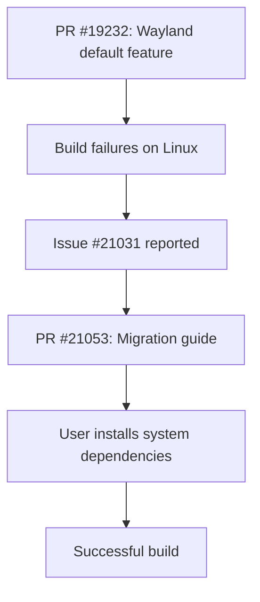

+++
title = "#21053 Migration 17/wayland"
date = "2025-09-15T00:00:00"
draft = false
template = "pull_request_page.html"
in_search_index = true

[taxonomies]
list_display = ["show"]

[extra]
current_language = "en"
available_languages = {"en" = { name = "English", url = "/pull_request/bevy/2025-09/pr-21053-en-20250915" }, "zh-cn" = { name = "中文", url = "/pull_request/bevy/2025-09/pr-21053-zh-cn-20250915" }}
labels = ["C-Docs", "A-Build-System"]
+++

# Migration 17/wayland

## Basic Information
- **Title**: Migration 17/wayland
- **PR Link**: https://github.com/bevyengine/bevy/pull/21053
- **Author**: janis-bhm
- **Status**: MERGED
- **Labels**: C-Docs, A-Build-System, S-Ready-For-Final-Review
- **Created**: 2025-09-15T12:01:51Z
- **Merged**: 2025-09-15T19:08:32Z
- **Merged By**: alice-i-cecile

## Description Translation

# Objective

Fixes https://github.com/bevyengine/bevy/issues/21031

## Solution
Mention the new default requirement of the `wayland-client` library and ways to install it on different systems.

## The Story of This Pull Request

This PR addresses a build system issue that emerged after Wayland support was added as a default feature in Bevy. The core problem was straightforward: when PR #19232 made Wayland a default dependency, Linux users without the necessary system libraries would encounter build failures with cryptic pkg-config errors.

The error message shown in the migration guide illustrates the exact problem developers would face:

```text
called `Result::unwrap()` on an `Err` value:
pkg-config exited with status code 1
> PKG_CONFIG_ALLOW_SYSTEM_LIBS=1 PKG_CONFIG_ALLOW_SYSTEM_CFLAGS=1 pkg-config --libs --cflags wayland-client

The system library `wayland-client` required by crate `wayland-sys` was not found.
```

The solution implemented here is purely documentation-focused but critically important. Instead of modifying build scripts or changing feature flags, the author created a comprehensive migration guide that:

1. Explains the new default dependency on Wayland
2. Shows the exact error message users will encounter
3. Provides system-specific installation instructions for major Linux distributions
4. Offers a clear path to resolution without requiring code changes

The technical approach recognizes that while the underlying code change (adding Wayland as default) was correct, the user experience needed improvement through better documentation. This is a common pattern in open-source projects where new dependencies are introduced - the documentation must keep pace with code changes to prevent user frustration.

The implementation consists of a single markdown file that serves as both error resolution guide and migration documentation. It's strategically placed in the release-content/migration-guides directory where users encountering upgrade issues would naturally look for solutions.

The impact of this change is significant for Linux users. Without this guide, developers might spend considerable time debugging pkg-config errors or searching through issues. Now they have immediate, clear instructions for resolving the dependency issue on Ubuntu/Debian, Arch Linux, and Nix systems.

## Visual Representation



## Key Files Changed

- `release-content/migration-guides/wayland.md` (+38/-0)

This is a new file created to document the Wayland migration requirements. The file includes:

1. A title and reference to the related PR
2. Explanation of the change (Wayland added to default features)
3. The exact error message users will encounter
4. Installation instructions for different Linux distributions

```markdown
---
title: Enable Wayland by default
pull_requests: [19232]
---

Wayland has now been added to the default features of the `bevy` crate.

```text
  called `Result::unwrap()` on an `Err` value:
  pkg-config exited with status code 1
  > PKG_CONFIG_ALLOW_SYSTEM_LIBS=1 PKG_CONFIG_ALLOW_SYSTEM_CFLAGS=1 pkg-config --libs --cflags wayland-client

  The system library `wayland-client` required by crate `wayland-sys` was not found.
  The file `wayland-client.pc` needs to be installed and the PKG_CONFIG_PATH environment variable must contain its parent directory.
  The PKG_CONFIG_PATH environment variable is not set.

  HINT: if you have installed the library, try setting PKG_CONFIG_PATH to the directory containing `wayland-client.pc`.
```

If you've encountered an error message similar to the one above, this means that you will want to make the `wayland-client` library available to your build system, or disable default features, in order to successfully build Bevy on Linux.

On Ubuntu, or other Debian-based distributions, install the `libwayland-dev` package:

```sh
sudo apt install libwayland-dev
```

On Arch Linux:

```sh
sudo pacman -S wayland
```

On Nix, add the `wayland` package to your `buildInputs`:

```nix
buildInputs = [ pkgs.wayland ];
```
```

## Further Reading

- [Wayland documentation](https://wayland.freedesktop.org/)
- [pkg-config usage](https://people.freedesktop.org/~dbn/pkg-config-guide.html)
- [Rust and system dependencies](https://doc.rust-lang.org/cargo/reference/build-scripts.html#sys-crates)
- [Bevy migration guides](https://bevyengine.org/learn/migration-guides/)