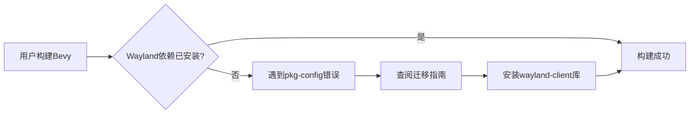

+++
title = "#21053 PR #21053 - Migration 17/wayland"
date = "2025-09-15T00:00:00"
draft = false
template = "pull_request_page.html"
in_search_index = false

[extra]
current_language = "zh-cn"
available_languages = {"en" = { name = "English", url = "/pull_request/bevy/2025-09/pr-21053-en-20250915" }, "zh-cn" = { name = "中文", url = "/pull_request/bevy/2025-09/pr-21053-zh-cn-20250915" }}
+++

# Title: PR #21053 - Migration 17/wayland

## 基本信息
- **标题**: Migration 17/wayland
- **PR链接**: https://github.com/bevyengine/bevy/pull/21053
- **作者**: janis-bhm
- **状态**: 已合并
- **标签**: C-Docs, A-Build-System, S-Ready-For-Final-Review
- **创建时间**: 2025-09-15T12:01:51Z
- **合并时间**: 2025-09-15T19:08:32Z
- **合并者**: alice-i-cecile

## 描述翻译
# 目标

修复 https://github.com/bevyengine/bevy/issues/21031

## 解决方案
说明 `wayland-client` 库的新默认要求以及在不同系统上安装它的方法。

## 本次PR的故事

这个PR源于一个实际的构建问题。当Bevy团队将Wayland支持添加到默认特性中后，Linux用户在构建时开始遇到依赖缺失的错误。问题#21031报告了用户在使用默认特性构建Bevy时遇到的pkg-config错误，提示找不到`wayland-client`系统库。

问题的核心是：Wayland现在成为了Bevy的默认特性，但许多Linux开发环境可能没有预先安装必要的Wayland开发文件。这导致构建失败，错误信息对不熟悉Wayland生态系统的用户来说不够友好。

开发者janis-bhm采取的解决方案很直接但有效：创建一个迁移指南文档，明确说明新的依赖要求并提供清晰的安装指导。这种方法不需要修改任何代码，而是通过文档来解决问题，符合"文档即代码"的理念。

迁移指南的设计考虑了实际使用场景。它首先展示了用户可能遇到的具体错误信息，让用户能够快速识别问题。然后提供了针对不同Linux发行版的安装命令：

- Ubuntu/Debian: `sudo apt install libwayland-dev`
- Arch Linux: `sudo pacman -S wayland`  
- Nix: 在`buildInputs`中添加`pkgs.wayland`

这种跨发行版的覆盖确保了大多数Linux用户都能找到适合自己环境的解决方案。文档还解释了错误的根本原因：`wayland-client.pc`文件需要被pkg-config找到，这通常通过设置PKG_CONFIG_PATH环境变量或安装相应的开发包来实现。

从工程角度看，这个解决方案有几个优点：首先，它不会破坏现有工作流程，用户仍然可以使用默认特性；其次，它提供了明确的解决路径，减少了用户在遇到问题时搜索解决方案的时间；最后，它为未来的类似依赖变更建立了文档模板。

这个更改虽然简单，但对用户体验有显著影响。清晰的错误解决指南可以减少新用户的挫败感，特别是那些不熟悉Linux图形栈复杂性的开发者。这也是开源项目中常见的模式：当引入新的系统依赖时，提供明确的安装指导。

## 视觉表示



## 关键文件更改

- `release-content/migration-guides/wayland.md` (+38/-0)

这个文件是全新创建的迁移指南文档，包含了Wayland成为默认特性后的构建问题解决方案。

```markdown
---
title: Enable Wayland by default
pull_requests: [19232]
---

Wayland has now been added to the default features of the `bevy` crate.

```text
  called `Result::unwrap()` on an `Err` value:
  pkg-config exited with status code 1
  > PKG_CONFIG_ALLOW_SYSTEM_LIBS=1 PKG_CONFIG_ALLOW_SYSTEM_CFLAGS=1 pkg-config --libs --cflags wayland-client

  The system library `wayland-client` required by crate `wayland-sys` was not found.
  The file `wayland-client.pc` needs to be installed and the PKG_CONFIG_PATH environment variable must contain its parent directory.
  The PKG_CONFIG_PATH environment variable is not set.

  HINT: if you have installed the library, try setting PKG_CONFIG_PATH to the directory containing `wayland-client.pc`.
```

If you've encountered an error message similar to the one above, this means that you will want to make the `wayland-client` library available to your build system, or disable default features, in order to successfully build Bevy on Linux.

On Ubuntu, or other Debian-based distributions, install the `libwayland-dev` package:

```sh
sudo apt install libwayland-dev
```

On Arch Linux:

```sh
sudo pacman -S wayland
```

On Nix, add the `wayland` package to your `buildInputs`:

```nix
buildInputs = [ pkgs.wayland ];
```
```

这个文件直接解决了PR中描述的问题，为用户提供了遇到Wayland依赖错误时的明确解决方案。

## 延伸阅读

- [Wayland官方文档](https://wayland.freedesktop.org/)
- [pkg-config使用指南](https://people.freedesktop.org/~dbn/pkg-config-guide.html)
- [Rust构建系统与系统依赖管理](https://doc.rust-lang.org/cargo/reference/specifying-dependencies.html)
- [Bevy图形后端选择](https://bevyengine.org/learn/advanced-topics/graphics-backends/)

# 完整代码差异
```diff
diff --git a/release-content/migration-guides/wayland.md b/release-content/migration-guides/wayland.md
new file mode 100644
index 0000000000000..2910b72005eaf
--- /dev/null
+++ b/release-content/migration-guides/wayland.md
@@ -0,0 +1,38 @@
+---
+title: Enable Wayland by default
+pull_requests: [19232]
+---
+
+Wayland has now been added to the default features of the `bevy` crate.
+
+```text
+  called `Result::unwrap()` on an `Err` value:
+  pkg-config exited with status code 1
+  > PKG_CONFIG_ALLOW_SYSTEM_LIBS=1 PKG_CONFIG_ALLOW_SYSTEM_CFLAGS=1 pkg-config --libs --cflags wayland-client
+
+  The system library `wayland-client` required by crate `wayland-sys` was not found.
+  The file `wayland-client.pc` needs to be installed and the PKG_CONFIG_PATH environment variable must contain its parent directory.
+  The PKG_CONFIG_PATH environment variable is not set.
+
+  HINT: if you have installed the library, try setting PKG_CONFIG_PATH to the directory containing `wayland-client.pc`.
+```
+
+If you've encountered an error message similar to the one above, this means that you will want to make the `wayland-client` library available to your build system, or disable default features, in order to successfully build Bevy on Linux.
+
+On Ubuntu, or other Debian-based distributions, install the `libwayland-dev` package:
+
+```sh
+sudo apt install libwayland-dev
+```
+
+On Arch Linux:
+
+```sh
+sudo pacman -S wayland
+```
+
+On Nix, add the `wayland` package to your `buildInputs`:
+
+```nix
+buildInputs = [ pkgs.wayland ];
+```
```