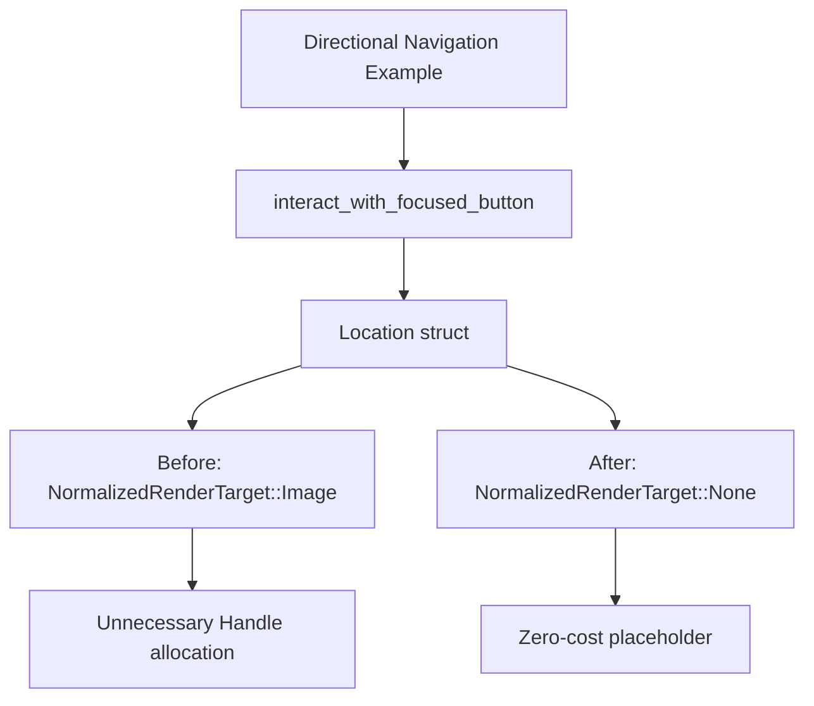

+++
title = "#21055 `directional_navigation` example tweak"
date = "2025-09-15T00:00:00"
draft = false
template = "pull_request_page.html"
in_search_index = true

[taxonomies]
list_display = ["show"]

[extra]
current_language = "en"
available_languages = {"en" = { name = "English", url = "/pull_request/bevy/2025-09/pr-21055-en-20250915" }, "zh-cn" = { name = "中文", url = "/pull_request/bevy/2025-09/pr-21055-zh-cn-20250915" }}
labels = ["D-Trivial", "C-Examples", "A-UI"]
+++

# Title
`directional_navigation` example tweak

## Basic Information
- **Title**: `directional_navigation` example tweak
- **PR Link**: https://github.com/bevyengine/bevy/pull/21055
- **Author**: ickshonpe
- **Status**: MERGED
- **Labels**: D-Trivial, C-Examples, A-UI, S-Ready-For-Final-Review
- **Created**: 2025-09-15T12:15:58Z
- **Merged**: 2025-09-15T19:07:00Z
- **Merged By**: alice-i-cecile

## Description Translation
# Objective

Use `NormalizedRenderTarget::None` for the dummy target.

## The Story of This Pull Request

This PR addresses a minor but meaningful optimization in Bevy's UI directional navigation example. The issue was in the `interact_with_focused_button` function where a placeholder `Location` struct was being created with unnecessary overhead.

The original implementation used `NormalizedRenderTarget::Image` with default values:
```rust
target: NormalizedRenderTarget::Image(bevy::camera::ImageRenderTarget {
    handle: Handle::default(),
    scale_factor: FloatOrd(1.0),
}),
```

This approach created an image handle and scale factor that were never actually used in the context of this dummy location. The solution replaces this with `NormalizedRenderTarget::None`, which is specifically designed for cases where no render target is needed:

```rust
target: NormalizedRenderTarget::None {
    width: 0,
    height: 0,
},
```

The change is technically sound because:
1. The code comment explicitly states "This field isn't used"
2. `NormalizedRenderTarget::None` provides the required type signature without unnecessary allocations
3. It removes the dependency on `FloatOrd` which is no longer needed

This optimization follows good practice of using the most appropriate type for the use case. While the performance impact is minimal in this example, it demonstrates proper API usage and eliminates unnecessary resource creation.

## Visual Representation



## Key Files Changed

- `examples/ui/directional_navigation.rs` (+5/-5)

**Changes:**
1. Removed unused `FloatOrd` import
2. Replaced `NormalizedRenderTarget::Image` with `NormalizedRenderTarget::None` in dummy location

```rust
// Before:
use bevy::math::{CompassOctant, FloatOrd};
// ...
pointer_location: Location {
    target: NormalizedRenderTarget::Image(bevy::camera::ImageRenderTarget {
        handle: Handle::default(),
        scale_factor: FloatOrd(1.0),
    }),
    position: Vec2::ZERO,
},

// After:
use bevy::math::CompassOctant;
// ...
pointer_location: Location {
    target: NormalizedRenderTarget::None {
        width: 0,
        height: 0,
    },
    position: Vec2::ZERO,
},
```

## Further Reading

- [Bevy NormalizedRenderTarget Documentation](https://docs.rs/bevy/latest/bevy/render/camera/enum.NormalizedRenderTarget.html)
- [Bevy UI System Guide](https://bevyengine.org/learn/books/introduction/features/ui/)
- [Rust Enum Best Practices](https://doc.rust-lang.org/book/ch06-01-defining-an-enum.html)