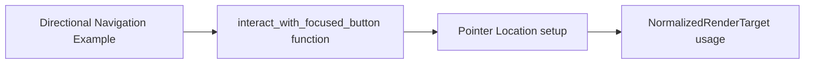

+++
title = "#21055 directional_navigation` example tweak"
date = "2025-09-15T00:00:00"
draft = false
template = "pull_request_page.html"
in_search_index = false

[extra]
current_language = "zh-cn"
available_languages = {"en" = { name = "English", url = "/pull_request/bevy/2025-09/pr-21055-en-20250915" }, "zh-cn" = { name = "中文", url = "/pull_request/bevy/2025-09/pr-21055-zh-cn-20250915" }}
+++

# 方向导航示例调整

## 基本信息
- **标题**: `directional_navigation` example tweak
- **PR链接**: https://github.com/bevyengine/bevy/pull/21055
- **作者**: ickshonpe
- **状态**: 已合并
- **标签**: D-Trivial, C-Examples, A-UI, S-Ready-For-Final-Review
- **创建时间**: 2025-09-15T12:15:58Z
- **合并时间**: 2025-09-15T19:07:00Z
- **合并者**: alice-i-cecile

## 描述翻译
### 目标

为虚拟目标使用 `NormalizedRenderTarget::None`。

## 本次PR的技术故事

这个PR解决了一个在Bevy引擎UI方向导航示例中的小问题。问题出现在`interact_with_focused_button`函数中，该函数模拟指针交互来触发聚焦按钮的点击事件。

在原来的实现中，代码创建了一个虚拟的`Location`结构体，其中包含一个渲染目标字段。开发者之前使用了`NormalizedRenderTarget::Image`变体，并为其提供了默认值：

```rust
target: NormalizedRenderTarget::Image(bevy::camera::ImageRenderTarget {
    handle: Handle::default(),
    scale_factor: FloatOrd(1.0),
}),
```

这种方法虽然能工作，但并不理想，因为：
1. 创建了一个不必要的`ImageRenderTarget`实例
2. 需要导入额外的`FloatOrd`类型
3. 这个渲染目标实际上不会被使用（如代码注释明确指出的）

解决方案是使用更合适的`NormalizedRenderTarget::None`变体，它专门用于这种情况——当不需要特定渲染目标时。新的实现：

```rust
target: NormalizedRenderTarget::None {
    width: 0,
    height: 0,
},
```

这个改动虽然很小，但体现了良好的API使用习惯。`NormalizedRenderTarget::None`是专门为这种"虚拟"或"占位符"场景设计的，它明确表达了开发者的意图：这里不需要真实的渲染目标。

从技术角度看，这个改动：
- 移除了不必要的依赖（不再需要导入`FloatOrd`）
- 使用了语义上更正确的API变体
- 减少了不必要的对象创建
- 使代码更加简洁和自文档化

这种优化属于代码卫生（code hygiene）的范畴，虽然不会改变功能，但提高了代码的质量和可维护性。在示例代码中尤其重要，因为它们应该展示最佳实践和正确的API用法。

## 可视化表示



## 关键文件变更

### examples/ui/directional_navigation.rs (+5/-5)

这个文件包含了Bevy引擎的方向导航UI示例。主要改动是优化了虚拟指针位置的创建方式。

**变更前**:
```rust
use bevy::{
    math::{CompassOctant, FloatOrd},
    // ...
};

// 在函数内部:
pointer_location: Location {
    target: NormalizedRenderTarget::Image(bevy::camera::ImageRenderTarget {
        handle: Handle::default(),
        scale_factor: FloatOrd(1.0),
    }),
    position: Vec2::ZERO,
},
```

**变更后**:
```rust
use bevy::{
    math::CompassOctant,  // 移除了 FloatOrd 导入
    // ...
};

// 在函数内部:
pointer_location: Location {
    target: NormalizedRenderTarget::None {
        width: 0,
        height: 0,
    },
    position: Vec2::ZERO,
},
```

这些变更直接实现了PR的目标：使用更合适的`NormalizedRenderTarget::None`来创建虚拟目标，同时移除了不再需要的导入。

## 延伸阅读

- [Bevy UI 官方文档](https://bevyengine.org/learn/books/introduction/)
- [NormalizedRenderTarget API 文档](https://docs.rs/bevy/latest/bevy/render/camera/enum.NormalizedRenderTarget.html)
- [Rust 枚举和模式匹配](https://doc.rust-lang.org/book/ch06-00-enums.html)

# 完整代码差异

```diff
diff --git a/examples/ui/directional_navigation.rs b/examples/ui/directional_navigation.rs
index 862d9140fd9c8..e0f303290cd09 100644
--- a/examples/ui/directional_navigation.rs
+++ b/examples/ui/directional_navigation.rs
@@ -15,7 +15,7 @@ use bevy::{
         },
         InputDispatchPlugin, InputFocus, InputFocusVisible,
     },
-    math::{CompassOctant, FloatOrd},
+    math::CompassOctant,
     picking::{
         backend::HitData,
         pointer::{Location, PointerId},
@@ -386,10 +386,10 @@ fn interact_with_focused_button(
             pointer_id: PointerId::Mouse,
             // This field isn't used, so we're just setting it to a placeholder value
             pointer_location: Location {
-                target: NormalizedRenderTarget::Image(bevy::camera::ImageRenderTarget {
-                    handle: Handle::default(),
-                    scale_factor: FloatOrd(1.0),
-                }),
+                target: NormalizedRenderTarget::None {
+                    width: 0,
+                    height: 0,
+                },
                 position: Vec2::ZERO,
             },
             event: Click {
```