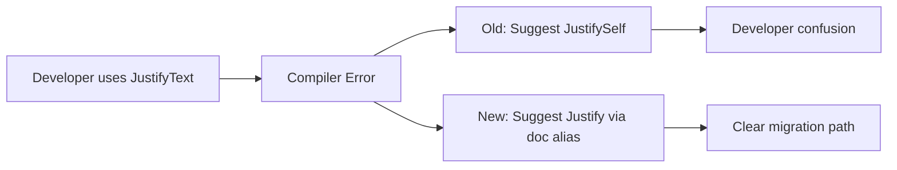

+++
title = "#21056 Improve suggestion when old name for `Justify` is used"
date = "2025-09-15T00:00:00"
draft = false
template = "pull_request_page.html"
in_search_index = true

[taxonomies]
list_display = ["show"]

[extra]
current_language = "en"
available_languages = {"en" = { name = "English", url = "/pull_request/bevy/2025-09/pr-21056-en-20250915" }, "zh-cn" = { name = "中文", url = "/pull_request/bevy/2025-09/pr-21056-zh-cn-20250915" }}
labels = ["A-UI", "C-Usability"]
+++

# Improve suggestion when old name for `Justify` is used

## Basic Information
- **Title**: Improve suggestion when old name for `Justify` is used
- **PR Link**: https://github.com/bevyengine/bevy/pull/21056
- **Author**: rparrett
- **Status**: MERGED
- **Labels**: A-UI, C-Usability, S-Ready-For-Final-Review
- **Created**: 2025-09-15T14:21:24Z
- **Merged**: 2025-09-15T19:07:00Z
- **Merged By**: alice-i-cecile

## Description Translation
# Objective

Rust currently suggests that users try `JustifySelf` when `JustifyText` (which has been renamed to `Justify`) is used.

## Solution

Add an alias for the old name

## Before

```
warning: `bevy-alt-ui-navigation-lite` (lib) generated 2 warnings
error[E0433]: failed to resolve: use of undeclared type `JustifyText`
   --> examples/infinite_upgrades.rs:526:46
    |
526 |                 TextLayout::new_with_justify(JustifyText::Center),
    |                                              ^^^^^^^^^^^
    |                                              |
    |                                              use of undeclared type `JustifyText`
    |                                              help: an enum with a similar name exists: `JustifySelf`
```

## After

```
warning: `bevy-alt-ui-navigation-lite` (lib) generated 2 warnings
error[E0433]: failed to resolve: use of undeclared type `JustifyText`
   --> examples/infinite_upgrades.rs:526:46
    |
526 |                 TextLayout::new_with_justify(JustifyText::Center),
    |                                              ^^^^^^^^^^^ use of undeclared type `JustifyText`
    |
help: `Justify` has a name defined in the doc alias attribute as `JustifyText`
    |
526 -                 TextLayout::new_with_justify(JustifyText::Center),
526 +                 TextLayout::new_with_justify(Justify::Center),
```

## Testing

Testing with local bevy dependency in a library I am migrating

## Alternatives

Add deprecated type alias

## The Story of This Pull Request

This PR addresses a specific usability issue in the Bevy engine's text system. The core problem stems from a previous renaming of the `JustifyText` enum to `Justify`. While this renaming improved consistency within the codebase, it created a poor developer experience for users who were still referencing the old name.

When developers attempted to use `JustifyText` after the rename, the Rust compiler would generate an unhelpful error message suggesting `JustifySelf` instead of the correct `Justify` type. This misleading suggestion occurred because `JustifySelf` was the closest matching name in the namespace, even though it's a completely different type with different functionality.

The solution implemented in this PR leverages Rust's `#[doc(alias)]` attribute to create a connection between the old and new names. By adding `#[doc(alias = "JustifyText")]` to the `Justify` enum, the compiler can now provide a targeted suggestion that directs users to the correct replacement. This approach maintains clean code while significantly improving the developer experience during migration.

The change is minimal but impactful. It doesn't affect runtime behavior or add any technical debt - it simply enhances the compiler's ability to guide developers toward the correct solution. The before-and-after error messages demonstrate the dramatic improvement in usability, with the new error message clearly indicating both the problem and the exact solution.

This approach was chosen over alternatives like adding a deprecated type alias because it doesn't introduce any actual code that needs to be maintained or eventually removed. The doc alias serves purely as metadata for documentation and compiler suggestions, making it a clean, maintenance-free solution.

## Visual Representation



## Key Files Changed

**File: `crates/bevy_text/src/text.rs`**

This file contains the definition of the `Justify` enum, which controls text justification in Bevy's UI system. The change adds a single doc alias attribute to improve error messages when developers use the old enum name.

**Code Change:**
```rust
// Before:
#[derive(Debug, Default, Clone, Copy, PartialEq, Eq, Hash, Reflect, Serialize, Deserialize)]
#[reflect(Serialize, Deserialize, Clone, PartialEq, Hash)]
pub enum Justify {

// After:
#[derive(Debug, Default, Clone, Copy, PartialEq, Eq, Hash, Reflect, Serialize, Deserialize)]
#[reflect(Serialize, Deserialize, Clone, PartialEq, Hash)]
#[doc(alias = "JustifyText")]
pub enum Justify {
```

The addition of `#[doc(alias = "JustifyText")]` creates a documented alias that the Rust compiler can use to provide better error suggestions when someone references the old `JustifyText` name.

## Further Reading

- [Rust Documentation: The `doc` attribute](https://doc.rust-lang.org/reference/attributes/doc.html)
- [Rust Edition Guide: Rustdoc Aliases](https://doc.rust-lang.org/edition-guide/rustdoc/aliases.html)
- [Bevy Engine: Text and UI Systems](https://bevyengine.org/learn/books/introduction/)


# Full Code Diff
```diff
diff --git a/crates/bevy_text/src/text.rs b/crates/bevy_text/src/text.rs
index 3c04cbd1d68d1..e4da3288d43c0 100644
--- a/crates/bevy_text/src/text.rs
+++ b/crates/bevy_text/src/text.rs
@@ -214,6 +214,7 @@ impl From<String> for TextSpan {
 /// [`TextBounds`](super::bounds::TextBounds) component with an explicit `width` value.
 #[derive(Debug, Default, Clone, Copy, PartialEq, Eq, Hash, Reflect, Serialize, Deserialize)]
 #[reflect(Serialize, Deserialize, Clone, PartialEq, Hash)]
+#[doc(alias = "JustifyText")]
 pub enum Justify {
     /// Leftmost character is immediately to the right of the render position.
     /// Bounds start from the render position and advance rightwards.
```