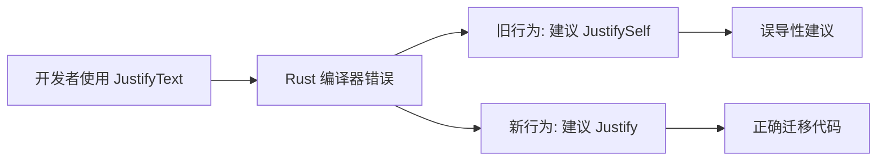

+++
title = "#21056 Improve suggestion when old name for `Justify` is used"
date = "2025-09-15T00:00:00"
draft = false
template = "pull_request_page.html"
in_search_index = false

[extra]
current_language = "zh-cn"
available_languages = {"en" = { name = "English", url = "/pull_request/bevy/2025-09/pr-21056-en-20250915" }, "zh-cn" = { name = "中文", url = "/pull_request/bevy/2025-09/pr-21056-zh-cn-20250915" }}
+++

# Improve suggestion when old name for `Justify` is used

## 基本信息
- **标题**: Improve suggestion when old name for `Justify` is used
- **PR链接**: https://github.com/bevyengine/bevy/pull/21056
- **作者**: rparrett
- **状态**: 已合并
- **标签**: A-UI, C-Usability, S-Ready-For-Review
- **创建时间**: 2025-09-15T14:21:24Z
- **合并时间**: 2025-09-15T19:07:00Z
- **合并者**: alice-i-cecile

## 描述翻译
# 目标

当用户使用 `JustifyText`（已重命名为 `Justify`）时，Rust 当前会建议用户尝试 `JustifySelf`。

## 解决方案

为旧名称添加别名

## 修改前

```
warning: `bevy-alt-ui-navigation-lite` (lib) generated 2 warnings
error[E0433]: failed to resolve: use of undeclared type `JustifyText`
   --> examples/infinite_upgrades.rs:526:46
    |
526 |                 TextLayout::new_with_justify(JustifyText::Center),
    |                                              ^^^^^^^^^^^
    |                                              |
    |                                              use of undeclared type `JustifyText`
    |                                              help: an enum with a similar name exists: `JustifySelf`
```

## 修改后

```
warning: `bevy-alt-ui-navigation-lite` (lib) generated 2 warnings
error[E0433]: failed to resolve: use of undeclared type `JustifyText`
   --> examples/infinite_upgrades.rs:526:46
    |
526 |                 TextLayout::new_with_justify(JustifyText::Center),
    |                                              ^^^^^^^^^^^ use of undeclared type `JustifyText`
    |
help: `Justify` has a name defined in the doc alias attribute as `JustifyText`
    |
526 -                 TextLayout::new_with_justify(JustifyText::Center),
526 +                 TextLayout::new_with_justify(Justify::Center),
```

## 测试

在我正在迁移的库中使用本地 bevy 依赖进行测试

## 替代方案

添加已弃用的类型别名

## 这个PR的故事

这个PR解决了一个具体但重要的开发者体验问题。在Bevy的UI系统中，`JustifyText`枚举被重命名为`Justify`，这是一个合理的命名简化，但带来了向后兼容性问题。

当开发者仍然使用旧的`JustifyText`名称时，Rust编译器的错误提示不够智能。由于系统中存在另一个名为`JustifySelf`的枚举，编译器会错误地建议用户使用这个完全不相关的类型，而不是正确的`Justify`类型。这种误导性的建议会显著增加开发者的调试时间，特别是对于那些不熟悉代码库变更历史的开发者。

问题的核心在于Rust的编译器错误提示系统。当遇到未解析的标识符时，编译器会尝试寻找名称相似的候选项，但它无法理解类型之间的语义关系。在这种情况下，`JustifySelf`在字符串相似度上比`Justify`更接近`JustifyText`，因此被错误地推荐。

解决方案采用了Rust的`#[doc(alias)]`属性，这是一个专门设计用于改善文档和错误提示的元数据特性。通过在`Justify`枚举上添加`#[doc(alias = "JustifyText")]`，我们明确告诉编译器和工具链：`Justify`类型曾经被称为`JustifyText`，应该将使用旧名称的用户引导到新名称。

这种方法的优势在于：
1. 无需引入实际的类型别名，避免了运行时开销和额外的维护负担
2. 专门针对开发工具（编译器、IDE等）优化，不影响实际代码执行
3. 符合Rust生态的最佳实践，许多库在重命名时都采用类似方法保持向后兼容

从技术实现角度看，这个修改极其简洁但效果显著。单行代码的添加解决了具体的用户体验痛点，展示了良好的工程权衡 - 用最小的改动解决明确的问题。

```rust
// 文件: crates/bevy_text/src/text.rs
// 修改前:
#[derive(Debug, Default, Clone, Copy, PartialEq, Eq, Hash, Reflect, Serialize, Deserialize)]
#[reflect(Serialize, Deserialize, Clone, PartialEq, Hash)]
pub enum Justify {
    // ... 变体定义
}

// 修改后:
#[derive(Debug, Default, Clone, Copy, PartialEq, Eq, Hash, Reflect, Serialize, Deserialize)]
#[reflect(Serialize, Deserialize, Clone, PartialEq, Hash)]
#[doc(alias = "JustifyText")]
pub enum Justify {
    // ... 变体定义保持不变
}
```

这个修改的影响是立即可见的：开发者现在会收到准确的错误提示，明确指出应该使用`Justify`而不是`JustifyText`，甚至提供了具体的代码修改建议。这种改进对于迁移现有代码库或者新手学习Bevy特别有价值。

## 可视化表示



## 关键文件变更

- `crates/bevy_text/src/text.rs` (+1/-0)
  - 在`Justify`枚举上添加了`#[doc(alias = "JustifyText")]`属性
  - 这使得编译器能够为使用旧名称`JustifyText`的开发者提供准确的迁移建议

```rust
// 关键变更:
#[doc(alias = "JustifyText")]
pub enum Justify {
    // ... 枚举变体
}
```

## 延伸阅读

- [Rust文档别名属性](https://doc.rust-lang.org/rustdoc/write-documentation/documentation-tests.html#doc-aliases)
- [Bevy UI系统文档](https://docs.rs/bevy_ui/latest/bevy_ui/)
- [Rust编译器错误提示改进RFC](https://github.com/rust-lang/rfcs/blob/master/text/3016-doc-alias.md)