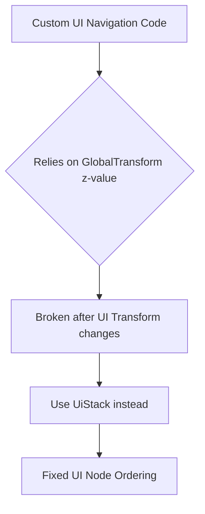

+++
title = "#21057 Add note about `z` translation value which is no longer present"
date = "2025-09-15T00:00:00"
draft = false
template = "pull_request_page.html"
in_search_index = true

[taxonomies]
list_display = ["show"]

[extra]
current_language = "en"
available_languages = {"en" = { name = "English", url = "/pull_request/bevy/2025-09/pr-21057-en-20250915" }, "zh-cn" = { name = "中文", url = "/pull_request/bevy/2025-09/pr-21057-zh-cn-20250915" }}
labels = ["C-Docs", "A-UI"]
+++

# Add note about `z` translation value which is no longer present

## Basic Information
- **Title**: Add note about `z` translation value which is no longer present
- **PR Link**: https://github.com/bevyengine/bevy/pull/21057
- **Author**: rparrett
- **Status**: MERGED
- **Labels**: C-Docs, A-UI, S-Ready-For-Final-Review
- **Created**: 2025-09-15T15:13:40Z
- **Merged**: 2025-09-15T19:07:00Z
- **Merged By**: alice-i-cecile

## Description Translation

# Objective

While migrating a [library](https://github.com/rparrett/bevy-alt-ui-navigation-lite) that does some custom UI "picking" / navigation, I stumbled on some code that was sorting UI nodes by the `GlobalTransform`'s z value.

It seems that the only way to obtain an ordering of UI nodes is now through `UiStack`

## Solution

Add a small note

## Alternatives

I would imagine that users doing this sort of thing should probably be using bevy's built-in picking instead. But I would sooner abandon maintenance of this thing than attempt such a migration. It does some things that bevy's built-in navigation can't do, but nothing that I am making use of personally.

## The Story of This Pull Request

During migration of a custom UI navigation library, the author encountered a breaking change in Bevy's UI system. Previously, developers could rely on the `z` value of `GlobalTransform` to determine UI node ordering for custom picking or navigation logic. However, with recent architectural changes, this approach no longer works reliably.

The core issue stems from Bevy's transition to specialized UI transforms (`UiTransform`), which no longer maintain meaningful z-values in the same way as traditional transforms. Instead, UI node ordering is now managed through the `UiStack` component, which provides the canonical source of truth for UI element rendering order.

This PR addresses a documentation gap in the migration guide by adding a clear note about this behavioral change. The solution is minimal but effective - a single sentence addition that directs developers to the correct alternative (`UiStack`) when they encounter this specific migration challenge.

The author acknowledges that using Bevy's built-in picking system would be the ideal solution, but recognizes that some custom implementations may have specific requirements not met by the standard approach. This note serves as a practical migration path for those maintaining legacy custom UI navigation code.

## Visual Representation



## Key Files Changed

**File:** `release-content/migration-guides/specialized_ui_transform.md`

**Changes:** Added a note about the removal of z-value ordering from GlobalTransform and directed users to UiStack as the alternative.

**Code Diff:**
```markdown
 In previous versions of Bevy `ui_layout_system` would overwrite UI node's `Transform::translation` each frame. `UiTransform`s aren't overwritten and there is no longer any need for systems that cache and rewrite the transform for translated UI elements.
+
+If you were relying on the `z` value of the `GlobalTransform`, this can be derived from `UiStack` instead.
```

## Further Reading

- [Bevy UI System Documentation](https://docs.rs/bevy_ui/latest/bevy_ui/)
- [UiStack Component Reference](https://docs.rs/bevy_ui/latest/bevy_ui/struct.UiStack.html)
- [Bevy Migration Guides](https://bevyengine.org/learn/migration-guides/)