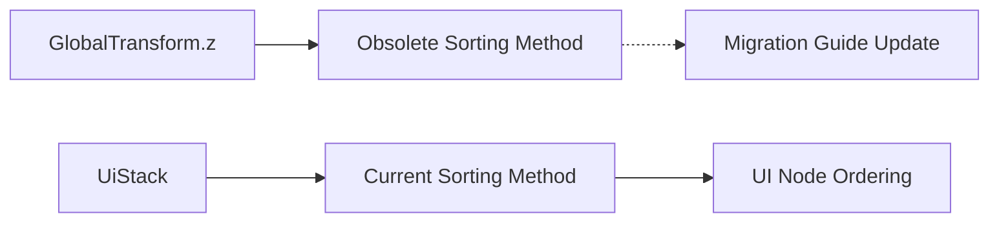

+++
title = "#21057 Add note about `z` translation value which is no longer present"
date = "2025-09-15T00:00:00"
draft = false
template = "pull_request_page.html"
in_search_index = false

[extra]
current_language = "zh-cn"
available_languages = {"en" = { name = "English", url = "/pull_request/bevy/2025-09/pr-21057-en-20250915" }, "zh-cn" = { name = "中文", url = "/pull_request/bevy/2025-09/pr-21057-zh-cn-20250915" }}
labels = ["C-Docs", "A-UI"]
+++

# Title

## Basic Information
- **Title**: Add note about `z` translation value which is no longer present
- **PR Link**: https://github.com/bevyengine/bevy/pull/21057
- **Author**: rparrett
- **Status**: MERGED
- **Labels**: C-Docs, A-UI, S-Ready-For-Final-Review
- **Created**: 2025-09-15T15:13:40Z
- **Merged**: 2025-09-15T19:07:00Z
- **Merged By**: alice-i-cecile

## Description Translation
# Objective

在迁移一个进行自定义UI"拾取"/导航的[库](https://github.com/rparrett/bevy-alt-ui-navigation-lite)时，我遇到了一些通过`GlobalTransform`的z值对UI节点进行排序的代码。

现在看来，获取UI节点排序的唯一方式是通过`UiStack`。

## Solution

添加一个小说明

## Alternatives

我认为做这类事情的用户可能应该使用bevy内置的拾取功能。但我宁愿放弃维护这个东西，也不愿尝试这样的迁移。它做了一些bevy内置导航无法做到的事情，但我个人并没有使用这些功能。

## The Story of This Pull Request

这个PR源于作者在迁移自定义UI导航库时的实际经验。问题出现在Bevy引擎的UI系统架构变更后，原有的排序机制不再有效。

在Bevy的早期版本中，开发者可以通过检查`GlobalTransform`组件的z值来确定UI节点的渲染顺序。这是一个直观的方法，因为z值直接反映了节点在3D空间中的深度位置，自然可以用来确定绘制顺序。许多第三方库和自定义实现都依赖这个机制。

然而，随着Bevy UI系统的重构，这种依赖变得不可靠。新的`UiTransform`系统不再覆盖UI节点的`Transform::translation`每一帧，这意味着z值不再被自动维护为反映UI层次结构的可靠指标。

作者在迁移自己的UI导航库时发现了这个问题。他的代码原本通过排序`GlobalTransform`的z值来处理UI节点的拾取顺序，但在新版本中这种方法失效了。经过调查，他发现现在唯一可靠的排序机制是通过`UiStack`组件。

这个问题的解决方案相对简单但重要：更新迁移指南，明确告知开发者这个行为变更。虽然看起来只是添加了一行文档，但这对于防止其他开发者遇到同样的困惑至关重要。

从技术角度看，这个变更反映了Bevy UI系统向更明确、更可控的架构演进。`UiStack`提供了专门的接口来处理UI排序，而不是依赖通用的变换组件，这带来了更好的封装性和可维护性。

作者也考虑了替代方案，比如完全迁移到Bevy的内置拾取系统，但决定保持现有实现，因为他的库提供了内置系统无法实现的特定功能。这个决定体现了在实际工程中经常需要做出的权衡：是彻底重构以适应平台变化，还是维护现有功能并解决兼容性问题。

## Visual Representation



## Key Files Changed

### `release-content/migration-guides/specialized_ui_transform.md` (+3/-1)

这个文件是Bevy的迁移指南，专门说明UI变换系统的变更。修改内容是在文档末尾添加了一行说明，告知开发者如果之前依赖`GlobalTransform`的z值，现在应该使用`UiStack`来替代。

```markdown
# Before:
In previous versions of Bevy `ui_layout_system` would overwrite UI node's `Transform::translation` each frame. `UiTransform`s aren't overwritten and there is no longer any need for systems that cache and rewrite the transform for translated UI elements.

# After:
In previous versions of Bevy `ui_layout_system` would overwrite UI node's `Transform::translation` each frame. `UiTransform`s aren't overwritten and there is no longer any need for systems that cache and rewrite the transform for translated UI elements.

If you were relying on the `z` value of the `GlobalTransform`, this can be derived from `UiStack` instead.
```

这个修改直接解决了PR中描述的问题，为迁移自定义UI排序逻辑的开发者提供了明确的指导。

## Further Reading

- [Bevy UI System Documentation](https://bevyengine.org/learn/books/introduction/ui/)
- [UiStack Component Reference](https://docs.rs/bevy/latest/bevy/ui/entity/struct.UiStack.html)
- [GlobalTransform Component Reference](https://docs.rs/bevy/latest/bevy/transform/components/struct.GlobalTransform.html)
- [Bevy Migration Guides](https://bevyengine.org/learn/migration-guides/)