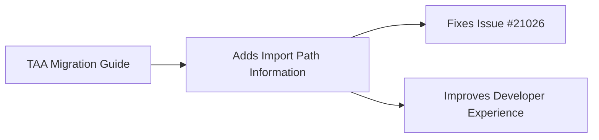

+++
title = "#21061 mention import paths in TAA migration guide"
date = "2025-09-15T00:00:00"
draft = false
template = "pull_request_page.html"
in_search_index = true

[taxonomies]
list_display = ["show"]

[extra]
current_language = "en"
available_languages = {"en" = { name = "English", url = "/pull_request/bevy/2025-09/pr-21061-en-20250915" }, "zh-cn" = { name = "中文", url = "/pull_request/bevy/2025-09/pr-21061-zh-cn-20250915" }}
labels = ["C-Docs", "A-Rendering"]
+++

# Title
mention import paths in TAA migration guide

## Basic Information
- **Title**: mention import paths in TAA migration guide
- **PR Link**: https://github.com/bevyengine/bevy/pull/21061
- **Author**: janis-bhm
- **Status**: MERGED
- **Labels**: C-Docs, A-Rendering, S-Ready-For-Final-Review
- **Created**: 2025-09-15T18:59:03Z
- **Merged**: 2025-09-15T19:50:18Z
- **Merged By**: alice-i-cecile

## Description Translation
# Objective

Fixes #21026

## Solution
mention types that have been moved.

## The Story of This Pull Request

This PR addresses a documentation gap in Bevy's migration guide for Temporal Anti-Aliasing (TAA). When TAA was moved from experimental to stable status, several types were relocated within the codebase, but the migration guide failed to mention these import path changes.

The core issue was straightforward: developers upgrading from the experimental TAA implementation to the stable version would encounter compilation errors because the import paths for key TAA components had changed. The migration guide previously only mentioned that TAA was no longer experimental and that the plugin was now part of DefaultPlugins, but omitted the critical information about updated import paths.

The solution implemented in this PR adds two lines to the migration guide that explicitly state the path changes. This follows standard practice for migration guides in software engineering - when types are moved between modules, the documentation should clearly indicate both the old and new import paths to prevent breaking changes for users.

The changes are minimal but impactful. By adding this information, developers can quickly update their code without needing to search through the codebase or consult additional documentation. The added text specifies that `TemporalAntiAliasNode`, `TemporalAntiAliasing`, and `TemporalAntiAliasPlugin` have moved from `bevy::anti_alias::experimental::taa` to `bevy::anti_alias::taa`, and provides a concrete example for the most common use case of adding `TemporalAntiAliasing` to a camera.

This type of documentation update is crucial for maintaining a positive developer experience during engine upgrades. It reduces friction and prevents unnecessary support requests by proactively addressing a common point of confusion.

## Visual Representation



## Key Files Changed

- `release-content/migration-guides/taa_non_experimental.md` (+2/-0)

This file contains the migration guide for TAA when it transitioned from experimental to non-experimental status. The changes add explicit information about import path changes for TAA-related types.

```markdown
# Before:
TAA is no longer experimental.

`TemporalAntiAliasPlugin` no longer needs to be added to your app to use TAA. It is now part of `DefaultPlugins`, via `AntiAliasPlugin`.

`TemporalAntiAliasSettings` now uses `MipBias` as a required component in the main world, instead of overriding it manually in the render world.

# After:
TAA is no longer experimental.

`TemporalAntiAliasPlugin` no longer needs to be added to your app to use TAA. It is now part of `DefaultPlugins`, via `AntiAliasPlugin`.

As part of this change, the import paths for `TemporalAntiAliasNode`, `TemporalAntiAliasSettings` and `TemporalAntiAliasPlugin` have changed from `bevy::anti_alias::experimental::taa` to `bevy::anti_alias::taa`: if you want to add `TemporalAntiAliasSettings` to a Camera, you can now find it at `bevy::anti_alias::taa::TemporalAntiAliasSettings`.

`TemporalAntiAliasSettings` now uses `MipBias` as a required component in the main world, instead of overriding it manually in the render world.
```

## Further Reading

- [Bevy's Documentation Guidelines](https://github.com/bevyengine/bevy/blob/main/docs/DOCUMENTATION_GUIDELINES.md)
- [Temporal Anti-Aliasing in Computer Graphics](https://en.wikipedia.org/wiki/Temporal_anti-aliasing)
- [Bevy's Migration Guide Structure](https://github.com/bevyengine/bevy/tree/main/release-content/migration-guides)