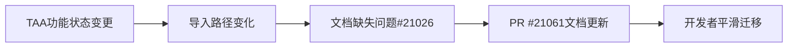

+++
title = "#21061 mention import paths in TAA migration guide"
date = "2025-09-15T00:00:00"
draft = false
template = "pull_request_page.html"
in_search_index = false

[extra]
current_language = "zh-cn"
available_languages = {"en" = { name = "English", url = "/pull_request/bevy/2025-09/pr-21061-en-20250915" }, "zh-cn" = { name = "中文", url = "/pull_request/bevy/2025-09/pr-21061-zh-cn-20250915" }}
+++

# 分析PR #21061：在TAA迁移指南中提及导入路径

## 基本信息
- **标题**: mention import paths in TAA migration guide
- **PR链接**: https://github.com/bevyengine/bevy/pull/21061
- **作者**: janis-bhm
- **状态**: 已合并
- **标签**: C-Docs, A-Rendering, S-Ready-For-Final-Review
- **创建时间**: 2025-09-15T18:59:03Z
- **合并时间**: 2025-09-15T19:50:18Z
- **合并者**: alice-i-cecile

## 描述翻译
### 目标
修复 #21026

### 解决方案
提及已被移动的类型。

## 这个PR的故事

这个PR解决了一个相对简单但重要的问题：文档更新。当Bevy引擎中的TAA（Temporal Anti-Aliasing，时间性抗锯齿）功能从实验状态转为正式功能后，相关的导入路径发生了变化，但迁移指南中没有明确说明这一点。

问题#21026指出了这个文档缺失：开发者在使用TAA功能时，如果按照旧的导入路径引用相关类型，会遇到编译错误，因为这些类型已经从实验性命名空间移动到了正式命名空间。

这个PR的解决方案很直接：在现有的TAA迁移指南文档中添加两行说明，明确指出三个主要TAA相关类型（`TemporalAntiAliasNode`、`TemporalAntiAliasing`和`TemporalAntiAliasPlugin`）的导入路径已经从`bevy::anti_alias::experimental::taa`变更为`bevy::anti_alias::taa`。

这种文档更新虽然代码改动量很小，但对开发者体验影响很大。没有这个信息，开发者可能需要花费额外时间在源代码或问题追踪系统中寻找正确的导入路径，特别是在大型代码库中，这种细微的路径变化容易被忽略。

从工程角度看，这个PR体现了良好的维护实践：当API发生变化时，及时更新相关文档，确保开发者能够平滑迁移。这也是开源项目中常见的贡献类型 - 小而精确的文档改进，对社区有实际价值。

## 可视化表示



## 关键文件变更

**文件**: `release-content/migration-guides/taa_non_experimental.md` (+2/-0)

这个文件是TAA功能从实验状态转为正式功能的迁移指南。PR在文档末尾添加了两行重要说明：

```markdown
As part of this change, the import paths for `TemporalAntiAliasNode`, `TemporalAntiAliasing` and `TemporalAntiAliasPlugin` have changed from `bevy::anti_alias::experimental::taa` to `bevy::anti_alias::taa`: if you want to add `TemporalAntiAliasing` to a Camera, you can now find it at `bevy::anti_alias::taa::TemporalAntiAliasing`.
```

这个变更：
1. 明确列出了三个受影响的主要类型
2. 提供了从旧路径到新路径的具体映射
3. 给出了一个具体的使用示例（如何给Camera添加TemporalAntiAliasing组件）

## 完整代码差异

```diff
diff --git a/release-content/migration-guides/taa_non_experimental.md b/release-content/migration-guides/taa_non_experimental.md
index 416ee164bfc06..6ad564dd0d785 100644
--- a/release-content/migration-guides/taa_non_experimental.md
+++ b/release-content/migration-guides/taa_non_experimental.md
@@ -7,4 +7,6 @@ TAA is no longer experimental.
 
 `TemporalAntiAliasPlugin` no longer needs to be added to your app to use TAA. It is now part of `DefaultPlugins`, via `AntiAliasPlugin`.
 
+As part of this change, the import paths for `TemporalAntiAliasNode`, `TemporalAntiAliasing` and `TemporalAntiAliasPlugin` have changed from `bevy::anti_alias::experimental::taa` to `bevy::anti_alias::taa`: if you want to add `TemporalAntiAliasing` to a Camera, you can now find it at `bevy::anti_alias::taa::TemporalAntiAliasing`.
+
 `TemporalAntiAliasing` now uses `MipBias` as a required component in the main world, instead of overriding it manually in the render world.
```

## 延伸阅读

对于想了解更多相关内容的开发者，建议阅读：

1. [Bevy官方文档中的迁移指南](https://bevyengine.org/learn/migration-guides/) - 了解其他功能的迁移说明
2. [Bevy渲染架构介绍](https://bevyengine.org/learn/book/getting-started/rendering/) - 理解Bevy的渲染系统如何工作
3. [时间性抗锯齿技术原理](https://en.wikipedia.org/wiki/Temporal_anti-aliasing) - 深入了解TAA的技术背景