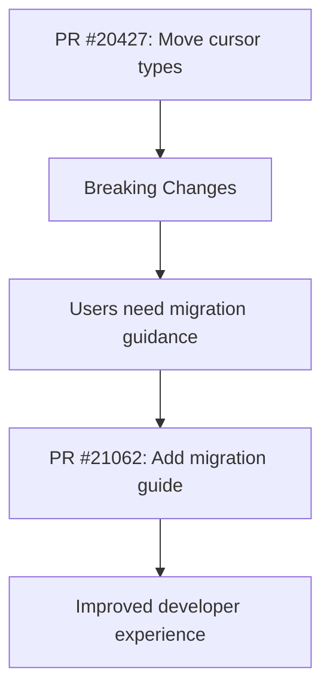

+++
title = "#21062 migration guide for #20427 (cursor)"
date = "2025-09-15T00:00:00"
draft = false
template = "pull_request_page.html"
in_search_index = true

[taxonomies]
list_display = ["show"]

[extra]
current_language = "en"
available_languages = {"en" = { name = "English", url = "/pull_request/bevy/2025-09/pr-21062-en-20250915" }, "zh-cn" = { name = "中文", url = "/pull_request/bevy/2025-09/pr-21062-zh-cn-20250915" }}
labels = ["C-Docs", "A-Windowing"]
+++

# Title
Migration Guide for #20427 (Cursor)

## Basic Information
- **Title**: migration guide for #20427 (cursor)
- **PR Link**: https://github.com/bevyengine/bevy/pull/21062
- **Author**: janis-bhm
- **Status**: MERGED
- **Labels**: C-Docs, A-Windowing, S-Ready-For-Final-Review
- **Created**: 2025-09-15T19:12:08Z
- **Merged**: 2025-09-15T21:20:59Z
- **Merged By**: alice-i-cecile

## Description Translation
# Objective

Fixes #21028

## Solution
Mention types moved, and rationale

## The Story of This Pull Request

This PR addresses a documentation gap created by a previous architectural change. When PR #20427 moved cursor-related types from `bevy_winit` to `bevy_window`, it introduced breaking changes that required user code updates. However, without proper migration guidance, users were left to discover these changes through compiler errors.

The problem was straightforward: breaking API changes require clear migration instructions. The solution implemented here follows Bevy's established pattern of providing migration guides for significant changes. The guide documents the specific type relocations and explains the architectural rationale behind the move.

The implementation consists of a single markdown file that concisely lists the moved types and their new locations. This follows the standard Bevy migration guide format, making it easily discoverable for developers upgrading their codebase. The guide explains that the move was part of an effort to "reduce and untangle dependencies," which helps users understand the architectural context.

From a technical perspective, this migration guide serves as essential documentation for a dependency restructuring effort. By moving cursor-related types from the platform-specific `bevy_winit` crate to the platform-agnostic `bevy_window` crate, the Bevy team improved code organization and reduced coupling between window management and specific backend implementations.

The impact is immediate: developers upgrading to the new version can quickly identify and fix import paths without searching through changelogs or source code. This reduces upgrade friction and maintains developer productivity when working with Bevy's windowing system.

## Visual Representation



## Key Files Changed

- `release-content/migration-guides/cursor-android.md` (+13/-0)

This file was created to document the breaking changes introduced by PR #20427. It provides a clear reference for developers needing to update their import paths after the cursor-related types were moved between crates.

```markdown
---
title: Move cursor-related types from `bevy_winit` to `bevy_window`
pull_requests: [20427]
---

In an effort to reduce and untangle dependencies, cursor-related types have been moved from the `bevy_winit` crate to the `bevy_window` crate.
The following types have been moved as part of this change:

- `CursorIcon` is now located at `bevy::window::CursorIcon`.
- `CustomCursor` is now located at `bevy::window::CustomCursor`.
- `CustomCursorImage` is now located at `bevy::window::CustomCursorImage`.
- `CustomCursorUrl` is now located at `bevy::window::CustomCursorUrl`.
- on the android platform, `ANDROID_APP` is now located in it's own crate and can be found at `bevy::android::ANDROID_APP`.
```

## Further Reading

- Bevy Migration Guide Overview: https://bevyengine.org/learn/migration-guides/
- PR #20427: The original implementation that moved the cursor types
- Bevy Window API Documentation: https://docs.rs/bevy_window/latest/bevy_window/
- Bevy Winit Documentation: https://docs.rs/bevy_winit/latest/bevy_winit/

# Full Code Diff
```diff
diff --git a/release-content/migration-guides/cursor-android.md b/release-content/migration-guides/cursor-android.md
new file mode 100644
index 0000000000000..ce3ade5e6ffb3
--- /dev/null
+++ b/release-content/migration-guides/cursor-android.md
@@ -0,0 +1,13 @@
+---
+title: Move cursor-related types from `bevy_winit` to `bevy_window`
+pull_requests: [20427]
+---
+
+In an effort to reduce and untangle dependencies, cursor-related types have been moved from the `bevy_winit` crate to the `bevy_window` crate.
+The following types have been moved as part of this change:
+
+- `CursorIcon` is now located at `bevy::window::CursorIcon`.
+- `CustomCursor` is now located at `bevy::window::CustomCursor`.
+- `CustomCursorImage` is now located at `bevy::window::CustomCursorImage`.
+- `CustomCursorUrl` is now located at `bevy::window::CustomCursorUrl`.
+- on the android platform, `ANDROID_APP` is now located in it's own crate and can be found at `bevy::android::ANDROID_APP`.
```