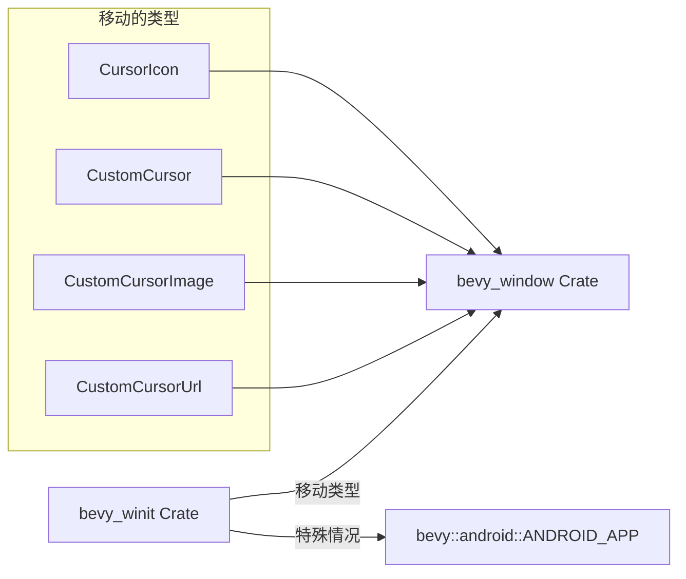

+++
title = "#21062 migration guide for #20427 (cursor)"
date = "2025-09-15T00:00:00"
draft = false
template = "pull_request_page.html"
in_search_index = false

[extra]
current_language = "zh-cn"
available_languages = {"en" = { name = "English", url = "/pull_request/bevy/2025-09/pr-21062-en-20250915" }, "zh-cn" = { name = "中文", url = "/pull_request/bevy/2025-09/pr-21062-zh-cn-20250915" }}
labels = ["C-Docs", "A-Windowing"]
+++

# Title

## Basic Information
- **Title**: migration guide for #20427 (cursor)
- **PR Link**: https://github.com/bevyengine/bevy/pull/21062
- **Author**: janis-bhm
- **Status**: MERGED
- **Labels**: C-Docs, A-Windowing, S-Ready-For-Final-Review
- **Created**: 2025-09-15T19:12:08Z
- **Merged**: 2025-09-15T21:20:59Z
- **Merged By**: alice-i-cecile

## Description Translation
# Objective

修复 #21028

## 解决方案
提及已移动的类型及其原理

## The Story of This Pull Request

这个PR解决了一个文档需求问题。在PR #20427中，开发团队将光标相关的类型从`bevy_winit` crate移动到了`bevy_window` crate，这是为了减少和梳理依赖关系。然而，这种破坏性变更需要相应的迁移指南来帮助开发者顺利过渡。

问题在于，当开发者升级到新版本时，如果没有明确的指导，他们会遇到编译错误，因为原有的导入路径不再有效。这会导致不必要的开发中断和困惑。PR #21028具体报告了这个问题，指出需要为这个变更提供迁移文档。

解决方案是创建一个新的迁移指南文件，明确列出所有移动的类型及其新的位置。这种方法直接有效，因为它：
1. 提供了清晰的路径映射
2. 解释了变更的原因（依赖关系优化）
3. 涵盖了所有相关的类型

迁移指南采用了标准的Markdown格式，包含标题、关联的PR编号，以及具体的类型迁移信息。对于Android平台的特殊情况，还单独说明了`ANDROID_APP`的移动位置。

这种文档维护方式符合Bevy项目的标准实践，确保破坏性变更都有相应的指导文档，帮助开发者快速适应API变化。

## Visual Representation



## Key Files Changed

### `release-content/migration-guides/cursor-android.md` (+13/-0)

这是一个新创建的迁移指南文档，专门记录从PR #20427引入的光标相关类型移动。

**关键内容：**
```markdown
---
title: Move cursor-related types from `bevy_winit` to `bevy_window`
pull_requests: [20427]
---

In an effort to reduce and untangle dependencies, cursor-related types have been moved from the `bevy_winit` crate to the `bevy_window` crate.
The following types have been moved as part of this change:

- `CursorIcon` is now located at `bevy::window::CursorIcon`.
- `CustomCursor` is now located at `bevy::window::CustomCursor`.
- `CustomCursorImage` is now located at `bevy::window::CustomCursorImage`.
- `CustomCursorUrl` is now located at `bevy::window::CustomCursorUrl`.
- on the android platform, `ANDROID_APP` is now located in it's own crate and can be found at `bevy::android::ANDROID_APP`.
```

这个文件提供了完整的迁移信息，包括：
1. 变更的标题和关联的PR编号
2. 变更的原因说明（减少和梳理依赖关系）
3. 所有移动类型的详细列表及其新位置
4. Android平台的特殊处理说明

## Further Reading

- [Bevy Migration Guides](https://bevyengine.org/learn/migration-guides/) - Bevy官方迁移指南
- [Rust Crate Dependencies Best Practices](https://doc.rust-lang.org/cargo/guide/creating-a-new-project.html) - Rust crate依赖管理最佳实践
- [Semantic Versioning and Breaking Changes](https://semver.org/) - 语义化版本管理和破坏性变更处理

# Full Code Diff
diff --git a/release-content/migration-guides/cursor-android.md b/release-content/migration-guides/cursor-android.md
new file mode 100644
index 0000000000000..ce3ade5e6ffb3
--- /dev/null
+++ b/release-content/migration-guides/cursor-android.md
@@ -0,0 +1,13 @@
+---
+title: Move cursor-related types from `bevy_winit` to `bevy_window`
+pull_requests: [20427]
+---
+
+In an effort to reduce and untangle dependencies, cursor-related types have been moved from the `bevy_winit` crate to the `bevy_window` crate.
+The following types have been moved as part of this change:
+
+- `CursorIcon` is now located at `bevy::window::CursorIcon`.
+- `CustomCursor` is now located at `bevy::window::CustomCursor`.
+- `CustomCursorImage` is now located at `bevy::window::CustomCursorImage`.
+- `CustomCursorUrl` is now located at `bevy::window::CustomCursorUrl`.
+- on the android platform, `ANDROID_APP` is now located in it's own crate and can be found at `bevy::android::ANDROID_APP`.