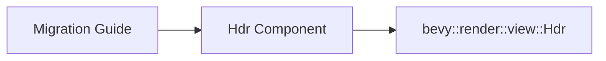

+++
title = "#21063 mention `Hdr` import path (#21026)"
date = "2025-09-15T00:00:00"
draft = false
template = "pull_request_page.html"
in_search_index = true

[taxonomies]
list_display = ["show"]

[extra]
current_language = "en"
available_languages = {"en" = { name = "English", url = "/pull_request/bevy/2025-09/pr-21063-en-20250915" }, "zh-cn" = { name = "中文", url = "/pull_request/bevy/2025-09/pr-21063-zh-cn-20250915" }}
labels = ["C-Docs", "A-Rendering"]
+++

# Hdr Import Path Documentation Update

## Basic Information
- **Title**: mention `Hdr` import path (#21026)
- **PR Link**: https://github.com/bevyengine/bevy/pull/21063
- **Author**: janis-bhm
- **Status**: MERGED
- **Labels**: C-Docs, A-Rendering, S-Ready-For-Final-Review
- **Created**: 2025-09-15T19:13:39Z
- **Merged**: 2025-09-15T21:20:59Z
- **Merged By**: alice-i-cecile

## Description Translation
# Objective

Fixes #21027

## Solution
Mention where `Hdr` can be found

## The Story of This Pull Request

This PR addresses a straightforward but important documentation issue in the Bevy engine's migration guide. The problem emerged after a previous architectural change where the `hdr` property was split from the `Camera` component into a separate marker component called `Hdr`.

The core issue was that while the migration guide correctly explained what changed, it didn't specify where developers could find the new `Hdr` component in the codebase. This created a discoverability problem - developers migrating their code knew they needed to use `Hdr` but had to search through the codebase to locate its import path.

The solution was minimal but effective: add a single line specifying the component's location within Bevy's module structure. The change directs developers to `bevy::render::view::Hdr`, which immediately resolves the import issue without requiring additional code changes or architectural modifications.

This type of documentation improvement is crucial in large codebases where components and modules are frequently reorganized. Clear import paths reduce friction during migration and help developers understand the project's structure more effectively.

The implementation demonstrates good documentation practices by providing both the conceptual change (what was moved) and the practical information (where to find it). This approach balances architectural clarity with immediate utility for developers working with the code.

## Visual Representation



## Key Files Changed

**File: `release-content/migration-guides/hdr_component.md`**

This file contains the migration guide for the HDR component split from Camera. The change adds the import path to help developers locate the component.

**Before:**
```markdown
`Camera.hdr` has been split out into a new marker component, `Hdr`
```

**After:**
```markdown
`Camera.hdr` has been split out into a new marker component, `Hdr`, which can be found at `bevy::render::view::Hdr`.
```

The change is minimal but significant - it adds the full import path (`bevy::render::view::Hdr`) to the documentation, making it immediately clear where developers can find this component in the codebase.

## Further Reading

- [Bevy Engine Documentation Guidelines](https://github.com/bevyengine/bevy/blob/main/docs/README.md)
- [Rust Module System and Paths](https://doc.rust-lang.org/book/ch07-02-defining-modules-to-control-scope-and-privacy.html)
- [Marker Components in ECS](https://bevy-cheatbook.github.io/programming/ecs-intro.html#components)

## Full Code Diff
```diff
diff --git a/release-content/migration-guides/hdr_component.md b/release-content/migration-guides/hdr_component.md
index 8061b664f84b1..33d5e6b02c1fb 100644
--- a/release-content/migration-guides/hdr_component.md
+++ b/release-content/migration-guides/hdr_component.md
@@ -3,7 +3,7 @@ title: Split `Hdr` from `Camera`
 pull_requests: [18873]
 ---
 
-`Camera.hdr` has been split out into a new marker component, `Hdr`
+`Camera.hdr` has been split out into a new marker component, `Hdr`, which can be found at `bevy::render::view::Hdr`.
 
 - before: `commands.spawn((Camera3d, Camera { hdr: true, ..default() });`
 - after: `commands.spawn((Camera3d, Hdr));`
```