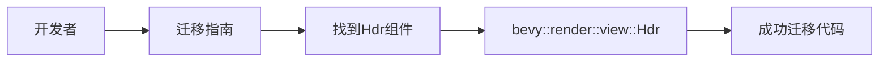

+++
title = "#21063 mention `Hdr` import path (#21026)"
date = "2025-09-15T00:00:00"
draft = false
template = "pull_request_page.html"
in_search_index = false

[extra]
current_language = "zh-cn"
available_languages = {"en" = { name = "English", url = "/pull_request/bevy/2025-09/pr-21063-en-20250915" }, "zh-cn" = { name = "中文", url = "/pull_request/bevy/2025-09/pr-21063-zh-cn-20250915" }}
+++

# Hdr 导入路径说明 (#21026)

## 基本信息
- **标题**: mention `Hdr` import path (#21026)
- **PR链接**: https://github.com/bevyengine/bevy/pull/21063
- **作者**: janis-bhm
- **状态**: 已合并
- **标签**: C-Docs, A-Rendering, S-Ready-For-Final-Review
- **创建时间**: 2025-09-15T19:13:39Z
- **合并时间**: 2025-09-15T21:20:59Z
- **合并者**: alice-i-cecile

## 描述翻译
### Objective
修复 #21027

### Solution
说明 `Hdr` 可以在哪里找到

## 这个PR的故事

这个PR解决了一个简单的文档问题，但体现了良好的开发者体验实践。问题源于Bevy引擎在版本更新中对HDR功能的架构调整。

在之前的版本中，HDR设置是`Camera`组件的一个布尔字段：
```rust
Camera { hdr: true, ..default() }
```

但随着架构演进，开发团队决定将HDR功能拆分为独立的标记组件。这个变更虽然提高了代码的模块化程度，但也带来了一个实际问题：开发者在迁移代码时不知道如何导入新的`Hdr`组件。

PR #21027报告了这个问题 - 迁移指南只说明了如何修改代码结构，但没有提供完整的导入路径信息。对于新手开发者或者不熟悉渲染模块结构的用户来说，这会造成不必要的困惑和开发阻力。

解决方案直接而有效：在迁移指南中添加一行说明，明确指出`Hdr`组件的完整导入路径。这个修改虽然简单，但体现了重要的文档编写原则 - 不仅要说明"做什么"，还要说明"怎么做"和"在哪里"。

从技术角度看，这个变更涉及Bevy的渲染视图模块结构。`Hdr`组件位于`bevy::render::view`模块中，这符合Bevy的架构设计模式，将渲染相关的视图组件集中管理。

这个修改的价值在于：
1. 减少了开发者的认知负担，不需要在代码库中搜索组件定义
2. 提高了迁移指南的实用性，使其成为真正可操作的指导
3. 保持了文档与代码变更的同步，避免了知识断层

虽然只是一个单行修改，但这种细节关注体现了开源项目对开发者体验的重视，也展示了良好的文档维护实践。

## 可视化表示



## 关键文件变更

### `release-content/migration-guides/hdr_component.md` (+1/-1)

这个文件是Bevy的迁移指南，专门指导开发者如何从旧版本的API迁移到新版本。本次修改添加了Hdr组件的具体导入路径。

**变更前:**
```markdown
`Camera.hdr` has been split out into a new marker component, `Hdr`
```

**变更后:**
```markdown
`Camera.hdr` has been split out into a new marker component, `Hdr`, which can be found at `bevy::render::view::Hdr`.
```

这个修改直接解决了问题#21027，为开发者提供了完整的导入信息，使迁移过程更加顺畅。

## 延伸阅读

- [Bevy官方文档 - 组件](https://bevyengine.org/learn/book/ecs/components/)
- [Rust模块系统指南](https://doc.rust-lang.org/book/ch07-02-defining-modules-to-control-scope-and-privacy.html)
- [Bevy渲染架构概述](https://bevyengine.org/learn/book/rendering/overview/)

# 完整代码差异
```diff
diff --git a/release-content/migration-guides/hdr_component.md b/release-content/migration-guides/hdr_component.md
index 8061b664f84b1..33d5e6b02c1fb 100644
--- a/release-content/migration-guides/hdr_component.md
+++ b/release-content/migration-guides/hdr_component.md
@@ -3,7 +3,7 @@ title: Split `Hdr` from `Camera`
 pull_requests: [18873]
 ---
 
-`Camera.hdr` has been split out into a new marker component, `Hdr`
+`Camera.hdr` has been split out into a new marker component, `Hdr`, which can be found at `bevy::render::view::Hdr`.
 
 - before: `commands.spawn((Camera3d, Camera { hdr: true, ..default() });`
 - after: `commands.spawn((Camera3d, Hdr));`
```