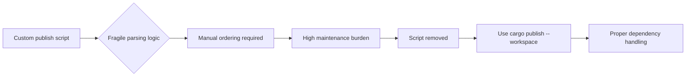

+++
title = "#21064 remove publish script"
date = "2025-09-15T00:00:00"
draft = false
template = "pull_request_page.html"
in_search_index = true

[taxonomies]
list_display = ["show"]

[extra]
current_language = "en"
available_languages = {"en" = { name = "English", url = "/pull_request/bevy/2025-09/pr-21064-en-20250915" }, "zh-cn" = { name = "中文", url = "/pull_request/bevy/2025-09/pr-21064-zh-cn-20250915" }}
labels = ["A-Meta"]
+++

# remove publish script

## Basic Information
- **Title**: remove publish script
- **PR Link**: https://github.com/bevyengine/bevy/pull/21064
- **Author**: mockersf
- **Status**: MERGED
- **Labels**: A-Meta, S-Ready-For-Final-Review
- **Created**: 2025-09-15T19:55:51Z
- **Merged**: 2025-09-15T21:20:59Z
- **Merged By**: alice-i-cecile

## Description Translation
# Objective

- the publish script didn't actually work, it was just a vague instruction on how to get something working
- it needed manual adaptation for each version to have the correct crate order
- it was not fun to do

## Solution

- `cargo +nightly publish --workspace` now works, use that instead

## The Story of This Pull Request

This PR addresses a maintenance pain point in Bevy's release process. The project maintained a custom shell script (`tools/publish.sh`) intended to automate crate publishing to crates.io, but the script had several fundamental issues that made it impractical for real-world use.

The original script attempted to automate workspace publishing by:
1. Checking for clean git status
2. Parsing `cargo package --workspace` output to determine crate order
3. Publishing crates individually in a loop
4. Finally publishing the root crate

However, this approach had multiple problems. The parsing logic was fragile - it relied on specific output formatting from Cargo that could change between versions. More importantly, it didn't actually handle dependency ordering correctly, requiring manual intervention for each release to ensure proper publish sequence. This made the script more of a starting point than a functional tool.

The solution was straightforward: remove the problematic custom script entirely and leverage Cargo's native workspace publishing functionality. The `cargo publish --workspace` command (available in nightly Rust) properly handles dependency ordering and publishing logistics without custom scripting.

This change represents a shift from maintaining custom tooling to using built-in Cargo functionality where possible. The removal simplifies the codebase and reduces maintenance burden while providing a more reliable publishing process.

## Visual Representation



## Key Files Changed

- `tools/publish.sh` (+0/-19)

This file contained the problematic publishing script that was completely removed. The script attempted to automate crate publishing but required manual ordering and had fragile output parsing.

**Before:**
```bash
if [ -n "$(git status --porcelain)" ]; then
    echo "You have local changes!"
    exit 1
fi

pushd crates

for crate in `cargo package --workspace 2>&1 | grep Packaging | sed 's_.*crates/\(.*\))_\1_' | grep -v Packaging`
do
  echo "Publishing ${crate}"
  pushd "$crate"
  cargo publish
  popd
done

popd

echo "Publishing root crate"
cargo publish
```

**After:** File completely removed

The removal of this script eliminates maintenance overhead and replaces it with standard Cargo functionality that properly handles workspace publishing.

## Further Reading

- [Cargo Workspace Documentation](https://doc.rust-lang.org/cargo/reference/workspaces.html)
- [Cargo publish --workspace](https://doc.rust-lang.org/cargo/commands/cargo-publish.html)
- [Rust Edition Guide: Working with Nightly](https://doc.rust-lang.org/edition-guide/rust-2021/working-with-nightly.html)