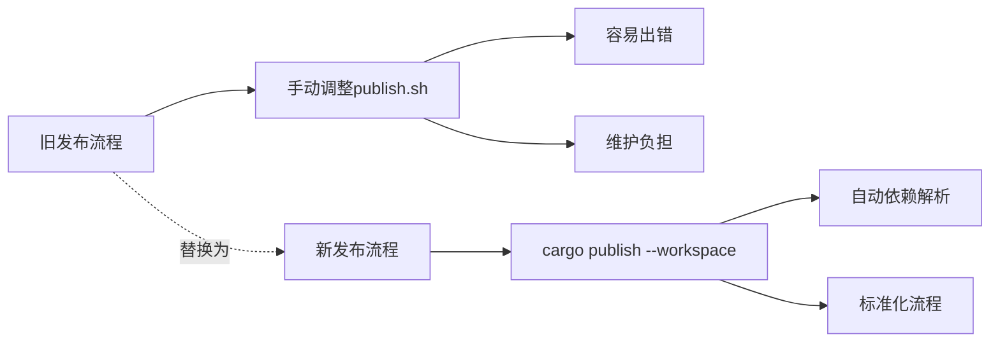

+++
title = "#21064 remove publish script"
date = "2025-09-15T00:00:00"
draft = false
template = "pull_request_page.html"
in_search_index = false

[extra]
current_language = "zh-cn"
available_languages = {"en" = { name = "English", url = "/pull_request/bevy/2025-09/pr-21064-en-20250915" }, "zh-cn" = { name = "中文", url = "/pull_request/bevy/2025-09/pr-21064-zh-cn-20250915" }}
labels = ["A-Meta"]
+++

# Title

## Basic Information
- **Title**: remove publish script
- **PR Link**: https://github.com/bevyengine/bevy/pull/21064
- **Author**: mockersf
- **Status**: MERGED
- **Labels**: A-Meta, S-Ready-For-Final-Review
- **Created**: 2025-09-15T19:55:51Z
- **Merged**: 2025-09-15T21:20:59Z
- **Merged By**: alice-i-cecile

## Description Translation
**Objective**
- 发布脚本实际上不工作，它只是一个关于如何让某些东西工作的模糊指导
- 它需要为每个版本手动调整以获得正确的crate顺序
- 这个过程并不愉快

**Solution**
- 现在可以使用 `cargo +nightly publish --workspace` 来代替

## The Story of This Pull Request

这个PR解决了一个工具链维护的问题。Bevy项目使用一个自定义的shell脚本`tools/publish.sh`来发布crates到crates.io，但这个脚本存在几个实际问题。

首先，这个脚本实际上并不能可靠工作。它本质上只是一个半成品的指导方案，而不是一个真正可用的自动化工具。每次发布时，开发人员都需要手动调整crate的发布顺序，这是一个容易出错的过程。

脚本的核心问题在于它尝试通过解析`cargo package --workspace`的输出来自动确定发布顺序：

```bash
for crate in `cargo package --workspace 2>&1 | grep Packaging | sed 's_.*crates/\(.*\))_\1_' | grep -v Packaging`
```

这种方法很脆弱，因为：
1. 它依赖cargo输出的特定格式，如果输出格式变化就会失效
2. 它不能正确处理crate之间的依赖关系
3. 需要手动维护正确的发布顺序

随着Rust工具链的发展，Cargo现在提供了原生的工作区发布支持。`cargo +nightly publish --workspace`命令能够自动处理所有crate的正确发布顺序和依赖关系，完全消除了对手动脚本的需求。

这个修改体现了工具链演进的最佳实践：当官方工具提供了足够的功能时，移除自定义的、难以维护的解决方案。这不仅简化了发布流程，还提高了可靠性和可维护性。

## Visual Representation



## Key Files Changed

**tools/publish.sh** (+0/-19)
这个文件被完全删除，因为它的功能现在由Cargo原生提供。

删除的脚本内容：
```bash
if [ -n "$(git status --porcelain)" ]; then
    echo "You have local changes!"
    exit 1
fi

pushd crates

for crate in `cargo package --workspace 2>&1 | grep Packaging | sed 's_.*crates/\(.*\))_\1_' | grep -v Packaging`
do
  echo "Publishing ${crate}"
  pushd "$crate"
  cargo publish
  popd
done

popd

echo "Publishing root crate"
cargo publish
```

这个脚本原本尝试：
1. 检查git工作区是否干净
2. 进入crates目录
3. 解析cargo输出获取crate列表
4. 逐个发布crate
5. 最后发布根crate

现在所有这些功能都由`cargo +nightly publish --workspace`一行命令替代。

## Further Reading

- [Cargo Workspace Documentation](https://doc.rust-lang.org/cargo/reference/workspaces.html)
- [Cargo publish --workspace RFC](https://github.com/rust-lang/rfcs/blob/master/text/2906-cargo-workspace-deduplication.md)
- [Bevy Engine Contribution Guide](https://github.com/bevyengine/bevy/blob/main/CONTRIBUTING.md)

# Full Code Diff
```diff
diff --git a/tools/publish.sh b/tools/publish.sh
deleted file mode 100644
index c76d4c16d3122..0000000000000
--- a/tools/publish.sh
+++ /dev/null
@@ -1,19 +0,0 @@
-if [ -n "$(git status --porcelain)" ]; then
-    echo "You have local changes!"
-    exit 1
-fi
-
-pushd crates
-
-for crate in `cargo package --workspace 2>&1 | grep Packaging | sed 's_.*crates/\(.*\))_\1_' | grep -v Packaging`
-do
-  echo "Publishing ${crate}"
-  pushd "$crate"
-  cargo publish
-  popd
-done
-
-popd
-
-echo "Publishing root crate"
-cargo publish
```