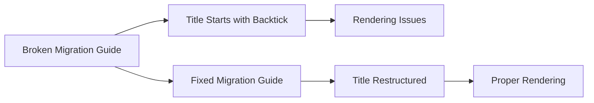

+++
title = "#21065 fix: migration guide starting with backtick"
date = "2025-09-15T00:00:00"
draft = false
template = "pull_request_page.html"
in_search_index = true

[taxonomies]
list_display = ["show"]

[extra]
current_language = "en"
available_languages = {"en" = { name = "English", url = "/pull_request/bevy/2025-09/pr-21065-en-20250915" }, "zh-cn" = { name = "中文", url = "/pull_request/bevy/2025-09/pr-21065-zh-cn-20250915" }}
labels = ["C-Docs"]
+++

# Fix: Migration Guide Starting with Backtick

## Basic Information
- **Title**: fix: migration guide starting with backtick
- **PR Link**: https://github.com/bevyengine/bevy/pull/21065
- **Author**: DaAlbrecht
- **Status**: MERGED
- **Labels**: C-Docs, S-Ready-For-Final-Review
- **Created**: 2025-09-15T20:37:15Z
- **Merged**: 2025-09-15T21:25:27Z
- **Merged By**: alice-i-cecile

## Description Translation
# Objective

Fix the broken migration guide.

## Solution

Restructure the sentence so it does not start with a backtick.

## Testing

I ran `cargo run -p export-content` and it produced no errors.

## The Story of This Pull Request

This PR addresses a documentation formatting issue in Bevy's migration guide system. The problem was straightforward: a migration guide title started with a backtick character, which caused formatting issues in the generated documentation.

The issue occurred in the YAML front matter of a markdown file where the title field began with a backtick. In Markdown, backticks are used to denote code spans, and starting a title with one could cause rendering problems or inconsistent formatting in the final documentation output.

The solution was simple but effective: restructure the title to avoid starting with a backtick while maintaining the same semantic meaning. The author changed the title from "`TextFont` constructor methods replaced with `From` impls" to "Replaced `TextFont` constructor methods with `From` impls". This maintains the technical accuracy while fixing the formatting issue.

The author verified the fix by running `cargo run -p export-content`, which processes the documentation content. The successful execution without errors confirmed that the formatting issue was resolved and the documentation would render correctly.

This type of documentation maintenance is crucial for ensuring that Bevy's migration guides remain clear and properly formatted, helping developers understand API changes between versions. While small, these fixes contribute to the overall quality and professionalism of the project's documentation.

## Visual Representation



## Key Files Changed

**File**: `release-content/migration-guides/remove_text_font_from_constructor_methods.md`

**Change**: Modified the title in the YAML front matter to avoid starting with a backtick character.

**Before**:
```markdown
---
title: `TextFont` constructor methods replaced with `From` impls
pull_requests: [20335, 20450]
---
```

**After**:
```markdown
---
title: Replaced `TextFont` constructor methods with `From` impls
pull_requests: [20335, 20450]
---
```

The change ensures proper Markdown formatting while maintaining the same technical meaning. The title now starts with a word instead of a code span delimiter, preventing potential rendering issues in the documentation system.

## Further Reading

- [Markdown Specification](https://daringfireball.net/projects/markdown/syntax)
- [YAML Front Matter Documentation](https://jekyllrb.com/docs/front-matter/)
- [Bevy's Documentation Guidelines](https://github.com/bevyengine/bevy/blob/main/docs/README.md)