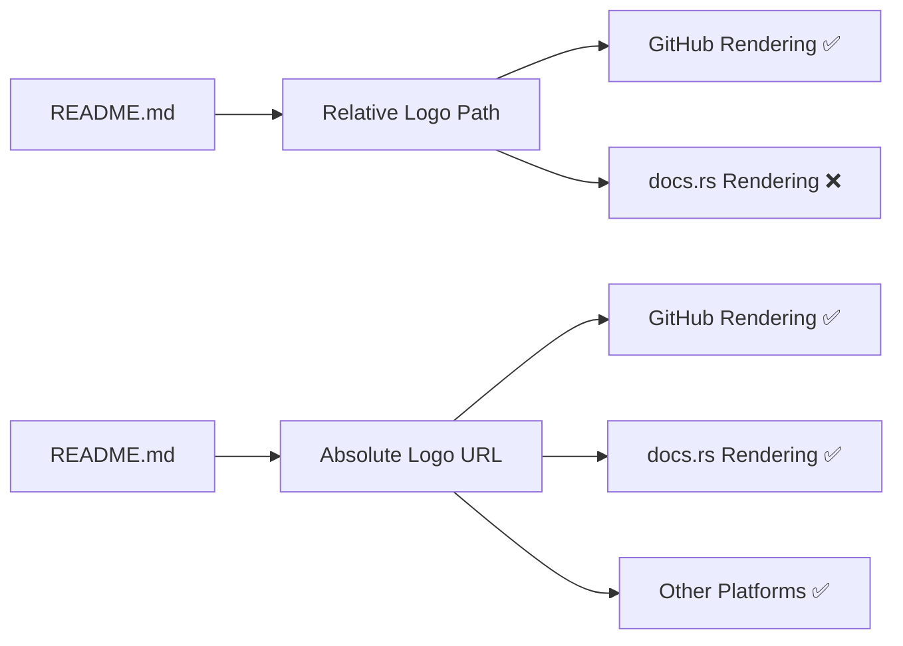

+++
title = "#21066 readme: use a logo url available from everywhere"
date = "2025-09-15T00:00:00"
draft = false
template = "pull_request_page.html"
in_search_index = true

[taxonomies]
list_display = ["show"]

[extra]
current_language = "en"
available_languages = {"en" = { name = "English", url = "/pull_request/bevy/2025-09/pr-21066-en-20250915" }, "zh-cn" = { name = "中文", url = "/pull_request/bevy/2025-09/pr-21066-zh-cn-20250915" }}
labels = ["C-Docs", "A-Meta"]
+++

# Title
readme: use a logo url available from everywhere

## Basic Information
- **Title**: readme: use a logo url available from everywhere
- **PR Link**: https://github.com/bevyengine/bevy/pull/21066
- **Author**: mockersf
- **Status**: MERGED
- **Labels**: C-Docs, A-Meta, S-Ready-For-Final-Review
- **Created**: 2025-09-15T20:50:05Z
- **Merged**: 2025-09-15T21:38:27Z
- **Merged By**: alice-i-cecile

## Description Translation
# Objective

- Logo in the readme is only available with the full repo and parsing markdown links
- For example, doesn't work on https://docs.rs/crate/bevy/0.16.1

## Solution

- Use an url on the website

## The Story of This Pull Request

This PR addresses a straightforward but important documentation issue affecting how the Bevy logo displays across different platforms. The problem was that the README.md file used a relative path to reference the project logo, which worked correctly when viewing the file within the GitHub repository context but failed when rendered elsewhere, particularly on documentation sites like docs.rs.

The core issue was that relative asset paths (`assets/branding/bevy_logo_light_dark_and_dimmed.svg`) only resolve correctly when the markdown processor has access to the full repository structure. On external platforms like docs.rs, which only display rendered documentation without the repository's asset directory, these relative paths become broken links.

The solution implemented was simple yet effective: replace the relative path with an absolute URL pointing to the same logo hosted on Bevy's official website (`https://bevy.org/assets/bevy_logo_light_dark_and_dimmed.svg`). This change ensures the logo remains accessible regardless of where the README is rendered, as long as internet connectivity is available.

From an engineering perspective, this change demonstrates good documentation practices. While relative paths are convenient for local development, absolute URLs provide better portability for documentation intended for multiple distribution channels. The trade-off is introducing a dependency on Bevy's website availability, but given the stability of the project's official domain, this is a reasonable compromise.

The implementation required only a single line change in the README.md file, modifying the image source from a relative path to an absolute URL while maintaining all other formatting and functionality intact.

## Visual Representation



## Key Files Changed

### File: README.md

**Change Description**: 
Replaced relative path to Bevy logo with absolute URL hosted on bevy.org to ensure consistent logo display across all platforms.

**Code Snippets**:

Before:
```markdown
# [](https://bevy.org)
```

After:
```markdown
# [](https://bevy.org)
```

**Relation to PR Purpose**:
This single-line change directly addresses the core issue by ensuring the Bevy logo remains accessible regardless of where the README is rendered, solving the broken logo problem on docs.rs and other external platforms.

## Further Reading

- [Markdown Reference: Images](https://www.markdownguide.org/basic-syntax/#images)
- [GitHub Docs: Relative links and image paths in README files](https://docs.github.com/en/repositories/managing-your-repositorys-settings-and-features/customizing-your-repository/about-readmes#relative-links-and-image-paths-in-readme-files)
- [docs.rs About Page](https://docs.rs/about)

# Full Code Diff
```diff
diff --git a/README.md b/README.md
index 73cc0e7a8d51c..ace4b5fd414d9 100644
--- a/README.md
+++ b/README.md
@@ -1,4 +1,4 @@
-# [](https://bevy.org)
+# [](https://bevy.org)
 
 [](https://github.com/bevyengine/bevy#license)
 [](https://crates.io/crates/bevy)
```