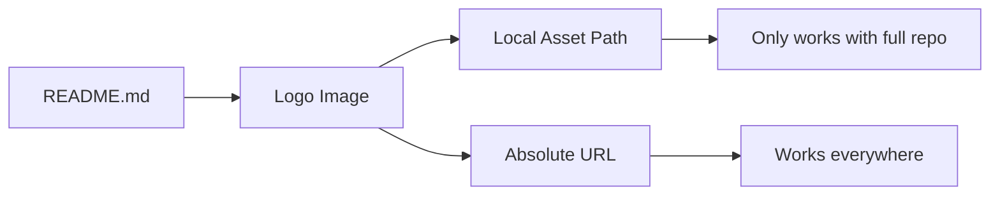

+++
title = "#21066 readme: use a logo url available from everywhere"
date = "2025-09-15T00:00:00"
draft = false
template = "pull_request_page.html"
in_search_index = false

[extra]
current_language = "zh-cn"
available_languages = {"en" = { name = "English", url = "/pull_request/bevy/2025-09/pr-21066-en-20250915" }, "zh-cn" = { name = "中文", url = "/pull_request/bevy/2025-09/pr-21066-zh-cn-20250915" }}
labels = ["C-Docs", "A-Meta"]
+++

# Title

## Basic Information
- **Title**: readme: use a logo url available from everywhere
- **PR Link**: https://github.com/bevyengine/bevy/pull/21066
- **Author**: mockersf
- **Status**: MERGED
- **Labels**: C-Docs, A-Meta, S-Ready-For-Final-Review
- **Created**: 2025-09-15T20:50:05Z
- **Merged**: 2025-09-15T21:38:27Z
- **Merged By**: alice-i-cecile

## Description Translation
# Objective

- README 中的 logo 仅在完整仓库和解析 markdown 链接时可用
- 例如，在 https://docs.rs/crate/bevy/0.16.1 上无法显示

## Solution

- 使用网站上的 URL

## The Story of This Pull Request

这个 PR 解决了一个看似简单但实际影响用户体验的问题：Bevy 项目 README 中的 logo 在某些第三方平台上无法正常显示。

问题的根源在于使用了相对路径引用 logo 资源。当用户在 GitHub 上查看 README 时，相对路径 `assets/branding/bevy_logo_light_dark_and_dimmed.svg` 能够正确解析，因为该文件确实存在于仓库的 assets 目录中。然而，当相同的 README 内容被渲染在其他平台上时（如 docs.rs 的 crate 文档页面），这些平台没有完整的仓库文件结构，相对路径就无法正确解析，导致 logo 显示为破损图像。

开发者 mockersf 识别到了这个问题，并提出了一个直接有效的解决方案：将相对路径替换为绝对 URL。通过使用 `https://bevy.org/assets/bevy_logo_light_dark_and_dimmed.svg`，无论 README 在何处被渲染，logo 都能从 Bevy 官方网站稳定加载。

这个修改虽然只有一行代码的变化，但体现了对用户体验细节的关注。在开源项目中，README 是项目的门面，确保在各种环境下都能正确显示品牌标识对于项目形象很重要。

从技术角度来看，这种修改是标准的做法。使用绝对 URL 而不是相对路径可以确保资源在任何上下文中都能正确加载，无论 Markdown 文件在何处被渲染。这种方法的唯一潜在缺点是依赖于外部服务的可用性，但对于 bevy.org 这样的项目官方网站来说，这种依赖是合理且可靠的。

## Visual Representation



## Key Files Changed

### `README.md` (+1/-1)

这个文件只进行了一行修改，将 logo 的引用从相对路径改为绝对 URL。

**修改前：**
```markdown
# [](https://bevy.org)
```

**修改后：**
```markdown
# [](https://bevy.org)
```

这个修改确保了 Bevy logo 在所有渲染 README 的环境中都能正确显示，包括 docs.rs 和其他第三方平台。

## Further Reading

- [Markdown Image Syntax](https://www.markdownguide.org/basic-syntax/#images-1)
- [Relative vs Absolute URLs](https://developer.mozilla.org/en-US/docs/Learn/Common_questions/Web_mechanics/What_is_a_URL#absolute_urls_vs_relative_urls)
- [docs.rs crate documentation](https://doc.rust-lang.org/cargo/reference/publishing.html#documentation)

# Full Code Diff
```diff
diff --git a/README.md b/README.md
index 73cc0e7a8d51c..ace4b5fd414d9 100644
--- a/README.md
+++ b/README.md
@@ -1,4 +1,4 @@
-# [](https://bevy.org)
+# [](https://bevy.org)
 
 [](https://github.com/bevyengine/bevy#license)
 [](https://crates.io/crates/bevy)
```