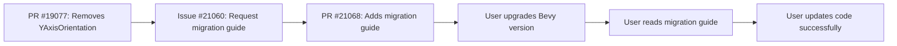

+++
title = "#21068 Add `YAxisOrientation` migration guide."
date = "2025-09-15T00:00:00"
draft = false
template = "pull_request_page.html"
in_search_index = true

[taxonomies]
list_display = ["show"]

[extra]
current_language = "en"
available_languages = {"en" = { name = "English", url = "/pull_request/bevy/2025-09/pr-21068-en-20250915" }, "zh-cn" = { name = "中文", url = "/pull_request/bevy/2025-09/pr-21068-zh-cn-20250915" }}
labels = ["C-Docs", "A-UI"]
+++

# Add `YAxisOrientation` migration guide

## Basic Information
- **Title**: Add `YAxisOrientation` migration guide.
- **PR Link**: https://github.com/bevyengine/bevy/pull/21068
- **Author**: ickshonpe
- **Status**: MERGED
- **Labels**: C-Docs, A-UI, S-Ready-For-Final-Review
- **Created**: 2025-09-15T21:56:17Z
- **Merged**: 2025-09-15T22:41:29Z
- **Merged By**: alice-i-cecile

## Description Translation
# Objective

`YAxisOrientation` migration guide

Fixes #21060

## The Story of This Pull Request

This PR addresses a documentation gap created by PR #19077, which removed the `YAxisOrientation` component from Bevy's text system. When components are removed from Bevy's public API, it's standard practice to provide migration guides that help users transition their code to the new approach.

The problem was straightforward: users upgrading from previous versions of Bevy would encounter compilation errors if they were using the removed `YAxisOrientation` component, and they needed clear guidance on how to adapt their code. The solution was to create a minimal but effective migration guide that explains both what changed and how users should update their projects.

The implementation consists of creating a new markdown file in Bevy's migration guides directory. The guide follows Bevy's standard migration guide format with frontmatter metadata linking to the original PR that introduced the change. The content is concise but complete, explaining that the component was removed and that the system now automatically handles y-axis orientation.

From a technical perspective, this change demonstrates Bevy's commitment to maintaining good developer experience during API transitions. The migration guide follows established patterns in the codebase and provides just enough information for users to understand both the change and the reasoning behind it.

The impact of this PR is improved upgrade experience for Bevy users. By providing clear migration guidance, the Bevy team reduces friction when users update to newer versions and helps prevent confusion about removed functionality.

## Visual Representation



## Key Files Changed

- `release-content/migration-guides/The_YAxisOrientation_component_has_been_removed` (+6/-0)

This is a new file created to document the removal of the `YAxisOrientation` component. The file follows Bevy's standard migration guide format:

```markdown
---
title: "`YAxisOrientation` has been removed"
pull_requests: [ 19077 ]
---

The `YAxisOrientation` component has been removed from `bevy_text`. The correct y-axis orientation is now chosen automatically by the text systems.
```

The frontmatter includes metadata linking to the original PR that removed the component, and the body provides a clear explanation of both the change and the new expected behavior.

## Further Reading

- [Bevy Migration Guides](https://github.com/bevyengine/bevy/tree/main/release-content/migration-guides) - Other examples of Bevy migration patterns
- [Semantic Versioning and Breaking Changes](https://semver.org/) - Understanding how API changes affect users
- [Bevy Text System Documentation](https://docs.rs/bevy_text/latest/bevy_text/) - Current text system implementation details

## Full Code Diff

```diff
diff --git a/release-content/migration-guides/The_YAxisOrientation_component_has_been_removed b/release-content/migration-guides/The_YAxisOrientation_component_has_been_removed
new file mode 100644
index 0000000000000..6e4df4739d8b1
--- /dev/null
+++ b/release-content/migration-guides/The_YAxisOrientation_component_has_been_removed
@@ -0,0 +1,6 @@
+---
+title: "`YAxisOrientation` has been removed"
+pull_requests: [ 19077 ]
+---
+
+The `YAxisOrientation` component has been removed from `bevy_text`. The correct y-axis orientation is now chosen automatically by the text systems.
```