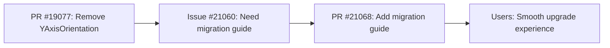

+++
title = "#21068 Add `YAxisOrientation` migration guide."
date = "2025-09-15T00:00:00"
draft = false
template = "pull_request_page.html"
in_search_index = false

[extra]
current_language = "zh-cn"
available_languages = {"en" = { name = "English", url = "/pull_request/bevy/2025-09/pr-21068-en-20250915" }, "zh-cn" = { name = "中文", url = "/pull_request/bevy/2025-09/pr-21068-zh-cn-20250915" }}
labels = ["C-Docs", "A-UI"]
+++

# Title
Add `YAxisOrientation` migration guide

## Basic Information
- **Title**: Add `YAxisOrientation` migration guide.
- **PR Link**: https://github.com/bevyengine/bevy/pull/21068
- **Author**: ickshonpe
- **Status**: MERGED
- **Labels**: C-Docs, A-UI, S-Ready-For-Review
- **Created**: 2025-09-15T21:56:17Z
- **Merged**: 2025-09-15T22:41:29Z
- **Merged By**: alice-i-cecile

## Description Translation
为 `YAxisOrientation` 添加迁移指南

修复 #21060

## The Story of This Pull Request

这是一个相对简单的文档更新PR，主要目的是为Bevy引擎中移除的`YAxisOrientation`组件提供迁移指南。该PR解决了issue #21060中提出的需求。

**问题背景**：在之前的PR #19077中，`YAxisOrientation`组件从`bevy_text`模块中被移除。这是一个破坏性变更（breaking change），意味着现有代码如果使用了这个组件，在升级后会出现编译错误。迁移指南的作用就是帮助开发者顺利过渡到新版本。

**解决方案**：开发者创建了一个新的迁移指南文档，明确告知用户：
1. `YAxisOrientation`组件已被移除
2. 现在Y轴方向由文本系统自动选择，无需手动配置

这种文档更新虽然代码量很小，但对于用户体验至关重要。它减少了升级过程中的困惑，让开发者能够快速了解如何调整他们的代码以适应新版本。

**技术实现**：迁移指南采用标准的Markdown格式，包含必要的元数据（标题、关联的PR编号）和简洁的说明文字。这种格式与其他Bevy迁移指南保持一致，确保了文档的一致性。

**影响**：这个简单的文档变更对代码库没有功能性影响，但显著改善了开发者体验。它帮助用户理解为什么他们的代码不再编译，以及如何修复问题，从而减少了升级到新版本的阻力。

## Visual Representation



## Key Files Changed

### `release-content/migration-guides/The_YAxisOrientation_component_has_been_removed` (+6/-0)

这是一个全新的迁移指南文件，提供了关于`YAxisOrientation`组件移除的重要信息。

```markdown
---
title: "`YAxisOrientation` has been removed"
pull_requests: [ 19077 ]
---

The `YAxisOrientation` component has been removed from `bevy_text`. The correct y-axis orientation is now chosen automatically by the text systems.
```

文件结构解析：
- Front matter部分定义了标题和关联的PR编号
- 正文部分明确说明了组件已被移除，并解释了新的自动选择机制
- 简洁明了，直接针对用户需要知道的信息

## Further Reading

对于想要了解更多关于Bevy迁移指南和版本升级最佳实践的开发者，可以查看：
- [Bevy官方迁移指南文档](https://bevyengine.org/learn/migration-guides/)
- [Semantic Versioning和Breaking Changes的最佳实践](https://semver.org/)
- [Bevy的UI系统文档](https://bevyengine.org/learn/book/getting-started/ui/)