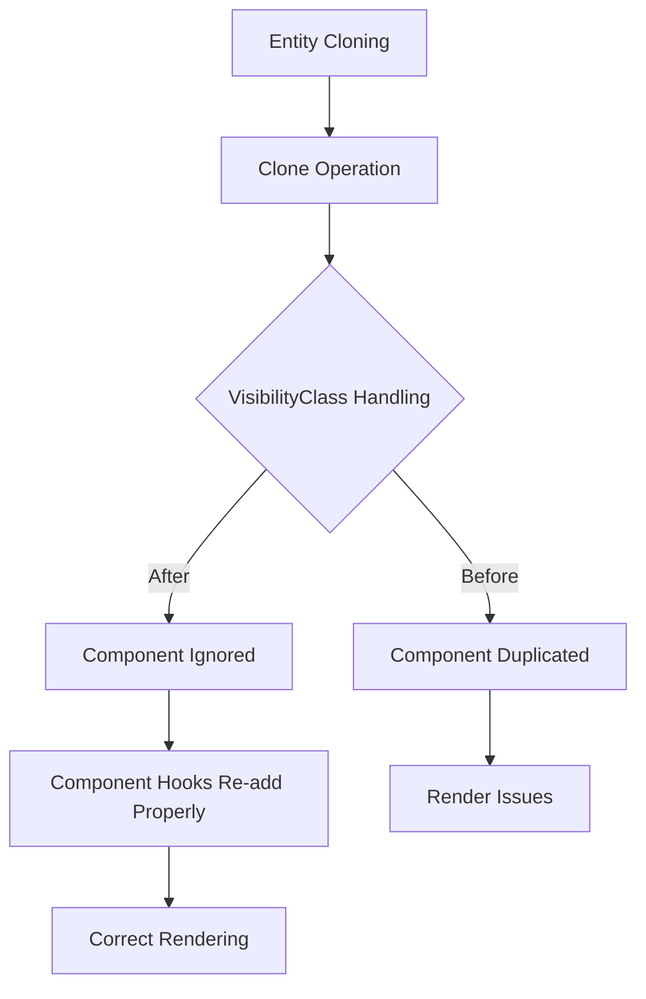

+++
title = "#21069 Guard against VisibilityClass being duplicated while cloning"
date = "2025-09-16T00:00:00"
draft = false
template = "pull_request_page.html"
in_search_index = true

[taxonomies]
list_display = ["show"]

[extra]
current_language = "en"
available_languages = {"en" = { name = "English", url = "/pull_request/bevy/2025-09/pr-21069-en-20250916" }, "zh-cn" = { name = "中文", url = "/pull_request/bevy/2025-09/pr-21069-zh-cn-20250916" }}
labels = ["C-Bug", "A-Rendering"]
+++

# Guard against VisibilityClass being duplicated while cloning

## Basic Information
- **Title**: Guard against VisibilityClass being duplicated while cloning
- **PR Link**: https://github.com/bevyengine/bevy/pull/21069
- **Author**: it-me-joda
- **Status**: MERGED
- **Labels**: C-Bug, A-Rendering, S-Ready-For-Final-Review
- **Created**: 2025-09-15T21:56:56Z
- **Merged**: 2025-09-16T16:56:06Z
- **Merged By**: alice-i-cecile

## Description Translation
# Objective

- This is the second attempt at "Fixes #20884" after conversation in #20891

## Solution

- I followed the approach discussed in #20891 to add `#[component(clone_behavior=Ignore)]` to avoid cloning this Component

## Testing

- I tested the change with a simple repro. I'm not sure if I can unit test just the existence of this line but I'll see if I can and update accordingly.

```rust
use bevy::{prelude::*, render::view::NoIndirectDrawing};
fn main() {
    App::new()
        .insert_resource(ClearColor(Color::BLACK))
        .add_plugins(DefaultPlugins)
        .add_systems(Startup, startup)
        .run();
}
fn startup(
    mut cmd: Commands,
    mut meshes: ResMut<Assets<Mesh>>,
    mut materials: ResMut<Assets<StandardMaterial>>,
    mut al: ResMut<AmbientLight>,
) {
    al.brightness = 5000.;
    cmd.spawn((
        Mesh3d(meshes.add(Cuboid::from_size(Vec3::new(4., 0.5, 0.1)))),
        MeshMaterial3d(materials.add(Color::srgb(1., 1., 0.))),
        Transform::from_xyz(0., 0., -2.),
    ));
    let mut id = cmd.spawn((
        Mesh3d(meshes.add(Cuboid::from_length(1.))),
        MeshMaterial3d(materials.add(Color::srgba(0., 0., 1., 0.5))),
        Transform::from_xyz(-0.5, 0., 0.),
    ));
    id.clone_and_spawn()
        .insert(Transform::from_xyz(0.5, 0., 0.));
    cmd.spawn((
        Camera3d::default(),
        Transform::from_xyz(0., 0., 10.).looking_at(Vec3::ZERO, Vec3::Y),
        NoIndirectDrawing,
    ));
}
```
## Showcase

Before


After


## The Story of This Pull Request

This PR addresses a specific bug in Bevy's rendering system where the `VisibilityClass` component was being incorrectly duplicated when entities were cloned. The `VisibilityClass` component tracks which renderable components an entity has and is automatically managed by Bevy's rendering system through component hooks.

The core issue was that when an entity with a `VisibilityClass` was cloned, the cloning operation would copy the `VisibilityClass` component to the new entity. This created a situation where both the original and cloned entities had the same `VisibilityClass`, but the rendering system expected each entity to have its own properly managed `VisibilityClass`.

The solution implemented here uses Bevy's component attribute system to specify that the `VisibilityClass` component should be ignored during cloning operations. This is achieved by adding the `#[component(clone_behavior=Ignore)]` attribute to the `VisibilityClass` component definition:

```rust
#[derive(Clone, Component, Default, Reflect, Deref, DerefMut)]
#[reflect(Component, Default, Clone)]
#[component(clone_behavior=Ignore)]
pub struct VisibilityClass(pub SmallVec<[TypeId; 1]>);
```

This approach ensures that when entities are cloned, the `VisibilityClass` component is not copied. Instead, the proper component hooks (like those on `Mesh3d` and `Mesh2d` components) will automatically add the correct `VisibilityClass` to the cloned entity when needed.

The PR also includes a comprehensive test that verifies this behavior works correctly:

```rust
#[test]
fn test_add_visibility_class_hook() {
    let mut world = World::new();
    let entity = world.spawn(TestVisibilityClassHook).id();
    let entity_clone = world.spawn_empty().id();
    world
        .entity_mut(entity)
        .clone_with_opt_out(entity_clone, |_| {});

    let entity_visibility_class = world.entity(entity).get::<VisibilityClass>().unwrap();
    assert_eq!(entity_visibility_class.len(), 1);

    let entity_clone_visibility_class =
        world.entity(entity_clone).get::<VisibilityClass>().unwrap();
    assert_eq!(entity_clone_visibility_class.len(), 1);
}
```

This test creates an entity with a test component that has a visibility class hook, clones it, and verifies that both entities have exactly one `VisibilityClass` component each, confirming that no duplication occurred.

The fix is minimal and targeted, addressing exactly the cloning behavior without affecting other aspects of the visibility system. It follows the approach discussed in the previous PR attempt (#20891) and represents a clean solution to the duplication problem.

## Visual Representation



## Key Files Changed

- `crates/bevy_camera/src/visibility/mod.rs` (+28/-0)

The main change adds the `clone_behavior=Ignore` attribute to prevent `VisibilityClass` duplication during entity cloning:

```rust
// Before:
#[derive(Clone, Component, Default, Reflect, Deref, DerefMut)]
#[reflect(Component, Default, Clone)]
pub struct VisibilityClass(pub SmallVec<[TypeId; 1]>);

// After:
#[derive(Clone, Component, Default, Reflect, Deref, DerefMut)]
#[reflect(Component, Default, Clone)]
#[component(clone_behavior=Ignore)]
pub struct VisibilityClass(pub SmallVec<[TypeId; 1]>);
```

Additionally, a test was added to verify the cloning behavior works correctly:

```rust
#[test]
fn test_add_visibility_class_hook() {
    // Test implementation that verifies VisibilityClass
    // is not duplicated during cloning operations
}
```

## Further Reading

- Bevy Component Attributes: https://bevyengine.org/learn/book/getting-started/ecs/#component-attributes
- Bevy Visibility System: https://bevyengine.org/learn/book/getting-started/rendering/#visibility
- Previous PR Discussion: #20891
- Original Issue: #20884

# Full Code Diff
```diff
diff --git a/crates/bevy_camera/src/visibility/mod.rs b/crates/bevy_camera/src/visibility/mod.rs
index 8ac0ea4fe565d..c4e313428a9c6 100644
--- a/crates/bevy_camera/src/visibility/mod.rs
+++ b/crates/bevy_camera/src/visibility/mod.rs
@@ -150,11 +150,16 @@ impl InheritedVisibility {
 /// When adding a new renderable component, you'll typically want to write an
 /// add-component hook that adds the type ID of that component to the
 /// [`VisibilityClass`] array. See `custom_phase_item` for an example.
+///
+/// `VisibilityClass` is automatically added by a hook on the `Mesh3d` and
+/// `Mesh2d` components. To avoid duplicating the `VisibilityClass` and
+/// causing issues when cloning, we use `#[component(clone_behavior=Ignore)]`
 //
 // Note: This can't be a `ComponentId` because the visibility classes are copied
 // into the render world, and component IDs are per-world.
 #[derive(Clone, Component, Default, Reflect, Deref, DerefMut)]
 #[reflect(Component, Default, Clone)]
+#[component(clone_behavior=Ignore)]
 pub struct VisibilityClass(pub SmallVec<[TypeId; 1]>);
 
 /// Algorithmically-computed indication of whether an entity is visible and should be extracted for rendering.
@@ -988,4 +993,27 @@ mod test {
         assert_eq!(1, size_of::<Visibility>());
         assert_eq!(1, size_of::<Option<Visibility>>());
     }
+
+    #[derive(Component, Default, Clone, Reflect)]
+    #[require(VisibilityClass)]
+    #[reflect(Component, Default, Clone)]
+    #[component(on_add = add_visibility_class::<Self>)]
+    struct TestVisibilityClassHook;
+
+    #[test]
+    fn test_add_visibility_class_hook() {
+        let mut world = World::new();
+        let entity = world.spawn(TestVisibilityClassHook).id();
+        let entity_clone = world.spawn_empty().id();
+        world
+            .entity_mut(entity)
+            .clone_with_opt_out(entity_clone, |_| {});
+
+        let entity_visibility_class = world.entity(entity).get::<VisibilityClass>().unwrap();
+        assert_eq!(entity_visibility_class.len(), 1);
+
+        let entity_clone_visibility_class =
+            world.entity(entity_clone).get::<VisibilityClass>().unwrap();
+        assert_eq!(entity_clone_visibility_class.len(), 1);
+    }
 }
```