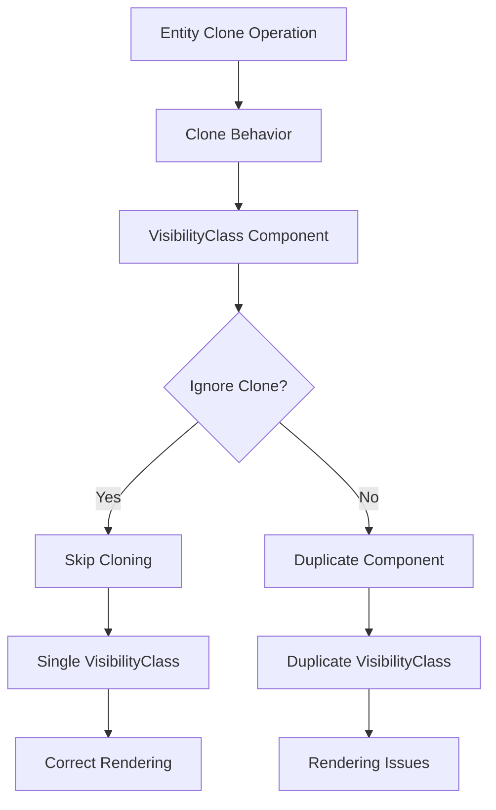

+++
title = "#21069 Guard against VisibilityClass being duplicated while cloning"
date = "2025-09-16T00:00:00"
draft = false
template = "pull_request_page.html"
in_search_index = false

[extra]
current_language = "zh-cn"
available_languages = {"en" = { name = "English", url = "/pull_request/bevy/2025-09/pr-21069-en-20250916" }, "zh-cn" = { name = "中文", url = "/pull_request/bevy/2025-09/pr-21069-zh-cn-20250916" }}
+++

# Guard against VisibilityClass being duplicated while cloning

## 基本信息
- **标题**: Guard against VisibilityClass being duplicated while cloning
- **PR链接**: https://github.com/bevyengine/bevy/pull/21069
- **作者**: it-me-joda
- **状态**: 已合并
- **标签**: C-Bug, A-Rendering, S-Ready-For-Final-Review
- **创建时间**: 2025-09-15T21:56:56Z
- **合并时间**: 2025-09-16T16:56:06Z
- **合并人**: alice-i-cecile

## 描述翻译
# Objective (目标)

- 这是在 #20891 中讨论后的第二次尝试，用于"修复 #20884"

## Solution (解决方案)

- 我按照 #20891 中讨论的方法，添加了 `#[component(clone_behavior=Ignore)]` 来避免克隆这个组件

## Testing (测试)

- 我使用一个简单的重现案例测试了这个更改。我不确定是否可以仅单元测试这一行的存在，但我会看看是否可能并相应更新。

```rust
use bevy::{prelude::*, render::view::NoIndirectDrawing};
fn main() {
    App::new()
        .insert_resource(ClearColor(Color::BLACK))
        .add_plugins(DefaultPlugins)
        .add_systems(Startup, startup)
        .run();
}
fn startup(
    mut cmd: Commands,
    mut meshes: ResMut<Assets<Mesh>>,
    mut materials: ResMut<Assets<StandardMaterial>>,
    mut al: ResMut<AmbientLight>,
) {
    al.brightness = 5000.;
    cmd.spawn((
        Mesh3d(meshes.add(Cuboid::from_size(Vec3::new(4., 0.5, 0.1)))),
        MeshMaterial3d(materials.add(Color::srgb(1., 1., 0.))),
        Transform::from_xyz(0., 0., -2.),
    ));
    let mut id = cmd.spawn((
        Mesh3d(meshes.add(Cuboid::from_length(1.))),
        MeshMaterial3d(materials.add(Color::srgba(0., 0., 1., 0.5))),
        Transform::from_xyz(-0.5, 0., 0.),
    ));
    id.clone_and_spawn()
        .insert(Transform::from_xyz(0.5, 0., 0.));
    cmd.spawn((
        Camera3d::default(),
        Transform::from_xyz(0., 0., 10.).looking_at(Vec3::ZERO, Vec3::Y),
        NoIndirectDrawing,
    ));
}
```
## Showcase (效果展示)

Before (修复前)


After (修复后)


## 这个PR的故事

这个PR解决了一个在Bevy渲染系统中出现的VisibilityClass组件重复克隆的问题。问题的核心在于，当实体被克隆时，VisibilityClass组件会被不必要地复制，导致渲染系统出现异常行为。

VisibilityClass是一个关键组件，用于管理渲染可见性分类。它包含了类型ID的小型数组，用于标识哪些组件类型应该参与可见性计算。问题出现在当实体通过`clone_and_spawn()`方法克隆时，系统会尝试复制所有组件，包括VisibilityClass。

在修复前的代码中，克隆操作会导致VisibilityClass被重复添加。这是因为Mesh3d和Mesh2d组件会自动添加VisibilityClass，而克隆操作又会复制已有的VisibilityClass，造成重复。这种重复会导致渲染系统无法正确处理可见性，从而产生视觉上的异常。

解决方案相当直接：在VisibilityClass组件定义上添加`#[component(clone_behavior=Ignore)]`属性。这个属性告诉Bevy的ECS系统在克隆实体时忽略这个组件，不进行复制。这样，新实体只会获得通过组件钩子自动添加的VisibilityClass，而不会出现重复。

从技术实现角度看，这个修复利用了Bevy的组件系统提供的克隆行为控制机制。`clone_behavior=Ignore`是一个强大的工具，可以精确控制哪些组件应该在克隆时被保留或忽略。在这种情况下，由于VisibilityClass是通过组件钩子自动管理的，手动复制它反而会造成问题。

为了验证修复效果，作者添加了一个单元测试`test_add_visibility_class_hook()`。这个测试创建了一个带有TestVisibilityClassHook组件的实体，然后克隆它，最后验证原实体和克隆实体都只有一个VisibilityClass组件，而不是两个。

这个修复的影响是显著的：它确保了渲染系统的可见性计算能够正常工作，避免了因组件重复导致的渲染错误。从提供的效果对比图可以看出，修复后透明物体的渲染效果更加准确和一致。

从架构角度看，这个解决方案保持了代码的简洁性，没有引入复杂的逻辑或额外的系统。它只是告诉现有的克隆机制如何正确处理这个特定的组件。

## 可视化表示



## 关键文件更改

- `crates/bevy_camera/src/visibility/mod.rs` (+28/-0)

这个文件包含了VisibilityClass组件的定义和相关的测试代码。主要更改包括：

1. 在VisibilityClass组件上添加了`#[component(clone_behavior=Ignore)]`属性
2. 添加了详细的注释说明为什么需要忽略克隆行为
3. 添加了单元测试来验证修复效果

关键代码更改：

```rust
// 在VisibilityClass定义前添加了注释说明
/// `VisibilityClass` is automatically added by a hook on the `Mesh3d` and
/// `Mesh2d` components. To avoid duplicating the `VisibilityClass` and
/// causing issues when cloning, we use `#[component(clone_behavior=Ignore)]`

// 在组件定义中添加了clone_behavior属性
#[derive(Clone, Component, Default, Reflect, Deref, DerefMut)]
#[reflect(Component, Default, Clone)]
#[component(clone_behavior=Ignore)]
pub struct VisibilityClass(pub SmallVec<[TypeId; 1]>);
```

```rust
// 添加了单元测试验证修复
#[test]
fn test_add_visibility_class_hook() {
    let mut world = World::new();
    let entity = world.spawn(TestVisibilityClassHook).id();
    let entity_clone = world.spawn_empty().id();
    world
        .entity_mut(entity)
        .clone_with_opt_out(entity_clone, |_| {});

    let entity_visibility_class = world.entity(entity).get::<VisibilityClass>().unwrap();
    assert_eq!(entity_visibility_class.len(), 1);

    let entity_clone_visibility_class =
        world.entity(entity_clone).get::<VisibilityClass>().unwrap();
    assert_eq!(entity_clone_visibility_class.len(), 1);
}
```

## 进一步阅读

- [Bevy ECS Component Documentation](https://docs.rs/bevy_ecs/latest/bevy_ecs/component/trait.Component.html)
- [Bevy Visibility System](https://github.com/bevyengine/bevy/blob/main/crates/bevy_camera/src/visibility/mod.rs)
- [Component Hooks in Bevy](https://docs.rs/bevy_ecs/latest/bevy_ecs/component/trait.ComponentHooks.html)
- [Original Issue #20884](https://github.com/bevyengine/bevy/issues/20884)
- [Discussion in #20891](https://github.com/bevyengine/bevy/pull/20891)