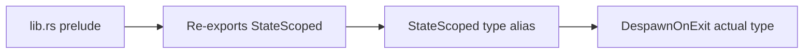

+++
title = "#21070 Add StateScoped as deprecated type alias"
date = "2025-09-15T00:00:00"
draft = false
template = "pull_request_page.html"
in_search_index = true

[taxonomies]
list_display = ["show"]

[extra]
current_language = "en"
available_languages = {"en" = { name = "English", url = "/pull_request/bevy/2025-09/pr-21070-en-20250915" }, "zh-cn" = { name = "中文", url = "/pull_request/bevy/2025-09/pr-21070-zh-cn-20250915" }}
labels = ["D-Trivial", "C-Usability", "A-States"]
+++

# Add StateScoped as deprecated type alias

## Basic Information
- **Title**: Add StateScoped as deprecated type alias
- **PR Link**: https://github.com/bevyengine/bevy/pull/21070
- **Author**: alice-i-cecile
- **Status**: MERGED
- **Labels**: D-Trivial, C-Usability, S-Ready-For-Final-Review, A-States
- **Created**: 2025-09-15T22:42:17Z
- **Merged**: 2025-09-15T23:25:56Z
- **Merged By**: alice-i-cecile

## Description Translation
# Objective

- Make migration easier.
- Fixes #21035.

## Solution

- Add a deprecated type alias to help with the rename, rather than immediately renaming.
- Remember to re-export it in the prelude too to reduce compiler errors.

## The Story of This Pull Request

This PR addresses a straightforward but important migration problem in the Bevy engine's state system. The core issue was that the `StateScoped` type was being renamed to `DespawnOnExit`, which would break existing codebases that hadn't yet migrated to the new naming convention.

The problem emerged from issue #21035, where users needed a smoother transition path when updating their code. Instead of forcing an immediate breaking change, the solution implements a standard deprecation pattern: creating a type alias that maintains backward compatibility while encouraging migration to the new naming.

The implementation follows established patterns for deprecating types in Rust. The key insight was that simply adding a deprecated type alias would allow existing code to continue working while providing clear migration guidance through compiler warnings. This approach balances the need for API evolution with developer experience, ensuring that users aren't faced with sudden breaking changes.

The technical implementation involved two coordinated changes. First, a type alias was added to the `state_scoped` module that maps `StateScoped` to `DespawnOnExit` with appropriate deprecation attributes. Second, this deprecated alias was re-exported in the prelude module to maintain visibility and reduce compiler errors during the transition period.

The use of the `#[expect(deprecated)]` attribute in the prelude re-export is particularly noteworthy. This suppresses warnings for the intentional deprecation within Bevy's own codebase while still allowing user code to see the deprecation warnings. This demonstrates careful consideration of both internal and external developer experience.

This change follows semantic versioning practices by marking the deprecation with the version number (0.17.0) when the change will take effect, giving users clear timing for when they need to complete their migration.

## Visual Representation



## Key Files Changed

### `crates/bevy_state/src/state_scoped.rs` (+4/-0)
Added a deprecated type alias to maintain backward compatibility during the rename from `StateScoped` to `DespawnOnExit`.

```rust
/// A deprecated alias for [`DespawnOnExit`].
#[deprecated(since = "0.17.0", note = "use DespawnOnExit instead")]
pub type StateScoped<S> = DespawnOnExit<S>;
```

### `crates/bevy_state/src/lib.rs` (+7/-0)
Re-exported the deprecated type alias in the prelude module to maintain visibility and reduce compiler errors during migration.

```rust
#[doc(hidden)]
#[expect(
    deprecated,
    reason = "Temporarily re-exporting deprecated type for transition"
)]
pub use crate::state_scoped::StateScoped;
```

## Further Reading

- Rust Deprecation Attributes: https://doc.rust-lang.org/reference/attributes/diagnostics.html#the-deprecated-attribute
- Semantic Versioning: https://semver.org/
- Bevy States Documentation: https://bevyengine.org/learn/books/introduction/states