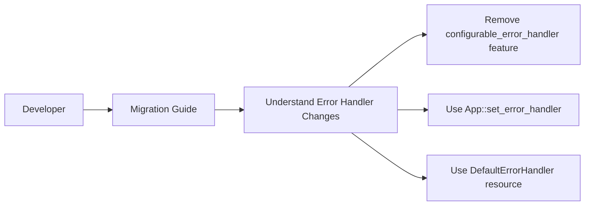

+++
title = "#21071 Improve migration guide for changes to the default error handler"
date = "2025-09-15T00:00:00"
draft = false
template = "pull_request_page.html"
in_search_index = true

[taxonomies]
list_display = ["show"]

[extra]
current_language = "en"
available_languages = {"en" = { name = "English", url = "/pull_request/bevy/2025-09/pr-21071-en-20250915" }, "zh-cn" = { name = "中文", url = "/pull_request/bevy/2025-09/pr-21071-zh-cn-20250915" }}
labels = ["C-Docs", "D-Trivial", "A-ECS"]
+++

# Improve migration guide for changes to the default error handler

## Basic Information
- **Title**: Improve migration guide for changes to the default error handler
- **PR Link**: https://github.com/bevyengine/bevy/pull/21071
- **Author**: alice-i-cecile
- **Status**: MERGED
- **Labels**: C-Docs, D-Trivial, A-ECS, S-Ready-For-Final-Review
- **Created**: 2025-09-15T22:49:01Z
- **Merged**: 2025-09-15T23:38:45Z
- **Merged By**: alice-i-cecile

## Description Translation
The original description is in English, so it's included as-is:

# Objective

- The removed feature was not mention
- The writing was a bit wonky otherwise
- Fixes #21042

## Solution

- Mention the feature and rationale explicitly, to aid in lazy CTRL+F migration
- Improve the wording on the rest of the note.

## The Story of This Pull Request

This PR addresses a documentation gap in Bevy's migration guide related to error handling changes. The core issue was that a significant architectural change - the removal of the `configurable_error_handler` feature - wasn't properly documented in the migration guide, leaving developers without clear guidance on how to adapt their code.

The problem emerged when Bevy's error handling system underwent optimization. The performance overhead was reduced to the point where the error handler could be always enabled, making the `configurable_error_handler` feature flag unnecessary. However, this removal wasn't mentioned in the migration guide, creating confusion for developers who might be searching for this feature or encountering related compilation errors.

The solution approach was straightforward: update the migration guide with clear, actionable information. The author added explicit mention of the removed feature and provided the necessary context about why it was removed (performance improvements making it always enabled). The wording was also improved throughout the section for better clarity.

From a technical perspective, this change is important because migration guides serve as critical documentation for developers upgrading between Bevy versions. Missing information about removed features can lead to frustration and wasted debugging time. The explicit mention of the removed feature flag helps developers who might be searching for it (using CTRL+F) to quickly understand what happened and how to proceed.

The implementation consists of clear, concise documentation changes that:
1. Explain the performance improvements that enabled always-on error handling
2. Explicitly state that the `configurable_error_handler` feature no longer exists
3. Provide clear migration instructions for both App-owned worlds and independent worlds
4. Improve the overall readability and flow of the migration guide

These changes ensure developers have all the necessary information to successfully migrate their code when encountering error handling-related issues during Bevy version upgrades.

## Visual Representation



## Key Files Changed

**File**: `release-content/migration-guides/per-world-error-handler.md`

**Changes**: Updated the migration guide to explicitly mention the removed `configurable_error_handler` feature and improved the overall wording and structure.

**Before**:
```markdown
Worlds can now have different default error handlers, so there no longer is a global handler.

Replace uses of `GLOBAL_ERROR_HANDLER` with `App`'s `.set_error_handler(handler)`.
For worlds that do not directly belong to an `App`/`SubApp`,
insert the `DefaultErrorHandler(handler)` resource.
```

**After**:
```markdown
We've improved the implementation of Bevy's default error handling.
The performance overhead has been reduced, and as a result it is always enabled.
The `configurable_error_handler` feature no longer exists: simply remove it from your list of enabled features.

Additionally, worlds can now have different default error handlers, so there is no longer a truly global handler.

Replace uses of `GLOBAL_ERROR_HANDLER` with `App::set_error_handler(handler)`.
For worlds that do not directly belong to an `App`/`SubApp`,
insert the `DefaultErrorHandler(handler)` resource.
```

## Further Reading

- [Bevy Error Handling Documentation](https://bevyengine.org/learn/errors/)
- [Bevy Migration Guides](https://bevyengine.org/learn/migration-guides/)
- [GitHub Issue #21042](https://github.com/bevyengine/bevy/issues/21042) - The original issue that prompted this documentation improvement