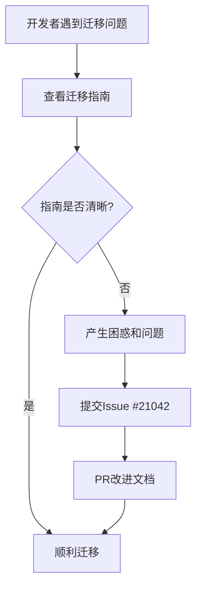

+++
title = "#21071 Improve migration guide for changes to the default error handler"
date = "2025-09-15T00:00:00"
draft = false
template = "pull_request_page.html"
in_search_index = false

[extra]
current_language = "zh-cn"
available_languages = {"en" = { name = "English", url = "/pull_request/bevy/2025-09/pr-21071-en-20250915" }, "zh-cn" = { name = "中文", url = "/pull_request/bevy/2025-09/pr-21071-zh-cn-20250915" }}
+++

# Improve migration guide for changes to the default error handler

## 基本信息
- **标题**: Improve migration guide for changes to the default error handler
- **PR链接**: https://github.com/bevyengine/bevy/pull/21071
- **作者**: alice-i-cecile
- **状态**: 已合并
- **标签**: C-Docs, D-Trivial, A-ECS, S-Ready-For-Final-Review
- **创建时间**: 2025-09-15T22:49:01Z
- **合并时间**: 2025-09-15T23:38:45Z
- **合并者**: alice-i-cecile

## 描述翻译
### 目标
- 被移除的功能没有被提及
- 其他部分的表述有些别扭
- 修复 #21042

### 解决方案
- 明确提及功能和理由，以便通过CTRL+F进行快速迁移
- 改进注释中其余部分的措辞

## 这个PR的故事

这个PR解决了一个看似简单但实际重要的文档问题。当Bevy引擎对错误处理机制进行重大改进时，原有的迁移指南没有充分说明被移除的功能，这给开发者升级版本带来了困惑。

问题的核心在于：Bevy团队优化了默认错误处理器的实现，减少了性能开销，因此现在默认始终启用。这意味着之前存在的`configurable_error_handler`功能标志被完全移除了。然而，原有的迁移文档没有明确提及这一变化，开发者可能会在代码中保留不再需要的特性标志，或者无法理解为什么相关的API发生了变化。

从技术角度来看，这个修改涉及两个关键变化：
1. 性能优化使得错误处理始终启用，不再需要可配置的开关
2. 错误处理机制从全局单例改为每个World（世界）独立的处理器

开发者alice-i-cecile采取了直接有效的解决方案：明确说明被移除的功能和背后的理由，同时改进文档的整体可读性。这种改进特别考虑了开发者常见的"懒惰迁移"模式——通过CTRL+F搜索关键术语来快速了解需要做的更改。

修改后的文档现在清晰说明了：
- `configurable_error_handler`特性已不存在，应该从特性列表中移除
- 性能改进是这一变化的主要原因
- 提供了具体的迁移指导：用`App::set_error_handler(handler)`替换`GLOBAL_ERROR_HANDLER`

这种文档改进虽然代码改动量很小，但对用户体验影响很大。清晰的迁移指南能够显著减少开发者升级版本时的困惑和错误，提高整个生态系统的升级效率。

## 视觉表示



## 关键文件更改

### `release-content/migration-guides/per-world-error-handler.md` (+6/-2)

这个文件是Bevy迁移指南的一部分，专门说明每个World错误处理器的变更。修改目的是提供更清晰、更完整的迁移指导。

**修改前:**
```markdown
Worlds can now have different default error handlers, so there no longer is a global handler.

Replace uses of `GLOBAL_ERROR_HANDLER` with `App`'s `.set_error_handler(handler)`.
For worlds that do not directly belong to an `App`/`SubApp`,
insert the `DefaultErrorHandler(handler)` resource.
```

**修改后:**
```markdown
We've improved the implementation of Bevy's default error handling.
The performance overhead has been reduced, and as a result it is always enabled.
The `configurable_error_handler` feature no longer exists: simply remove it from your list of enabled features.

Additionally, worlds can now have different default error handlers, so there is no longer a truly global handler.

Replace uses of `GLOBAL_ERROR_HANDLER` with `App::set_error_handler(handler)`.
For worlds that do not directly belong to an `App`/`SubApp`,
insert the `DefaultErrorHandler(handler)` resource.
```

主要改进包括：
1. 明确说明了性能改进和始终启用的原因
2. 明确提及`configurable_error_handler`特性已被移除
3. 改进了API方法的引用格式（`App::set_error_handler`）
4. 调整了语句结构，使表述更加清晰

## 延伸阅读

- [Bevy错误处理文档](https://bevyengine.org/learn/errors/)
- [Rust错误处理最佳实践](https://doc.rust-lang.org/book/ch09-00-error-handling.html)
- [Bevy迁移指南概述](https://bevyengine.org/learn/migration-guides/)
- [GitHub Issue #21042](https://github.com/bevyengine/bevy/issues/21042) - 原始问题报告

## 完整代码差异
```diff
diff --git a/release-content/migration-guides/per-world-error-handler.md b/release-content/migration-guides/per-world-error-handler.md
index c9a1f1dd8ee77..3565886df14ff 100644
--- a/release-content/migration-guides/per-world-error-handler.md
+++ b/release-content/migration-guides/per-world-error-handler.md
@@ -3,8 +3,12 @@ title: Changes to the default error handler mechanism
 pull_requests: [18810]
 ---
 
-Worlds can now have different default error handlers, so there no longer is a global handler.
+We've improved the implementation of Bevy's default error handling.
+The performance overhead has been reduced, and as a result it is always enabled.
+The `configurable_error_handler` feature no longer exists: simply remove it from your list of enabled features.
 
-Replace uses of `GLOBAL_ERROR_HANDLER` with `App`'s `.set_error_handler(handler)`.
+Additionally, worlds can now have different default error handlers, so there is no longer a truly global handler.
+
+Replace uses of `GLOBAL_ERROR_HANDLER` with `App::set_error_handler(handler)`.
 For worlds that do not directly belong to an `App`/`SubApp`,
 insert the `DefaultErrorHandler(handler)` resource.
```