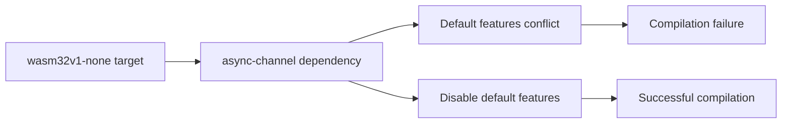

+++
title = "#21076 fix `wasm32v1-none` compiling with --no-default-features"
date = "2025-09-17T00:00:00"
draft = false
template = "pull_request_page.html"
in_search_index = true

[taxonomies]
list_display = ["show"]

[extra]
current_language = "en"
available_languages = {"en" = { name = "English", url = "/pull_request/bevy/2025-09/pr-21076-en-20250917" }, "zh-cn" = { name = "中文", url = "/pull_request/bevy/2025-09/pr-21076-zh-cn-20250917" }}
labels = ["C-Bug", "A-Build-System"]
+++

# fix `wasm32v1-none` compiling with --no-default-features

## Basic Information
- **Title**: fix `wasm32v1-none` compiling with --no-default-features
- **PR Link**: https://github.com/bevyengine/bevy/pull/21076
- **Author**: janis-bhm
- **Status**: MERGED
- **Labels**: C-Bug, A-Build-System, S-Ready-For-Final-Review, P-Compile-Failure
- **Created**: 2025-09-16T00:02:01Z
- **Merged**: 2025-09-17T21:21:51Z
- **Merged By**: alice-i-cecile

## Description Translation
# Objective

Fixes #21006

## Solution
disable default features for wasm32 arch dependency on `async-channel`

## The Story of This Pull Request

The issue began when users attempted to compile Bevy for the `wasm32v1-none` target without default features. This configuration failed to build due to a dependency conflict in the `async-channel` crate. The problem was specific to WebAssembly targets where certain default features of `async-channel` weren't compatible with the constrained environment.

The root cause was that `async-channel`'s default features included functionality that relied on system APIs unavailable in the wasm32 environment, particularly when compiling without default features. This created a dependency chain that pulled in incompatible code paths during compilation.

The solution was straightforward and surgical: disable the default features for the `async-channel` dependency specifically for wasm32 targets. This approach ensures that only the minimal necessary functionality from `async-channel` is included when targeting WebAssembly, avoiding the incompatible code paths while maintaining the required channel functionality for async task execution.

The implementation involved a single-line change in the Cargo.toml file, modifying the dependency declaration from a simple version string to a more detailed specification that explicitly disables default features. This change demonstrates a common pattern in Rust dependency management where target-specific feature configuration is necessary for cross-platform compatibility.

From an engineering perspective, this fix highlights the importance of carefully managing dependency features across different target architectures. The WebAssembly environment has unique constraints that require explicit feature control, and this change follows established best practices for Rust-WASM development.

The impact is significant for developers targeting WebAssembly with minimal feature sets - they can now successfully compile Bevy projects for `wasm32v1-none` without default features enabled. This maintains Bevy's cross-platform compatibility while addressing a specific compilation barrier for WebAssembly deployments.

## Visual Representation



## Key Files Changed

**crates/bevy_tasks/Cargo.toml** (+1/-1)
This file contains the dependency configuration for Bevy's task system. The change modifies how the async-channel dependency is configured for WebAssembly targets.

**Before:**
```toml
[target.'cfg(target_arch = "wasm32")'.dependencies]
pin-project = "1"
async-channel = "2.3.0"
```

**After:**
```toml
[target.'cfg(target_arch = "wasm32")'.dependencies]
pin-project = "1"
async-channel = { version = "2.3.0", default-features = false }
```

The change adds `default-features = false` to the async-channel dependency specification for wasm32 targets, preventing the inclusion of incompatible default features when compiling for WebAssembly without default features.

## Further Reading

- [Cargo Target-specific dependencies documentation](https://doc.rust-lang.org/cargo/reference/specifying-dependencies.html#target-specific-dependencies)
- [The Rust WebAssembly Working Group](https://rustwasm.github.io/)
- [Async-channel crate documentation](https://docs.rs/async-channel/latest/async_channel/)
- [Bevy WebAssembly development guide](https://bevyengine.org/learn/books/introduction/platform-specifics/web/)