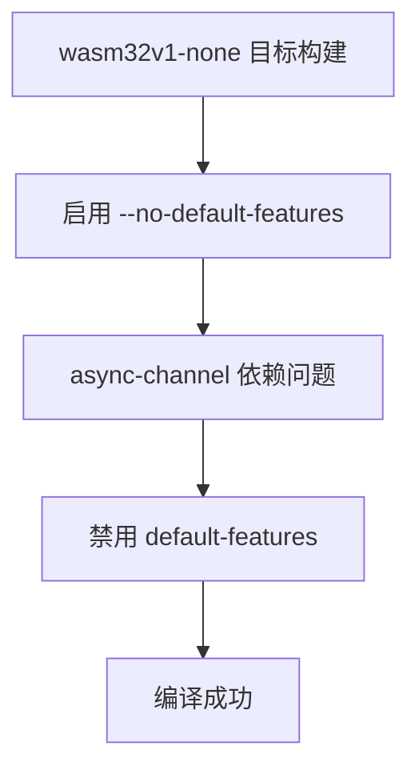

+++
title = "#21076 fix `wasm32v1-none` compiling with --no-default-features"
date = "2025-09-17T00:00:00"
draft = false
template = "pull_request_page.html"
in_search_index = false

[extra]
current_language = "zh-cn"
available_languages = {"en" = { name = "English", url = "/pull_request/bevy/2025-09/pr-21076-en-20250917" }, "zh-cn" = { name = "中文", url = "/pull_request/bevy/2025-09/pr-21076-zh-cn-20250917" }}
labels = ["C-Bug", "A-Build-System"]
+++

# Title

## Basic Information
- **Title**: fix `wasm32v1-none` compiling with --no-default-features
- **PR Link**: https://github.com/bevyengine/bevy/pull/21076
- **Author**: janis-bhm
- **Status**: MERGED
- **Labels**: C-Bug, A-Build-System, S-Ready-For-Final-Review, P-Compile-Failure
- **Created**: 2025-09-16T00:02:01Z
- **Merged**: 2025-09-17T21:21:51Z
- **Merged By**: alice-i-cecile

## Description Translation
# 目标

修复 #21006

## 解决方案
对 wasm32 架构的依赖项 `async-channel` 禁用默认特性

## The Story of This Pull Request

这个 PR 解决了一个特定的编译问题：当针对 `wasm32v1-none` 目标编译 Bevy 且使用 `--no-default-features` 标志时出现的编译失败。

问题的根源在于 `async-channel` crate 的默认特性包含了标准库（std）依赖。在 `wasm32v1-none` 这样的裸机（bare-metal）wasm 目标上，标准库通常不可用，因此需要禁用默认特性来确保编译成功。

开发者采用了直接且有效的解决方案：修改 `async-channel` 的依赖声明，明确禁用其默认特性。这个修改只针对 wasm32 架构，通过条件编译实现：

```toml
[target.'cfg(target_arch = "wasm32")'.dependencies]
async-channel = { version = "2.3.0", default-features = false }
```

这种解决方案体现了对 Rust 条件编译和特性管理的深入理解。通过精确地定位问题并实施最小化的修改，开发者确保了：
1. 只有 wasm32 目标受到影响
2. 现有的其他平台构建保持不变
3. 解决方案简洁且易于维护

从工程角度来看，这个修复展示了如何处理跨平台编译时的依赖特性管理问题。在嵌入式或 wasm 环境中，正确处理默认特性对于确保代码能够在资源受限或无标准库的环境中编译至关重要。

## Visual Representation



## Key Files Changed

### `crates/bevy_tasks/Cargo.toml` (+1/-1)

这个文件包含了 Bevy 任务系统的依赖配置。修改确保了在 wasm32 架构下，`async-channel` 依赖不会启用其默认特性，从而避免了标准库依赖问题。

**变更前：**
```toml
[target.'cfg(target_arch = "wasm32")'.dependencies]
async-channel = "2.3.0"
```

**变更后：**
```toml
[target.'cfg(target_arch = "wasm32")'.dependencies]
async-channel = { version = "2.3.0", default-features = false }
```

这个修改直接解决了 #21006 中报告的编译问题，确保了 wasm32 目标在使用 `--no-default-features` 时能够成功编译。

## Further Reading

- [Rust Cargo 特性文档](https://doc.rust-lang.org/cargo/reference/features.html)
- [Rust 条件编译](https://doc.rust-lang.org/reference/conditional-compilation.html)
- [Wasm 目标支持](https://rust-lang.github.io/rustup/cross-compilation.html)
- [async-channel crate 文档](https://docs.rs/async-channel/latest/async_channel/)

# Full Code Diff
```
diff --git a/crates/bevy_tasks/Cargo.toml b/crates/bevy_tasks/Cargo.toml
index 7974e0c82cb23..32cdc9ff9e906 100644
--- a/crates/bevy_tasks/Cargo.toml
+++ b/crates/bevy_tasks/Cargo.toml
@@ -55,7 +55,7 @@ crossbeam-queue = { version = "0.3", default-features = false, features = [
 
 [target.'cfg(target_arch = "wasm32")'.dependencies]
 pin-project = "1"
-async-channel = "2.3.0"
+async-channel = { version = "2.3.0", default-features = false }
 
 [target.'cfg(not(all(target_has_atomic = "8", target_has_atomic = "16", target_has_atomic = "32", target_has_atomic = "64", target_has_atomic = "ptr")))'.dependencies]
 async-task = { version = "4.4.0", default-features = false, features = [
```