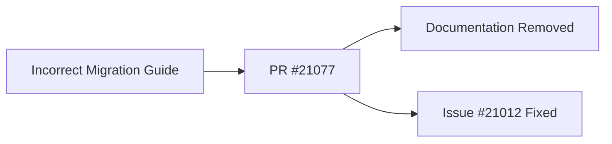

+++
title = "#21077 Remove unneeded migration guide"
date = "2025-09-16T00:00:00"
draft = false
template = "pull_request_page.html"
in_search_index = true

[taxonomies]
list_display = ["show"]

[extra]
current_language = "en"
available_languages = {"en" = { name = "English", url = "/pull_request/bevy/2025-09/pr-21077-en-20250916" }, "zh-cn" = { name = "中文", url = "/pull_request/bevy/2025-09/pr-21077-zh-cn-20250916" }}
labels = ["C-Docs", "D-Trivial", "A-UI"]
+++

# Remove unneeded migration guide

## Basic Information
- **Title**: Remove unneeded migration guide
- **PR Link**: https://github.com/bevyengine/bevy/pull/21077
- **Author**: alice-i-cecile
- **Status**: MERGED
- **Labels**: C-Docs, D-Trivial, A-UI, S-Needs-Review
- **Created**: 2025-09-16T00:16:39Z
- **Merged**: 2025-09-16T02:21:21Z
- **Merged By**: james7132

## Description Translation
# Objective

- This migration guide is for a method that didn't exist in Bevy 0.16.
- Fixes #21012

## Solution

- Yeet!

## The Story of This Pull Request

This PR addresses a documentation issue where an incorrect migration guide was included in the codebase. The problem was straightforward: a migration guide file existed for a method (`BorderColor::all`) that never actually existed in Bevy 0.16. This created confusion and incorrect documentation for developers trying to understand version changes.

The solution was simple and direct - complete removal of the unnecessary file. The developer recognized that maintaining accurate documentation is crucial for effective developer onboarding and version migration. Incorrect guides can mislead developers and create more confusion than they solve.

The implementation involved deleting the entire migration guide file with no additional changes required. This approach follows the principle of removing dead or incorrect documentation to maintain the overall quality and trustworthiness of the project's documentation.

From a technical perspective, this change demonstrates the importance of regularly auditing documentation for accuracy, especially for projects with rapid development cycles like Bevy. It also shows how trivial fixes can significantly improve the developer experience by preventing confusion.

The impact is purely positive: developers will no longer encounter misleading migration instructions, and the documentation set becomes more accurate and trustworthy. This maintains the high quality standard expected from the Bevy project's documentation.

## Visual Representation



## Key Files Changed

- `release-content/migration-guides/border_color_all_takes_impl_into_color.md` (+0/-6)

This file was completely removed because it documented a migration for a method that never existed in the specified version. The file contained:

```markdown
---
title: "`BorderColor::all` now accepts any `impl Into<Color>` type"
pull_requests: [20311]
---

`BorderColor`'s `all` constructor function is no longer const and its `color` parameter now accepts any `impl Into<Color>` type, not only `Color`.
```

The removal ensures that developers won't be misled by documentation for non-existent API changes.

## Further Reading

- [Bevy Migration Guide Documentation](https://bevyengine.org/learn/migration-guides/)
- [GitHub Issue #21012](https://github.com/bevyengine/bevy/issues/21012)
- [Bevy UI Component Documentation](https://docs.rs/bevy/latest/bevy/ui/index.html)

# Full Code Diff
```diff
diff --git a/release-content/migration-guides/border_color_all_takes_impl_into_color.md b/release-content/migration-guides/border_color_all_takes_impl_into_color.md
deleted file mode 100644
index ab20bfad64040..0000000000000
--- a/release-content/migration-guides/border_color_all_takes_impl_into_color.md
+++ /dev/null
@@ -1,6 +0,0 @@
----
-title: "`BorderColor::all` now accepts any `impl Into<Color>` type"
-pull_requests: [20311]
----
-
-`BorderColor`'s `all` constructor function is no longer const and its `color` parameter now accepts any `impl Into<Color>` type, not only `Color`.
```