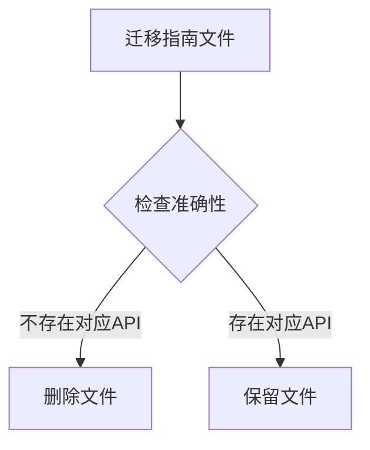

+++
title = "#21077 Remove unneeded migration guide"
date = "2025-09-16T00:00:00"
draft = false
template = "pull_request_page.html"
in_search_index = false

[extra]
current_language = "zh-cn"
available_languages = {"en" = { name = "English", url = "/pull_request/bevy/2025-09/pr-21077-en-20250916" }, "zh-cn" = { name = "中文", url = "/pull_request/bevy/2025-09/pr-21077-zh-cn-20250916" }}
+++

# Remove unneeded migration guide

## 基本信息
- **标题**: Remove unneeded migration guide
- **PR链接**: https://github.com/bevyengine/bevy/pull/21077
- **作者**: alice-i-cecile
- **状态**: 已合并
- **标签**: C-Docs, D-Trivial, A-UI, S-Needs-Review
- **创建时间**: 2025-09-16T00:16:39Z
- **合并时间**: 2025-09-16T02:21:21Z
- **合并者**: james7132

## 描述翻译
### Objective（目标）
- 这个迁移指南针对的是一个在 Bevy 0.16 中不存在的方法
- 修复 #21012

### Solution（解决方案）
- 删除！

## 这个Pull Request的故事

在软件开发中，准确的文档与代码本身同样重要。不准确或过时的文档会导致开发者困惑，浪费调试时间，甚至引入错误。这个PR解决的就是这样一个文档准确性问题。

问题的核心在于一个迁移指南文件的存在性。迁移指南本应帮助开发者从旧版本升级到新版本，但这份特定的指南却引用了一个在目标版本中根本不存在的API方法。具体来说，`BorderColor::all` 方法在 Bevy 0.16 中并不存在，因此为其编写的迁移指南实际上会产生误导而非帮助。

这种文档与代码不匹配的情况通常发生在快速迭代的项目中。可能的原因包括：
- 功能在开发过程中被重构或移除，但相关文档未被同步更新
- 版本管理出现偏差，文档基于未发布的API编写
- 自动化工具错误生成了迁移指南

从工程角度看，这个问题虽然不大，但体现了文档维护的重要性。不准确的文档比没有文档更糟糕，因为它会主动误导开发者。

解决方案非常直接：完全移除这个无效的迁移指南文件。这是一个典型的"减法是加法"的案例 - 通过删除错误信息来提高整体文档质量。这种处理方式符合软件开发中的"最少知识原则"，只提供准确且必要的信息。

技术实现上，这个修改简单明了：
```bash
git rm release-content/migration-guides/border_color_all_takes_impl_into_color.md
```

这个修改确保了：
1. 用户不会看到关于不存在方法的迁移指导
2. 文档集合中不再包含无效内容
3. 项目保持整洁，避免累积技术债务

从工程实践来看，这个PR展示了良好的维护习惯：及时识别并修复文档中的不准确信息，保持代码库的整洁和一致性。虽然修改本身很小，但对维护项目质量和开发者体验有积极影响。

## 可视化表示



## 关键文件变更

### `release-content/migration-guides/border_color_all_takes_impl_into_color.md` (+0/-6)

这个文件被完全删除，因为它描述的API方法在目标版本中并不存在。

**删除前内容：**
```markdown
---
title: "`BorderColor::all` now accepts any `impl Into<Color>` type"
pull_requests: [20311]
---

`BorderColor`'s `all` constructor function is no longer const and its `color` parameter now accepts any `impl Into<Color>` type, not only `Color`.
```

**修改后：** 文件被完全删除

这个变更直接实现了PR的目标：移除关于不存在API的误导性迁移指南。

## 延伸阅读

- [Bevy 官方文档](https://bevyengine.org/learn/)
- [语义化版本控制规范](https://semver.org/)
- [编写有效的迁移指南](https://documentation.divio.com/how-to-guides/)
- [开源项目文档维护最佳实践](https://opensource.com/article/19/4/documentation-maintenance)