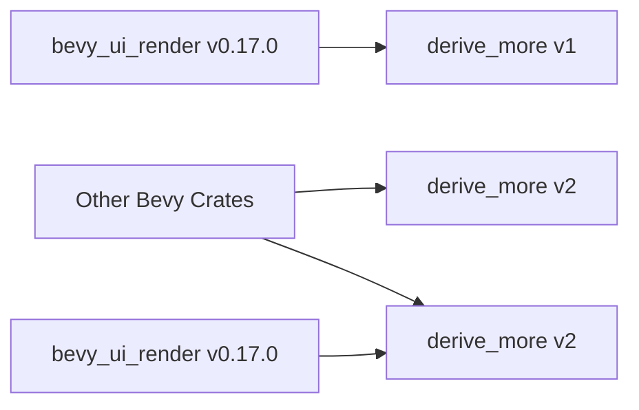

+++
title = "#21080 update `bevy_ui_render`'s `derive_more` dependency"
date = "2025-09-16T00:00:00"
draft = false
template = "pull_request_page.html"
in_search_index = true

[taxonomies]
list_display = ["show"]

[extra]
current_language = "en"
available_languages = {"en" = { name = "English", url = "/pull_request/bevy/2025-09/pr-21080-en-20250916" }, "zh-cn" = { name = "中文", url = "/pull_request/bevy/2025-09/pr-21080-zh-cn-20250916" }}
labels = ["C-Dependencies"]
+++

# Title
update `bevy_ui_render`'s `derive_more` dependency

## Basic Information
- **Title**: update `bevy_ui_render`'s `derive_more` dependency
- **PR Link**: https://github.com/bevyengine/bevy/pull/21080
- **Author**: ickshonpe
- **Status**: MERGED
- **Labels**: C-Dependencies, S-Ready-For-Final-Review
- **Created**: 2025-09-16T09:25:09Z
- **Merged**: 2025-09-16T16:56:06Z
- **Merged By**: alice-i-cecile

## Description Translation
# Objective

`bevy_ui_render` still uses `derive_more` version `1` when the rest of the crates now use version `2`.

Fixes #21074

## The Story of This Pull Request

This PR addresses a straightforward but important dependency version inconsistency in the Bevy engine's UI rendering system. The `bevy_ui_render` crate was still using version 1 of the `derive_more` dependency while other crates in the project had already been updated to version 2.

Dependency version mismatches like this can cause several technical issues in a Rust workspace. When multiple versions of the same crate are present, it leads to duplicated compilation efforts, increased binary size, and potential trait implementation conflicts. This is particularly problematic for derive macros like `derive_more`, where different versions might generate incompatible code.

The fix was minimal but necessary - updating the version specification in the Cargo.toml file from "1" to "2". This ensures that all crates in the Bevy workspace use the same version of `derive_more`, eliminating the version conflict and its associated problems.

The change maintains the same feature configuration (`default-features = false, features = ["from"]`), ensuring that the update doesn't introduce any functional changes or break existing functionality. The "from" feature allows automatic derivation of `From` trait implementations, which is commonly used in Bevy's UI system for type conversions.

This kind of dependency synchronization is crucial in large Rust projects like Bevy where multiple crates work together closely. Keeping dependencies consistent across the workspace improves build times, reduces binary size, and prevents subtle bugs that can occur when different parts of the codebase use different versions of the same dependency.

## Visual Representation



## Key Files Changed

### `crates/bevy_ui_render/Cargo.toml`

This file contained the outdated dependency specification that was causing the version mismatch. The change ensures consistency with the rest of the Bevy workspace.

**Change:**
```toml
# Before:
derive_more = { version = "1", default-features = false, features = ["from"] }

# After:
derive_more = { version = "2", default-features = false, features = ["from"] }
```

## Further Reading

- [derive_more crate documentation](https://docs.rs/derive_more/latest/derive_more/)
- [Cargo documentation on dependency specifications](https://doc.rust-lang.org/cargo/reference/specifying-dependencies.html)
- [Rust Edition Guide: Dependency management](https://doc.rust-lang.org/edition-guide/rust-2018/cargo-and-crates-io/cargo-workspaces-for-multi-crate-projects.html)

# Full Code Diff
```diff
diff --git a/crates/bevy_ui_render/Cargo.toml b/crates/bevy_ui_render/Cargo.toml
index 74f037b9fde29..e6429f5202d04 100644
--- a/crates/bevy_ui_render/Cargo.toml
+++ b/crates/bevy_ui_render/Cargo.toml
@@ -37,7 +37,7 @@ bevy_text = { path = "../bevy_text", version = "0.17.0-dev" }
 
 # other
 bytemuck = { version = "1.5", features = ["derive"] }
-derive_more = { version = "1", default-features = false, features = ["from"] }
+derive_more = { version = "2", default-features = false, features = ["from"] }
 tracing = { version = "0.1", default-features = false, features = ["std"] }
 
 [features]
```