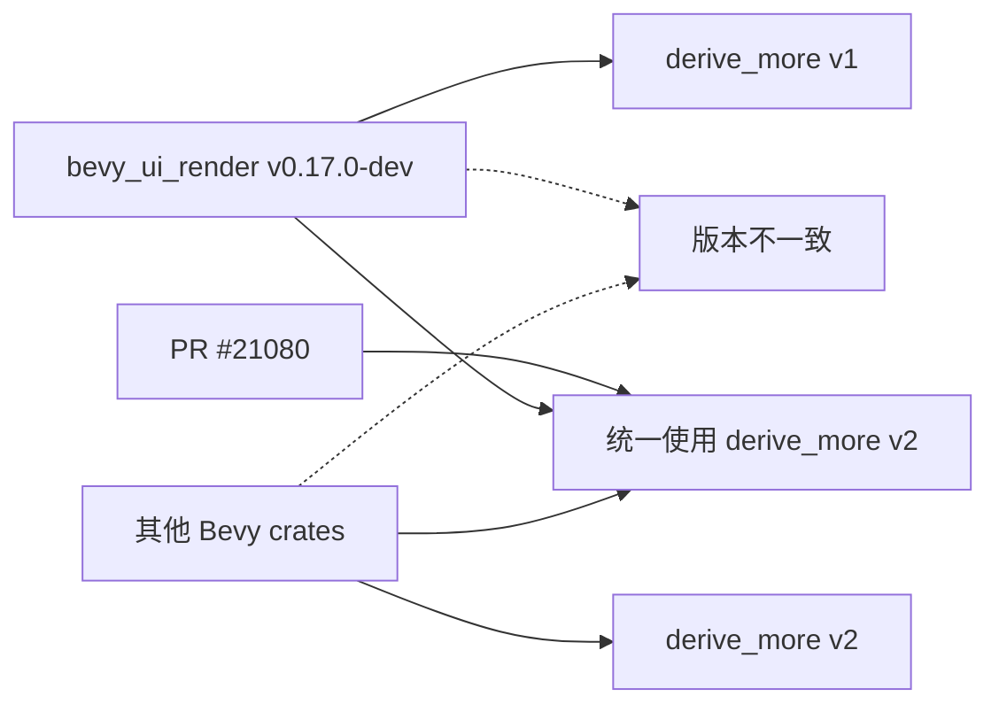

+++
title = "#21080 update `bevy_ui_render`'s `derive_more` dependency"
date = "2025-09-16T00:00:00"
draft = false
template = "pull_request_page.html"
in_search_index = false

[extra]
current_language = "zh-cn"
available_languages = {"en" = { name = "English", url = "/pull_request/bevy/2025-09/pr-21080-en-20250916" }, "zh-cn" = { name = "中文", url = "/pull_request/bevy/2025-09/pr-21080-zh-cn-20250916" }}
labels = ["C-Dependencies"]
+++

# Title

## Basic Information
- **Title**: update `bevy_ui_render`'s `derive_more` dependency
- **PR Link**: https://github.com/bevyengine/bevy/pull/21080
- **Author**: ickshonpe
- **Status**: MERGED
- **Labels**: C-Dependencies, S-Ready-For-Final-Review
- **Created**: 2025-09-16T09:25:09Z
- **Merged**: 2025-09-16T16:56:06Z
- **Merged By**: alice-i-cecile

## Description Translation
`bevy_ui_render` 仍然在使用 `derive_more` 版本 `1`，而其他 crate 现在都使用版本 `2`。

修复 #21074

## The Story of This Pull Request

这个 PR 解决了一个依赖版本不一致的问题。在大型 Rust 项目中，保持依赖版本的一致性非常重要，特别是对于过程宏（proc-macro）类依赖如 `derive_more`，因为不同版本可能产生不兼容的代码生成结果。

问题的根源在于 `bevy_ui_render` crate 的 `derive_more` 依赖版本落后于项目中的其他 crate。当项目中的其他模块都升级到 `derive_more` v2 时，`bevy_ui_render` 仍然停留在 v1 版本。这种不一致性可能导致编译问题、难以调试的行为差异，以及增加维护复杂度。

开发者 ickshonpe 识别到这个问题后，采取了最直接有效的解决方案：将 `bevy_ui_render` 的 `derive_more` 依赖从版本 1 升级到版本 2。这个变更确保了整个项目使用相同版本的 `derive_more` 过程宏，消除了潜在的不一致风险。

从技术角度来看，`derive_more` 是一个用于自动派生（derive）常见 trait 的库，它通过过程宏为结构体和枚举自动生成 `From`、`Display`、`Deref` 等 trait 的实现。在 `bevy_ui_render` 中，它主要用于简化类型转换代码的编写。

版本升级本身是向后兼容的，v2 版本在保持 API 兼容性的同时提供了性能改进和一些新功能。这也是为什么这个变更可以安全地进行，不需要修改任何使用这些派生宏的代码。

这个简单的依赖版本更新体现了良好的依赖管理实践。在大型项目中，保持依赖版本的一致性有助于减少构建问题，简化依赖解析，并确保所有组件使用相同的行为和性能特性。

## Visual Representation



## Key Files Changed

### `crates/bevy_ui_render/Cargo.toml`

这个文件是 `bevy_ui_render` crate 的依赖声明文件。变更内容非常简单但重要：

```toml
# 修改前：
derive_more = { version = "1", default-features = false, features = ["from"] }

# 修改后：
derive_more = { version = "2", default-features = false, features = ["from"] }
```

这个变更将 `derive_more` 依赖的版本从 "1" 更新为 "2"，保持了相同的特性配置（禁用默认特性，只启用 "from" 特性）。这确保了 `bevy_ui_render` 与其他 Bevy crate 使用相同版本的 `derive_more` 库。

## Further Reading

- [derive_more crate 文档](https://docs.rs/derive_more/latest/derive_more/) - 了解这个库提供的各种派生宏
- [Cargo 语义化版本规范](https://doc.rust-lang.org/cargo/reference/specifying-dependencies.html) - 理解 Rust 依赖版本管理
- [Bevy 引擎官方文档](https://bevyengine.org/learn/) - 了解这个游戏引擎的更多信息
- [Rust 过程宏指南](https://doc.rust-lang.org/reference/procedural-macros.html) - 理解 `derive_more` 这类库的工作原理

# Full Code Diff
```diff
diff --git a/crates/bevy_ui_render/Cargo.toml b/crates/bevy_ui_render/Cargo.toml
index 74f037b9fde29..e6429f5202d04 100644
--- a/crates/bevy_ui_render/Cargo.toml
+++ b/crates/bevy_ui_render/Cargo.toml
@@ -37,7 +37,7 @@ bevy_text = { path = "../bevy_text", version = "0.17.0-dev" }
 
 # other
 bytemuck = { version = "1.5", features = ["derive"] }
-derive_more = { version = "1", default-features = false, features = ["from"] }
+derive_more = { version = "2", default-features = false, features = ["from"] }
 tracing = { version = "0.1", default-features = false, features = ["std"] }
 
 [features]
```