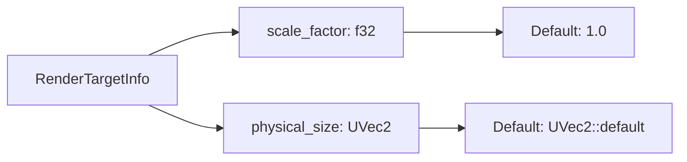

+++
title = "#21082 Change the default for `RenderTargetInfo::scale_factor` to `1.`"
date = "2025-09-16T00:00:00"
draft = false
template = "pull_request_page.html"
in_search_index = true

[taxonomies]
list_display = ["show"]

[extra]
current_language = "en"
available_languages = {"en" = { name = "English", url = "/pull_request/bevy/2025-09/pr-21082-en-20250916" }, "zh-cn" = { name = "中文", url = "/pull_request/bevy/2025-09/pr-21082-zh-cn-20250916" }}
labels = ["C-Bug", "D-Trivial", "A-Rendering"]
+++

# Change the default for `RenderTargetInfo::scale_factor` to `1.`

## Basic Information
- **Title**: Change the default for `RenderTargetInfo::scale_factor` to `1.`
- **PR Link**: https://github.com/bevyengine/bevy/pull/21082
- **Author**: ickshonpe
- **Status**: MERGED
- **Labels**: C-Bug, D-Trivial, A-Rendering, S-Ready-For-Final-Review
- **Created**: 2025-09-16T10:42:04Z
- **Merged**: 2025-09-16T16:46:17Z
- **Merged By**: alice-i-cecile

## Description Translation
# Objective

The default for `RenderTargetInfo`'s `scale_factor` field is `0.` but it's much more natural to assume that it would be `1.`.
A scale factor of `0.` is degenerate, and could potentially cause a panic.

## Solution

Set it to `1.` by default.

## The Story of This Pull Request

This PR addresses a subtle but important issue in Bevy's camera rendering system. The problem was centered around the `RenderTargetInfo` struct's `scale_factor` field, which had a default value of `0.0` due to Rust's automatic Default derivation for numeric types.

A scale factor of 0.0 is problematic for several reasons. First, it's mathematically degenerate - many rendering calculations involve division by scale factor, which would cause division by zero errors. Second, it doesn't represent a realistic scenario; most render targets operate with a scale factor of 1.0 by default, meaning no scaling is applied. The previous default could lead to unexpected panics or rendering artifacts when developers used the default `RenderTargetInfo` without explicitly setting the scale factor.

The solution was straightforward but impactful: replace the automatically derived Default implementation with a manual one that sets `scale_factor` to `1.0` instead of `0.0`. This required two key changes:

1. Removing the `Default` derive macro from the `RenderTargetInfo` struct
2. Implementing `Default` manually with sensible defaults for both fields

The implementation ensures backward compatibility while fixing the potential panic scenario. The `physical_size` field continues to use its default value (a zero-sized UVec2), which is appropriate for an uninitialized render target.

Additionally, the PR includes a migration guide to inform users about this breaking change. This is important because existing code that relied on the previous default behavior might need adjustment, though the change from 0.0 to 1.0 is generally safer and more correct.

This change is categorized as a bug fix (C-Bug) because the previous default could cause panics, and as trivial (D-Trivial) because the implementation is simple and focused. It affects the rendering system (A-Rendering) since `RenderTargetInfo` is used in camera computations and render target management.

## Visual Representation



## Key Files Changed

### 1. `crates/bevy_camera/src/camera.rs`

**What changed**: Modified the `RenderTargetInfo` struct to use a custom Default implementation with scale_factor set to 1.0 instead of 0.0.

**Code snippets**:
```rust
// Before:
#[derive(Default, Debug, Clone)]
pub struct RenderTargetInfo {
    pub physical_size: UVec2,
    pub scale_factor: f32,
}

// After:
#[derive(Debug, Clone)]
pub struct RenderTargetInfo {
    pub physical_size: UVec2,
    pub scale_factor: f32,
}

impl Default for RenderTargetInfo {
    fn default() -> Self {
        Self {
            physical_size: Default::default(),
            scale_factor: 1.,
        }
    }
}
```

**Relation to PR**: This is the core change that fixes the problematic default value.

### 2. `release-content/migration-guides/RenderTargetInfo_default.md`

**What changed**: Added a migration guide document to inform users about the breaking change.

**Code snippets**:
```markdown
---
title: "RenderTargetInfo's default `scale_factor` has been changed to `1.`"
pull_requests: [21802]
---

The default for `RenderTargetInfo`'s `scale_factor` field is now `1.`.
```

**Relation to PR**: This ensures users are aware of the change and can update their code accordingly.

## Further Reading

- [Rust Default trait documentation](https://doc.rust-lang.org/std/default/trait.Default.html)
- [Bevy Camera and Rendering documentation](https://docs.rs/bevy/latest/bevy/camera/index.html)
- [Bevy Migration Guides](https://bevyengine.org/learn/migration-guides/)