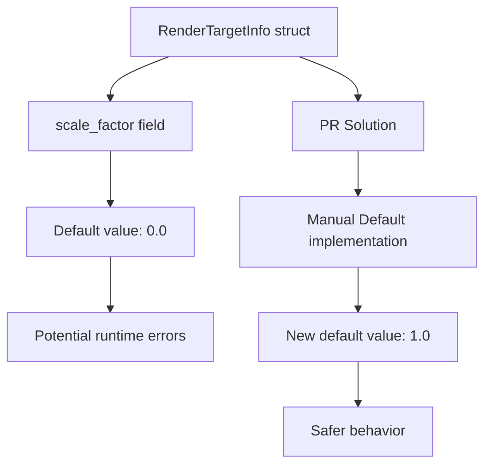

+++
title = "#21082 Change the default for `RenderTargetInfo::scale_factor` to `1."
date = "2025-09-16T00:00:00"
draft = false
template = "pull_request_page.html"
in_search_index = false

[extra]
current_language = "zh-cn"
available_languages = {"en" = { name = "English", url = "/pull_request/bevy/2025-09/pr-21082-en-20250916" }, "zh-cn" = { name = "中文", url = "/pull_request/bevy/2025-09/pr-21082-zh-cn-20250916" }}
+++

# 技术分析报告：将 RenderTargetInfo::scale_factor 默认值改为 1

## 基本信息
- **标题**: Change the default for `RenderTargetInfo::scale_factor` to `1.`
- **PR 链接**: https://github.com/bevyengine/bevy/pull/21082
- **作者**: ickshonpe
- **状态**: 已合并
- **标签**: C-Bug, D-Trivial, A-Rendering, S-Ready-For-Final-Review
- **创建时间**: 2025-09-16T10:42:04Z
- **合并时间**: 2025-09-16T16:46:17Z
- **合并人**: alice-i-cecile

## 描述翻译
**目标**  
`RenderTargetInfo` 的 `scale_factor` 字段默认值为 `0.`，但更自然的假设应该是 `1.`。  
比例为 `0.` 是无效的，并可能导致 panic（运行时错误）。

**解决方案**  
将其默认值设置为 `1.`。

## 本次 Pull Request 的故事

这个 PR 解决了一个看似简单但潜在危险的问题：`RenderTargetInfo` 结构体中 `scale_factor` 字段的默认值设置不当。在 Bevy 的渲染系统中，`RenderTargetInfo` 用于存储渲染目标的相关信息，其中 `scale_factor` 表示缩放因子，用于处理高DPI显示器的像素比例问题。

**问题与背景**  
原本的代码使用 `#[derive(Default)]` 来自动生成 `RenderTargetInfo` 的默认实现，这意味着所有字段都会使用它们的默认值。对于 `scale_factor` 字段（f32 类型），Rust 的默认值是 `0.0`。这在数学和图形渲染中是个问题，因为：

1. 缩放因子为 0 会导致除零错误或无效计算
2. 在实际渲染中，缩放因子为 1 才是更合理的默认假设（表示无缩放）
3. 使用 0 作为默认值可能导致运行时 panic 或渲染异常

**解决方案方法**  
开发者采取了最直接有效的解决方案：移除自动派生的 `Default` 实现，改为手动实现，明确将 `scale_factor` 的默认值设置为 `1.0`。这种方法：
- 保持了向后兼容性（现有代码无需修改）
- 修复了潜在的运行时错误
- 使默认行为更符合直觉预期

**实现细节**  
关键修改在 `crates/bevy_camera/src/camera.rs` 文件中：

```rust
// 修改前：
#[derive(Default, Debug, Clone)]
pub struct RenderTargetInfo {
    pub physical_size: UVec2,
    pub scale_factor: f32,
}

// 修改后：
#[derive(Debug, Clone)]  // 移除了 Default
pub struct RenderTargetInfo {
    pub physical_size: UVec2,
    pub scale_factor: f32,
}

impl Default for RenderTargetInfo {
    fn default() -> Self {
        Self {
            physical_size: Default::default(),  // 保持原有默认值
            scale_factor: 1.,  // 关键修改：从 0. 改为 1.
        }
    }
}
```

**技术影响**  
这个修改虽然简单，但具有重要意义：
1. **安全性提升**：消除了因缩放因子为 0 导致的潜在运行时错误
2. **用户体验改善**：默认值更符合开发者直觉，减少困惑
3. **代码健壮性**：为可能使用默认值的场景提供了合理的后备值

同时，开发者还创建了迁移指南文档（`RenderTargetInfo_default.md`），明确记录了这一变更，帮助其他开发者了解这个不兼容的更改。

## 视觉表示



## 关键文件变更

**1. `crates/bevy_camera/src/camera.rs`**
- **修改类型**: 代码逻辑修改
- **变更描述**: 移除了 `RenderTargetInfo` 的自动 `Default` 派生实现，改为手动实现，将 `scale_factor` 默认值从 `0.0` 改为 `1.0`

```rust
// 修改前：
#[derive(Default, Debug, Clone)]
pub struct RenderTargetInfo {
    pub physical_size: UVec2,
    pub scale_factor: f32,  // 默认值为 0.0
}

// 修改后：
#[derive(Debug, Clone)]
pub struct RenderTargetInfo {
    pub physical_size: UVec2,
    pub scale_factor: f32,
}

impl Default for RenderTargetInfo {
    fn default() -> Self {
        Self {
            physical_size: Default::default(),
            scale_factor: 1.,  // 显式设置为 1.0
        }
    }
}
```

**2. `release-content/migration-guides/RenderTargetInfo_default.md`**
- **修改类型**: 新增文档
- **变更描述**: 创建迁移指南，记录默认值变更

```markdown
---
title: "RenderTargetInfo's default `scale_factor` has been changed to `1.`"
pull_requests: [21802]
---

The default for `RenderTargetInfo`'s `scale_factor` field is now `1.`.
```

## 进一步阅读

1. **Rust 的 Default trait**: [官方文档](https://doc.rust-lang.org/std/default/trait.Default.html)
2. **Bevy 渲染系统介绍**: [Bevy 渲染手册](https://bevy-cheatbook.github.io/features/rendering.html)
3. **高DPI处理最佳实践**: [Windows 开发文档](https://docs.microsoft.com/en-us/windows/win32/hidpi/high-dpi-desktop-application-development-on-windows)
4. **语义化版本与破坏性变更**: [SemVer 规范](https://semver.org/)