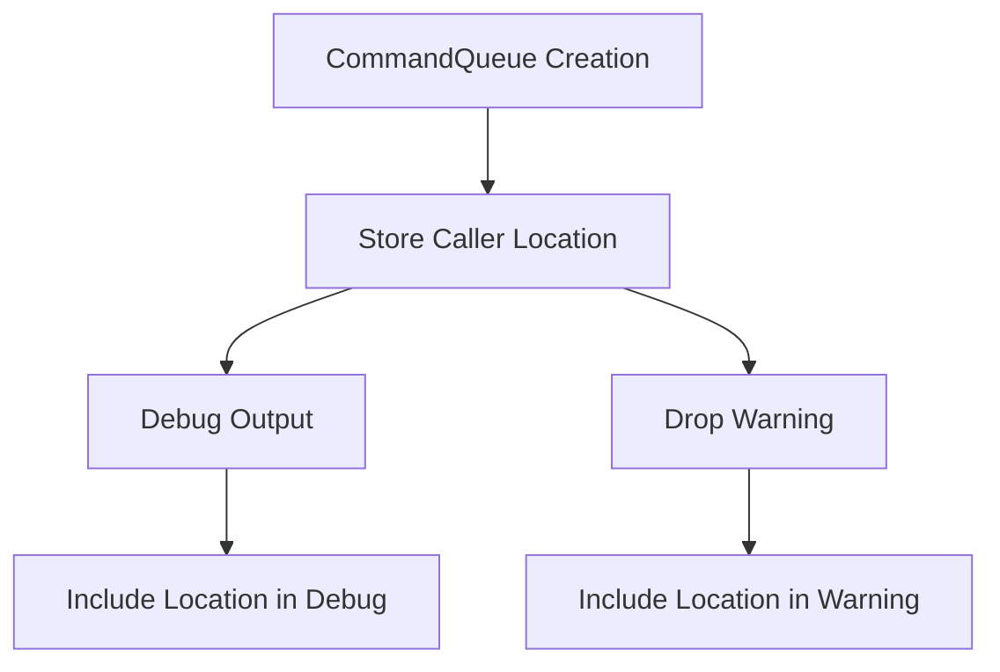

+++
title = "#21084 Commandqueue uses source tracing."
date = "2025-09-16T00:00:00"
draft = false
template = "pull_request_page.html"
in_search_index = true

[taxonomies]
list_display = ["show"]

[extra]
current_language = "en"
available_languages = {"en" = { name = "English", url = "/pull_request/bevy/2025-09/pr-21084-en-20250916" }, "zh-cn" = { name = "中文", url = "/pull_request/bevy/2025-09/pr-21084-zh-cn-20250916" }}
labels = ["A-ECS", "C-Usability"]
+++

# Commandqueue uses source tracing

## Basic Information
- **Title**: Commandqueue uses source tracing.
- **PR Link**: https://github.com/bevyengine/bevy/pull/21084
- **Author**: MushineLament
- **Status**: MERGED
- **Labels**: A-ECS, C-Usability, S-Ready-For-Final-Review
- **Created**: 2025-09-16T13:21:53Z
- **Merged**: 2025-09-16T16:56:06Z
- **Merged By**: alice-i-cecile

## Description Translation
Add a caller to track the source of the command queue. Add a command queue source for printing tests.

# Objective
Fixes #21046

## Solution

Commandqueue uses source tracing

## Testing

Only one MaybeLocation has been added for tracking sources, and it only works when track-location is enabled.

## The Story of This Pull Request

This PR addresses a common debugging challenge in Bevy's ECS system: identifying the source of unapplied commands when a CommandQueue is dropped. Previously, when commands weren't properly applied, developers would see a generic warning without context about where the problematic CommandQueue was created.

The core issue was that CommandQueue implemented Default via derive, which provided no context about where the queue was instantiated. The solution adds source location tracking using Rust's `#[track_caller]` attribute, which captures the caller's location when the CommandQueue is created through Default::default().

The implementation introduces a new `caller` field of type `MaybeLocation` to the CommandQueue struct, guarded by the `track_location` feature flag. This ensures the overhead is only incurred when explicitly enabled. The Default implementation was changed from a derive to a manual implementation with `#[track_caller]`, allowing it to capture and store the caller's location.

When a CommandQueue with unapplied commands is dropped, the warning message now includes the source location where the queue was created, significantly improving debugging capabilities. The Debug implementation was also enhanced to include the caller information when available.

The changes maintain backward compatibility - when the `track_location` feature is disabled, the behavior remains identical to the previous implementation, with no performance impact.

## Visual Representation



## Key Files Changed

### `crates/bevy_ecs/src/world/command_queue.rs` (+28/-4)

This file contains the core implementation changes for adding source tracing to CommandQueue:

1. Added conditional import and field for caller tracking:
```rust
#[cfg(feature = "track_location")]
use crate::change_detection::MaybeLocation;

// In CommandQueue struct:
#[cfg(feature = "track_location")]
pub(crate) caller: MaybeLocation,
```

2. Replaced derived Default with manual implementation:
```rust
// Before:
#[derive(Default)]

// After:
impl Default for CommandQueue {
    #[track_caller]
    fn default() -> Self {
        Self {
            bytes: Default::default(),
            cursor: Default::default(),
            panic_recovery: Default::default(),
            #[cfg(feature = "track_location")]
            caller: MaybeLocation::caller(),
        }
    }
}
```

3. Enhanced Debug implementation to include caller information:
```rust
// Before:
f.debug_struct("CommandQueue")
    .field("len_bytes", &self.bytes.len())
    .finish_non_exhaustive()

// After:
let mut binding = f.debug_struct("CommandQueue");
binding.field("len_bytes", &self.bytes.len());

#[cfg(feature = "track_location")]
binding.field("caller", &self.caller.into_option());

binding.finish_non_exhaustive()
```

4. Improved drop warning to include source location:
```rust
// Before:
warn!("CommandQueue has un-applied commands being dropped. Did you forget to call SystemState::apply?");

// After:
#[cfg(feature = "track_location")]
warn!("CommandQueue has un-applied commands being dropped. Did you forget to call SystemState::apply? caller:{:?}",self.caller.into_option());
#[cfg(not(feature = "track_location"))]
warn!("CommandQueue has un-applied commands being dropped. Did you forget to call SystemState::apply?");
```

## Further Reading

- Rust's `#[track_caller]` attribute: https://doc.rust-lang.org/reference/attributes/diagnostics.html#the-track_caller-attribute
- Bevy ECS Command System: https://bevyengine.org/learn/advanced-topics/commands/
- Error Handling and Diagnostics in Rust: https://doc.rust-lang.org/book/ch09-00-error-handling.html

# Full Code Diff
```diff
diff --git a/crates/bevy_ecs/src/world/command_queue.rs b/crates/bevy_ecs/src/world/command_queue.rs
index 3d0c22f468ed9..fa541af1d7e7c 100644
--- a/crates/bevy_ecs/src/world/command_queue.rs
+++ b/crates/bevy_ecs/src/world/command_queue.rs
@@ -1,7 +1,10 @@
+#[cfg(feature = "track_location")]
+use crate::change_detection::MaybeLocation;
 use crate::{
     system::{Command, SystemBuffer, SystemMeta},
     world::{DeferredWorld, World},
 };
+
 use alloc::{boxed::Box, vec::Vec};
 use bevy_ptr::{OwningPtr, Unaligned};
 use core::{
@@ -29,7 +32,6 @@ struct CommandMeta {
 // entities/components/resources, and it's not currently possible to parallelize these
 // due to mutable [`World`] access, maximizing performance for [`CommandQueue`] is
 // preferred to simplicity of implementation.
-#[derive(Default)]
 pub struct CommandQueue {
     // This buffer densely stores all queued commands.
     //
@@ -39,6 +41,21 @@ pub struct CommandQueue {
     pub(crate) bytes: Vec<MaybeUninit<u8>>,
     pub(crate) cursor: usize,
     pub(crate) panic_recovery: Vec<MaybeUninit<u8>>,
+    #[cfg(feature = "track_location")]
+    pub(crate) caller: MaybeLocation,
+}
+
+impl Default for CommandQueue {
+    #[track_caller]
+    fn default() -> Self {
+        Self {
+            bytes: Default::default(),
+            cursor: Default::default(),
+            panic_recovery: Default::default(),
+            #[cfg(feature = "track_location")]
+            caller: MaybeLocation::caller(),
+        }
+    }
 }
 
 /// Wraps pointers to a [`CommandQueue`], used internally to avoid stacked borrow rules when
@@ -57,9 +74,13 @@ pub(crate) struct RawCommandQueue {
 // So instead, the manual impl just prints the length of vec.
 impl Debug for CommandQueue {
     fn fmt(&self, f: &mut core::fmt::Formatter<'_>) -> core::fmt::Result {
-        f.debug_struct("CommandQueue")
-            .field("len_bytes", &self.bytes.len())
-            .finish_non_exhaustive()
+        let mut binding = f.debug_struct("CommandQueue");
+        binding.field("len_bytes", &self.bytes.len());
+
+        #[cfg(feature = "track_location")]
+        binding.field("caller", &self.caller.into_option());
+
+        binding.finish_non_exhaustive()
     }
 }
 
@@ -311,6 +332,9 @@ impl RawCommandQueue {
 impl Drop for CommandQueue {
     fn drop(&mut self) {
         if !self.bytes.is_empty() {
+            #[cfg(feature = "track_location")]
+            warn!("CommandQueue has un-applied commands being dropped. Did you forget to call SystemState::apply? caller:{:?}",self.caller.into_option());
+            #[cfg(not(feature = "track_location"))]
             warn!("CommandQueue has un-applied commands being dropped. Did you forget to call SystemState::apply?");
         }
         // SAFETY: A reference is always a valid pointer
```