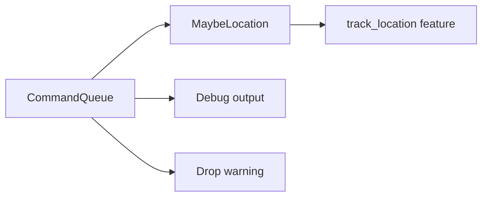

+++
title = "#21084 Commandqueue uses source tracing."
date = "2025-09-16T00:00:00"
draft = false
template = "pull_request_page.html"
in_search_index = false

[extra]
current_language = "zh-cn"
available_languages = {"en" = { name = "English", url = "/pull_request/bevy/2025-09/pr-21084-en-20250916" }, "zh-cn" = { name = "中文", url = "/pull_request/bevy/2025-09/pr-21084-zh-cn-20250916" }}
+++

# Commandqueue uses source tracing.

## 基本信息
- **标题**: Commandqueue uses source tracing.
- **PR链接**: https://github.com/bevyengine/bevy/pull/21084
- **作者**: MushineLament
- **状态**: 已合并
- **标签**: A-ECS, C-Usability, S-Ready-For-Final-Review
- **创建时间**: 2025-09-16T13:21:53Z
- **合并时间**: 2025-09-16T16:56:06Z
- **合并者**: alice-i-cecile

## 描述翻译
添加调用者追踪命令队列的来源。添加用于打印测试的命令队列源。

# 目标
修复 #21046

## 解决方案

Commandqueue 使用源追踪

## 测试

仅添加了一个 MaybeLocation 用于追踪来源，且仅在启用 track-location 时有效。

## 本次PR的故事

这个PR解决了一个具体的调试问题：当CommandQueue中有未应用的命令被丢弃时，开发者难以确定这些命令的来源。问题#21046描述了这种情况下的调试困难，特别是在复杂的ECS系统中，多个系统可能同时产生命令。

开发者采用了条件编译的解决方案，通过添加`track_location`特性来控制是否启用源追踪功能。这种方法既保证了生产环境的性能（默认不启用追踪），又为开发调试提供了详细的上下文信息。

实现的核心是在CommandQueue结构中添加了caller字段，该字段仅在启用`track_location`特性时存在：

```rust
#[cfg(feature = "track_location")]
pub(crate) caller: MaybeLocation,
```

手动实现了Default trait来注入调用者位置信息：

```rust
impl Default for CommandQueue {
    #[track_caller]
    fn default() -> Self {
        Self {
            bytes: Default::default(),
            cursor: Default::default(),
            panic_recovery: Default::default(),
            #[cfg(feature = "track_location")]
            caller: MaybeLocation::caller(),
        }
    }
}
```

在调试输出和错误警告中，现在可以显示命令队列的来源信息：

```rust
impl Debug for CommandQueue {
    fn fmt(&self, f: &mut core::fmt::Formatter<'_>) -> core::fmt::Result {
        let mut binding = f.debug_struct("CommandQueue");
        binding.field("len_bytes", &self.bytes.len());

        #[cfg(feature = "track_location")]
        binding.field("caller", &self.caller.into_option());

        binding.finish_non_exhaustive()
    }
}
```

当命令队列被丢弃且包含未应用的命令时，警告信息现在包含调用者位置：

```rust
impl Drop for CommandQueue {
    fn drop(&mut self) {
        if !self.bytes.is_empty() {
            #[cfg(feature = "track_location")]
            warn!("CommandQueue has un-applied commands being dropped. Did you forget to call SystemState::apply? caller:{:?}",self.caller.into_option());
            #[cfg(not(feature = "track_location"))]
            warn!("CommandQueue has un-applied commands being dropped. Did you forget to call SystemState::apply?");
        }
        // SAFETY: A reference is always a valid pointer
    }
}
```

这种实现方式体现了良好的工程实践：通过条件编译平衡性能与调试能力，使用标准化的`#[track_caller]`机制获取调用信息，以及在适当的地方（Debug实现和Drop实现）提供有价值的调试信息。

## 视觉表示



## 关键文件更改

- `crates/bevy_ecs/src/world/command_queue.rs` (+28/-4)

主要变更：
1. 添加了条件导入MaybeLocation
2. 修改CommandQueue结构体，添加caller字段
3. 手动实现Default trait以记录调用者位置
4. 增强Debug实现以显示调用者信息
5. 改进Drop实现以在警告中包含调用者位置

代码变更示例：
```rust
// 之前:
#[derive(Default)]
pub struct CommandQueue {
    pub(crate) bytes: Vec<MaybeUninit<u8>>,
    pub(crate) cursor: usize,
    pub(crate) panic_recovery: Vec<MaybeUninit<u8>>,
}

// 之后:
pub struct CommandQueue {
    pub(crate) bytes: Vec<MaybeUninit<u8>>,
    pub(crate) cursor: usize,
    pub(crate) panic_recovery: Vec<MaybeUninit<u8>>,
    #[cfg(feature = "track_location")]
    pub(crate) caller: MaybeLocation,
}
```

## 扩展阅读

- [Rust的#[track_caller]属性](https://doc.rust-lang.org/reference/attributes/diagnostics.html#the-track_caller-attribute)
- [Bevy ECS命令系统文档](https://bevyengine.org/learn/books/ecs/commands)
- [条件编译在Rust中的使用](https://doc.rust-lang.org/reference/conditional-compilation.html)

# 完整代码差异
```diff
diff --git a/crates/bevy_ecs/src/world/command_queue.rs b/crates/bevy_ecs/src/world/command_queue.rs
index 3d0c22f468ed9..fa541af1d7e7c 100644
--- a/crates/bevy_ecs/src/world/command_queue.rs
+++ b/crates/bevy_ecs/src/world/command_queue.rs
@@ -1,7 +1,10 @@
+#[cfg(feature = "track_location")]
+use crate::change_detection::MaybeLocation;
 use crate::{
     system::{Command, SystemBuffer, SystemMeta},
     world::{DeferredWorld, World},
 };
+
 use alloc::{boxed::Box, vec::Vec};
 use bevy_ptr::{OwningPtr, Unaligned};
 use core::{
@@ -29,7 +32,6 @@ struct CommandMeta {
 // entities/components/resources, and it's not currently possible to parallelize these
 // due to mutable [`World`] access, maximizing performance for [`CommandQueue`] is
 // preferred to simplicity of implementation.
-#[derive(Default)]
 pub struct CommandQueue {
     // This buffer densely stores all queued commands.
     //
@@ -39,6 +41,21 @@ pub struct CommandQueue {
     pub(crate) bytes: Vec<MaybeUninit<u8>>,
     pub(crate) cursor: usize,
     pub(crate) panic_recovery: Vec<MaybeUninit<u8>>,
+    #[cfg(feature = "track_location")]
+    pub(crate) caller: MaybeLocation,
+}
+
+impl Default for CommandQueue {
+    #[track_caller]
+    fn default() -> Self {
+        Self {
+            bytes: Default::default(),
+            cursor: Default::default(),
+            panic_recovery: Default::default(),
+            #[cfg(feature = "track_location")]
+            caller: MaybeLocation::caller(),
+        }
+    }
 }
 
 /// Wraps pointers to a [`CommandQueue`], used internally to avoid stacked borrow rules when
@@ -57,9 +74,13 @@ pub(crate) struct RawCommandQueue {
 // So instead, the manual impl just prints the length of vec.
 impl Debug for CommandQueue {
     fn fmt(&self, f: &mut core::fmt::Formatter<'_>) -> core::fmt::Result {
-        f.debug_struct("CommandQueue")
-            .field("len_bytes", &self.bytes.len())
-            .finish_non_exhaustive()
+        let mut binding = f.debug_struct("CommandQueue");
+        binding.field("len_bytes", &self.bytes.len());
+
+        #[cfg(feature = "track_location")]
+        binding.field("caller", &self.caller.into_option());
+
+        binding.finish_non_exhaustive()
     }
 }
 
@@ -311,6 +332,9 @@ impl RawCommandQueue {
 impl Drop for CommandQueue {
     fn drop(&mut self) {
         if !self.bytes.is_empty() {
+            #[cfg(feature = "track_location")]
+            warn!("CommandQueue has un-applied commands being dropped. Did you forget to call SystemState::apply? caller:{:?}",self.caller.into_option());
+            #[cfg(not(feature = "track_location"))]
             warn!("CommandQueue has un-applied commands being dropped. Did you forget to call SystemState::apply?");
         }
         // SAFETY: A reference is always a valid pointer
```