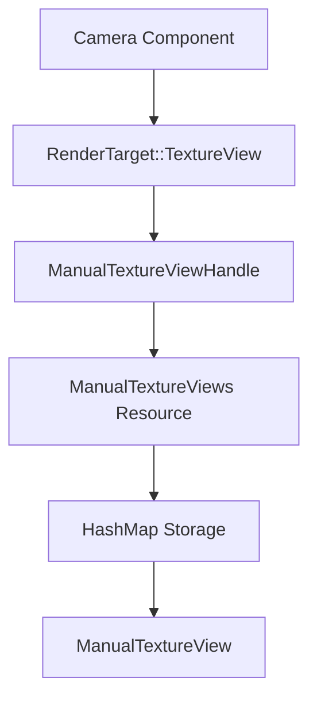

+++
title = "#21087 add doc comment to manual texture view and handle"
date = "2025-09-17T00:00:00"
draft = false
template = "pull_request_page.html"
in_search_index = true

[taxonomies]
list_display = ["show"]

[extra]
current_language = "en"
available_languages = {"en" = { name = "English", url = "/pull_request/bevy/2025-09/pr-21087-en-20250917" }, "zh-cn" = { name = "中文", url = "/pull_request/bevy/2025-09/pr-21087-zh-cn-20250917" }}
labels = ["C-Docs", "A-Rendering", "D-Straightforward"]
+++

# add doc comment to manual texture view and handle

## Basic Information
- **Title**: add doc comment to manual texture view and handle
- **PR Link**: https://github.com/bevyengine/bevy/pull/21087
- **Author**: janis-bhm
- **Status**: MERGED
- **Labels**: C-Docs, A-Rendering, S-Ready-For-Final-Review, X-Uncontroversial, D-Straightforward
- **Created**: 2025-09-16T15:04:35Z
- **Merged**: 2025-09-17T20:17:46Z
- **Merged By**: alice-i-cecile

## Description Translation
# Objective
Addresses #21037

## Solution

explain how `ManualTextureViews` can be used.

------

I think the handles should be atomically increasing ids like other internal ids so that users don't have to pick a random offset into `u32` to avoid colliding with other `ManualTextureView`s (I'm not sure if there ever are multiple systems/libraries using this functionality in the same world, but it's not forbidden).
A quick search through github shows most people just start at 0.

I'm hoping these docs might make it into 0.17 though, so unless someone disagrees with me or that change would prevent some use-case I'm not aware of, I plan on creating a PR for that in in 0.18.

## The Story of This Pull Request

This PR addresses a documentation gap in Bevy's rendering system. The `ManualTextureViews` resource and `ManualTextureViewHandle` component lacked proper documentation, making it difficult for developers to understand how to use them effectively for custom rendering scenarios.

The core problem was straightforward: developers needed clear guidance on how to create and use manual texture views for rendering. Without proper documentation, users had to rely on trial and error or search through GitHub examples, which often showed incomplete or potentially problematic implementations.

The solution approach focused on adding comprehensive doc comments that explain both the purpose and practical usage of these components. The implementation adds two key documentation improvements:

1. A cross-reference from `ManualTextureViewHandle` to the main `ManualTextureViews` resource
2. A complete usage example showing how to create a texture view, register it, and configure a camera to render to it

The documentation now clearly explains that:
- `ManualTextureViews` dereferences to a `HashMap<ManualTextureViewHandle, ManualTextureView>`
- Users must choose an unused handle value when inserting new views
- Cameras can be configured to render to these views using `RenderTarget::TextureView(handle)`

The author also identified a potential improvement for future versions - using atomically increasing IDs instead of requiring users to manually choose handle values to avoid collisions. However, this was considered out of scope for the current documentation-focused PR.

These changes make the API more accessible and reduce the likelihood of implementation errors, particularly around handle collision issues that the author observed in existing community code.

## Visual Representation



## Key Files Changed

### `crates/bevy_render/src/texture/manual_texture_view.rs` (+24/-1)

This file received the most significant documentation improvements. The existing one-line comment was replaced with comprehensive documentation including a complete usage example.

**Before:**
```rust
/// Stores manually managed [`ManualTextureView`]s for use as a [`bevy_camera::RenderTarget`].
```

**After:**
```rust
/// Resource that stores manually managed [`ManualTextureView`]s for use as a [`RenderTarget`](bevy_camera::RenderTarget).
/// This type dereferences to a `HashMap<ManualTextureViewHandle, ManualTextureView>`.
/// To add a new texture view, pick a new [`ManualTextureViewHandle`] and insert it into the map.
/// Then, to render to the view, set a [`Camera`](bevy_camera::Camera)s `target` to `RenderTarget::TextureView(handle)`.
/// ```ignore
/// # use bevy_ecs::prelude::*;
/// # let mut world = World::default();
/// # world.insert_resource(ManualTextureViews::default());
/// # let texture_view = todo!();
/// let manual_views = world.resource_mut::<ManualTextureViews>();
/// let manual_view = ManualTextureView::with_default_format(texture_view, UVec2::new(1024, 1024));
///
/// // Choose an unused handle value; it's likely only you are inserting manual views.
/// const MANUAL_VIEW_HANDLE: ManualTextureViewHandle = ManualTextureViewHandle::new(42);
/// manual_views.insert(MANUAL_VIEW_HANDLE, manual_view);
///
/// // Now you can spawn a Cemera that renders to the manual view:
/// # use bevy_camera::{Camera, RenderTarget};
/// world.spawn(Camera {
///     target: RenderTarget::TextureView(MANUAL_VIEW_HANDLE),
///     ..Default::default()
/// });
/// ```
/// Bevy will then use the `ManualTextureViews` resource to find your texture view and render to it.
```

### `crates/bevy_camera/src/camera.rs` (+2/-0)

This file received a minor documentation addition that cross-references the main documentation.

**Before:**
```rust
/// A unique id that corresponds to a specific `ManualTextureView` in the `ManualTextureViews` collection.
```

**After:**
```rust
/// A unique id that corresponds to a specific `ManualTextureView` in the `ManualTextureViews` collection.
///
/// See `ManualTextureViews` in `bevy_camera` for more details.
```

## Further Reading

- [Bevy Render Targets Documentation](https://bevyengine.org/learn/books/rendering/render-targets/)
- [Bevy ECS Resources](https://bevyengine.org/learn/books/ecs/resources/)
- [Rust HashMap Documentation](https://doc.rust-lang.org/std/collections/struct.HashMap.html)
- [Bevy Camera Component](https://docs.rs/bevy_camera/latest/bevy_camera/struct.Camera.html)