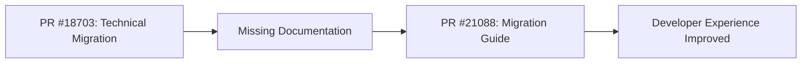

+++
title = "#21088 `UiDebugOptions` migration guide"
date = "2025-09-17T00:00:00"
draft = false
template = "pull_request_page.html"
in_search_index = true

[taxonomies]
list_display = ["show"]

[extra]
current_language = "en"
available_languages = {"en" = { name = "English", url = "/pull_request/bevy/2025-09/pr-21088-en-20250917" }, "zh-cn" = { name = "中文", url = "/pull_request/bevy/2025-09/pr-21088-zh-cn-20250917" }}
labels = ["C-Docs", "A-UI", "A-Dev-Tools"]
+++

# Title
`UiDebugOptions` migration guide

## Basic Information
- **Title**: `UiDebugOptions` migration guide
- **PR Link**: https://github.com/bevyengine/bevy/pull/21088
- **Author**: janis-bhm
- **Status**: MERGED
- **Labels**: C-Docs, A-UI, S-Ready-For-Final-Review, A-Dev-Tools
- **Created**: 2025-09-16T15:06:17Z
- **Merged**: 2025-09-17T17:26:29Z
- **Merged By**: alice-i-cecile

## Description Translation
# Objective
Fixes #21036

## The Story of This Pull Request

This PR addresses a documentation gap that emerged from a previous architectural change. In PR #18703, the `UiDebugOptions` resource was moved from the `bevy_ui` crate to `bevy_ui_render` as part of a larger refactoring effort to improve code organization. While the technical migration was completed successfully, the corresponding migration guide documentation was missing, leaving developers without clear guidance on how to update their code.

The problem was straightforward but important: developers upgrading from Bevy 0.16 to 0.17 would encounter breaking changes when trying to access `UiDebugOptions`, but the migration path wasn't documented. This could lead to confusion and unnecessary debugging time as developers tried to figure out why their existing code no longer compiled.

The solution approach was direct - create a comprehensive migration guide that clearly explains the change and provides concrete code examples. The implementation consists of a new markdown file in the release-content migration guides section, following the established pattern for Bevy migration documentation.

The technical implementation is minimal but effective. The migration guide includes both the old and new import patterns, showing developers exactly how to update their code. It provides two scenarios: one for developers using the full `bevy` prelude and another for those who might be using `bevy_ui_render` directly.

```rust
// 0.16
use bevy::prelude::*;
// or
use bevy::ui::UiDebugOptions;

// 0.17
use bevy::prelude::*;
// or, if you are not using the full `bevy` crate:
// use bevy_ui_render::prelude::*;

let options = world.resource_mut::<UiDebugOptions>();
```

The impact of this PR is primarily on developer experience. It reduces friction during the upgrade process by providing clear, actionable guidance. The changes are minimal from a code perspective but significant from a documentation standpoint, ensuring that developers can quickly understand and adapt to the architectural changes made in the previous PR.

This type of documentation PR demonstrates the importance of maintaining complete migration guides alongside technical refactors. Even well-designed architectural changes can cause frustration if the migration path isn't clearly communicated to developers.

## Visual Representation



## Key Files Changed

- `release-content/migration-guides/ui-debug-overlay.md` (+20/-0)

This file was created to document the migration path for the `UiDebugOptions` resource move. The key changes include:

1. Title and PR reference for context
2. Clear explanation of what moved where
3. Code examples showing both old and new import patterns

```markdown
---
title: Move UI Debug Options from `bevy_ui` to `bevy_ui_render`
pull_requests: [18703]
---

The `UiDebugOptions` resource used for controlling the UI Debug Overlay has been moved from the internal `bevy_ui` crate to the `bevy_ui_render` crate, and is now accessible from the prelude of `bevy_ui_render` and, as before, from the prelude of `bevy`:

```rust
// 0.16
use bevy::prelude::*;
// or
use bevy::ui::UiDebugOptions;

// 0.17
use bevy::prelude::*;
// or, if you are not using the full `bevy` crate:
// use bevy_ui_render::prelude::*;

let options = world.resource_mut::<UiDebugOptions>();
```
```

## Further Reading

- Bevy Migration Guide: https://bevyengine.org/learn/migration-guides/
- Bevy UI Documentation: https://docs.rs/bevy_ui/latest/bevy_ui/
- Rust Module System: https://doc.rust-lang.org/book/ch07-02-defining-modules-to-control-scope-and-privacy.html

# Full Code Diff
```diff
diff --git a/release-content/migration-guides/ui-debug-overlay.md b/release-content/migration-guides/ui-debug-overlay.md
new file mode 100644
index 0000000000000..109b106a82704
--- /dev/null
+++ b/release-content/migration-guides/ui-debug-overlay.md
@@ -0,0 +1,20 @@
+---
+title: Move UI Debug Options from `bevy_ui` to `bevy_ui_render`
+pull_requests: [18703]
+---
+
+The `UiDebugOptions` resource used for controlling the UI Debug Overlay has been moved from the internal `bevy_ui` crate to the `bevy_ui_render` crate, and is now accessible from the prelude of `bevy_ui_render` and, as before, from the prelude of `bevy`:
+
+```rust
+// 0.16
+use bevy::prelude::*;
+// or
+use bevy::ui::UiDebugOptions;
+
+// 0.17
+use bevy::prelude::*;
+// or, if you are not using the full `bevy` crate:
+// use bevy_ui_render::prelude::*;
+
+let options = world.resource_mut::<UiDebugOptions>();
+```
```