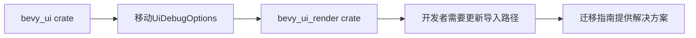

+++
title = "#21088 UiDebugOptions` migration guide"
date = "2025-09-17T00:00:00"
draft = false
template = "pull_request_page.html"
in_search_index = false

[extra]
current_language = "zh-cn"
available_languages = {"en" = { name = "English", url = "/pull_request/bevy/2025-09/pr-21088-en-20250917" }, "zh-cn" = { name = "中文", url = "/pull_request/bevy/2025-09/pr-21088-zh-cn-20250917" }}
+++

# `UiDebugOptions` migration guide

## 基本信息
- **标题**: `UiDebugOptions` migration guide
- **PR链接**: https://github.com/bevyengine/bevy/pull/21088
- **作者**: janis-bhm
- **状态**: 已合并
- **标签**: C-Docs, A-UI, S-Ready-For-Final-Review, A-Dev-Tools
- **创建时间**: 2025-09-16T15:06:17Z
- **合并时间**: 2025-09-17T17:26:29Z
- **合并者**: alice-i-cecile

## 描述翻译
# Objective
修复 #21036

## 这个PR的故事

这个PR解决了一个相对直接但重要的问题：为`UiDebugOptions`资源的迁移提供清晰的文档说明。在Bevy 0.17版本中，开发团队决定将`UiDebugOptions`从`bevy_ui` crate移动到`bevy_ui_render` crate，这是对代码库内部结构的一次重构优化。

问题的核心在于，当这样的内部重构发生时，如果没有适当的迁移指南，开发者可能会遇到编译错误或者不知道如何更新他们的代码。Issue #21036很可能就是报告了这样的问题——开发者在使用新版本时发现`UiDebugOptions`无法从原来的路径导入。

解决方案很明确：创建一个迁移指南文档，清晰地说明如何从旧版本迁移到新版本。这个PR添加了一个新的markdown文件，提供了具体的代码示例，展示了在0.16和0.17版本中如何正确导入和使用`UiDebugOptions`。

从技术实现角度看，这个迁移指南遵循了Bevy的标准文档格式，包含了：
- 明确的标题说明变更内容
- 相关的PR引用（#18703，即实际进行代码移动的PR）
- 简洁的版本对比代码示例

代码示例特别重要，因为它展示了两种使用场景：
1. 使用完整`bevy` prelude的情况（保持不变）
2. 不使用完整bevy crate时，需要从`bevy_ui_render`导入

这种变更属于典型的内部重构带来的API调整，不影响功能但影响导入路径。良好的迁移文档对于保持开发者体验的连贯性至关重要。

## 可视化表示



## 关键文件变更

- `release-content/migration-guides/ui-debug-overlay.md` (+20/-0)

这个文件是全新创建的迁移指南，包含了从Bevy 0.16到0.17版本使用`UiDebugOptions`的变更说明：

```markdown
---
title: Move UI Debug Options from `bevy_ui` to `bevy_ui_render`
pull_requests: [18703]
---

The `UiDebugOptions` resource used for controlling the UI Debug Overlay has been moved from the internal `bevy_ui` crate to the `bevy_ui_render` crate, and is now accessible from the prelude of `bevy_ui_render` and, as before, from the prelude of `bevy`:

```rust
// 0.16
use bevy::prelude::*;
// or
use bevy::ui::UiDebugOptions;

// 0.17
use bevy::prelude::*;
// or, if you are not using the full `bevy` crate:
// use bevy_ui_render::prelude::*;

let options = world.resource_mut::<UiDebugOptions>();
```
```

这个文件提供了清晰的版本对比和迁移路径，帮助开发者顺利过渡到新版本的API。

## 延伸阅读

- [Bevy迁移指南概述](https://bevyengine.org/learn/migration-guides/)
- [Bevy UI系统文档](https://docs.rs/bevy_ui/latest/bevy_ui/)
- [Rust模块系统和use声明](https://doc.rust-lang.org/book/ch07-02-defining-modules-to-control-scope-and-privacy.html)

# 完整代码差异
```diff
diff --git a/release-content/migration-guides/ui-debug-overlay.md b/release-content/migration-guides/ui-debug-overlay.md
new file mode 100644
index 0000000000000..109b106a82704
--- /dev/null
+++ b/release-content/migration-guides/ui-debug-overlay.md
@@ -0,0 +1,20 @@
+---
+title: Move UI Debug Options from `bevy_ui` to `bevy_ui_render`
+pull_requests: [18703]
+---
+
+The `UiDebugOptions` resource used for controlling the UI Debug Overlay has been moved from the internal `bevy_ui` crate to the `bevy_ui_render` crate, and is now accessible from the prelude of `bevy_ui_render` and, as before, from the prelude of `bevy`:
+
+```rust
+// 0.16
+use bevy::prelude::*;
+// or
+use bevy::ui::UiDebugOptions;
+
+// 0.17
+use bevy::prelude::*;
+// or, if you are not using the full `bevy` crate:
+// use bevy_ui_render::prelude::*;
+
+let options = world.resource_mut::<UiDebugOptions>();
+```
```