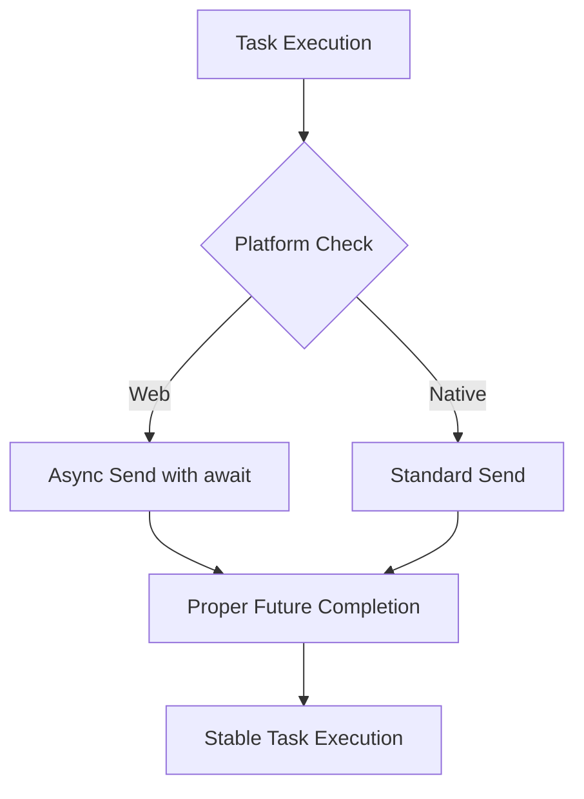

+++
title = "#21096 Fix tasks on wasm"
date = "2025-09-17T00:00:00"
draft = false
template = "pull_request_page.html"
in_search_index = true

[taxonomies]
list_display = ["show"]

[extra]
current_language = "en"
available_languages = {"en" = { name = "English", url = "/pull_request/bevy/2025-09/pr-21096-en-20250917" }, "zh-cn" = { name = "中文", url = "/pull_request/bevy/2025-09/pr-21096-zh-cn-20250917" }}
labels = ["C-Bug", "D-Trivial", "P-Crash", "O-Web", "A-Tasks", "D-Async"]
+++

# Fix tasks on wasm

## Basic Information
- **Title**: Fix tasks on wasm
- **PR Link**: https://github.com/bevyengine/bevy/pull/21096
- **Author**: NthTensor
- **Status**: MERGED
- **Labels**: C-Bug, D-Trivial, P-Crash, O-Web, S-Ready-For-Review, A-Tasks, D-Async
- **Created**: 2025-09-16T21:17:48Z
- **Merged**: 2025-09-16T23:43:03Z
- **Merged By**: alice-i-cecile

## Description Translation
**Objective**

Fix #21079. This was caused by incorrectly dropping a future.

**Solution**

Await the future instead of dropping it.

**Testing**

See https://github.com/bevyengine/bevy/issues/21079#issuecomment-3295174637. @rparrett has indicated this resolves the issue. I have not personally tested it.

We need to figure out a better solution to unit test the web. This would be very easy to test, except that it requires `web_bindgen_futures` and has to run in a browser environment.

## The Story of This Pull Request

This PR addresses a critical issue with task execution in WebAssembly (wasm) environments. The problem originated from improper future handling in Bevy's task system, where a future was being dropped prematurely instead of being properly awaited. This caused crashes and unexpected behavior in wasm targets, which are particularly sensitive to async task management due to their single-threaded nature and different concurrency model compared to native platforms.

The issue was identified in the web-specific implementation of task spawning within `bevy_tasks`. The code was setting up a channel to communicate task results but was using a synchronous send operation that could drop the value if the channel was full. In wasm environments, this led to the future being dropped incorrectly, causing the observed crashes.

The solution was straightforward but critical: replace the synchronous `send` operation with an asynchronous `send().await`. This ensures that the send operation properly yields execution until the channel has capacity, preventing the future from being dropped and ensuring the task result is properly communicated.

The implementation change is minimal but impactful. In the web-specific code path, the line:

```rust
let _ = sender.send(value);
```

was changed to:

```rust
let _ = sender.send(value).await;
```

This change ensures that the send operation is properly awaited, allowing the async runtime to manage the task execution correctly in wasm environments. The fix is surgical and targeted, affecting only the web implementation while leaving native platforms unchanged.

From a technical perspective, this highlights the importance of proper async/await patterns in cross-platform game engines. Wasm environments require careful attention to future handling since they operate in a browser context with different concurrency constraints than native systems. The fix demonstrates how subtle differences in async handling can have significant impacts across different target platforms.

The impact of this change is substantial for web-based Bevy applications. It resolves crash conditions and ensures that tasks execute reliably in wasm targets. This is particularly important for web games and applications built with Bevy that rely on async task processing.

## Visual Representation



## Key Files Changed

**File: crates/bevy_tasks/src/task.rs**

This file contains the core task implementation for Bevy's async task system. The change was made in the web-specific implementation section to fix improper future handling.

**Code Change:**
```rust
// Before:
let value = CatchUnwind(AssertUnwindSafe(future)).await;
let _ = sender.send(value);

// After:
let value = CatchUnwind(AssertUnwindSafe(future)).await;
let _ = sender.send(value).await;
```

The change ensures that the send operation is properly awaited in web environments, preventing premature future dropping and ensuring reliable task execution in wasm targets.

## Further Reading

- [Async/Await in Rust](https://rust-lang.github.io/async-book/)
- [WebAssembly and Async Rust](https://rustwasm.github.io/docs/wasm-bindgen/reference/js-promises-and-rust-futures.html)
- [Bevy Tasks Documentation](https://docs.rs/bevy_tasks/latest/bevy_tasks/)
- [futures::channel::mpsc Documentation](https://docs.rs/futures/0.3/futures/channel/mpsc/struct.Sender.html#method.send)