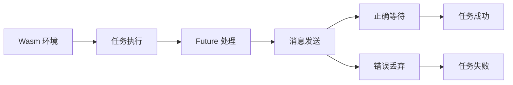

+++
title = "#21096 Fix tasks on wasm"
date = "2025-09-17T00:00:00"
draft = false
template = "pull_request_page.html"
in_search_index = false

[extra]
current_language = "zh-cn"
available_languages = {"en" = { name = "English", url = "/pull_request/bevy/2025-09/pr-21096-en-20250917" }, "zh-cn" = { name = "中文", url = "/pull_request/bevy/2025-09/pr-21096-zh-cn-20250917" }}
+++

# Fix tasks on wasm

## Basic Information
- **Title**: Fix tasks on wasm
- **PR Link**: https://github.com/bevyengine/bevy/pull/21096
- **作者**: NthTensor
- **状态**: 已合并
- **标签**: C-Bug, D-Trivial, P-Crash, O-Web, S-Ready-For-Final-Review, A-Tasks, D-Async
- **创建时间**: 2025-09-16T21:17:48Z
- **合并时间**: 2025-09-16T23:43:03Z
- **合并人**: alice-i-cecile

## 描述翻译
### 目标
修复 #21079。该问题由错误地丢弃一个 future 引起。

### 解决方案
等待 future 完成而不是丢弃它。

### 测试
参见 https://github.com/bevyengine/bevy/issues/21079#issuecomment-3295174637。@rparrett 已确认此修复解决了问题。我本人尚未测试。

我们需要找到更好的单元测试 web 的方法。这本来很容易测试，只是它需要 `web_bindgen_futures` 并且必须在浏览器环境中运行。

## 本次 PR 的故事

这个 PR 解决了一个在 WebAssembly (wasm) 环境下任务处理的关键问题。问题的核心是在 wasm 平台上，一个 future 被不正确地丢弃，导致任务无法正常完成。

问题的根本原因在于异步任务处理中的资源管理。在 wasm 环境中，当使用 `sender.send(value)` 时，返回的是一个 future，如果这个 future 没有被正确等待，它会被立即丢弃，导致消息可能无法成功发送。这在异步编程中是一个常见的陷阱，因为许多异步操作返回的 future 需要被显式等待才能确保操作完成。

解决方案很简单但很关键：将 `sender.send(value)` 改为 `sender.send(value).await`。这个改动确保了发送操作会完成，而不是被中途取消。虽然只是一个字符的差别（添加了 `.await`），但它修复了整个 wasm 平台上的任务执行机制。

从技术角度看，这个修改涉及到了 Rust 异步编程的核心概念。在异步代码中，任何返回 future 的操作都必须被等待，否则操作可能不会执行完成。特别是在 wasm 这种单线程异步环境中，正确的 future 处理尤为重要。

这个修复的影响是直接且重要的：它解决了 wasm 平台上 Bevy 引擎的崩溃问题，确保了异步任务能够正常执行和完成。对于想要在浏览器中运行 Bevy 应用的开发者来说，这个修复至关重要。

从工程角度看，这个 PR 也提醒我们在处理跨平台代码时需要特别注意条件编译块中的实现。wasm 平台有其独特的特性和约束，需要专门的处理方式。

## 可视化表示



## 关键文件更改

### `crates/bevy_tasks/src/task.rs` (+1/-1)

这个文件包含了任务系统的核心实现。修改涉及 wasm 平台特定的代码路径，修复了 future 处理方式。

**修改前:**
```rust
let _ = sender.send(value);
```

**修改后:**
```rust
let _ = sender.send(value).await;
```

这个修改确保了在 wasm 平台上，通过 channel 发送任务结果的操作会被正确等待完成，而不是被意外丢弃。`.await` 的添加保证了异步操作的完整性，解决了 wasm 平台上的任务崩溃问题。

## 扩展阅读

- [Rust Async/Await 指南](https://rust-lang.github.io/async-book/)
- [Wasm 和异步 Rust](https://rustwasm.github.io/docs/book/)
- [Bevy 引擎任务系统文档](https://docs.rs/bevy_tasks/latest/bevy_tasks/)

## 完整代码差异

```diff
diff --git a/crates/bevy_tasks/src/task.rs b/crates/bevy_tasks/src/task.rs
index dd649ba47dca3..e70ab1d18b3c8 100644
--- a/crates/bevy_tasks/src/task.rs
+++ b/crates/bevy_tasks/src/task.rs
@@ -39,7 +39,7 @@ cfg::web! {
                     // Catch any panics that occur when polling the future so they can
                     // be propagated back to the task handle.
                     let value = CatchUnwind(AssertUnwindSafe(future)).await;
-                    let _ = sender.send(value);
+                    let _ = sender.send(value).await;
                 });
                 Self(receiver)
             }
```