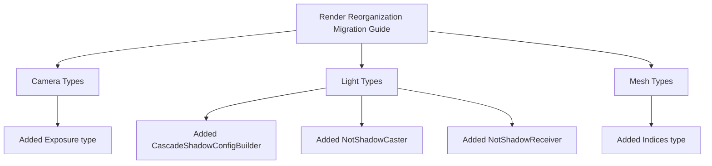

+++
title = "#21098 improve render reorg guide"
date = "2025-09-17T00:00:00"
draft = false
template = "pull_request_page.html"
in_search_index = true

[taxonomies]
list_display = ["show"]

[extra]
current_language = "en"
available_languages = {"en" = { name = "English", url = "/pull_request/bevy/2025-09/pr-21098-en-20250917" }, "zh-cn" = { name = "中文", url = "/pull_request/bevy/2025-09/pr-21098-zh-cn-20250917" }}
labels = ["A-Rendering"]
+++

# improve render reorg guide

## Basic Information
- **Title**: improve render reorg guide
- **PR Link**: https://github.com/bevyengine/bevy/pull/21098
- **Author**: atlv24
- **Status**: MERGED
- **Labels**: A-Rendering, S-Ready-For-Final-Review
- **Created**: 2025-09-16T23:00:10Z
- **Merged**: 2025-09-16T23:43:19Z
- **Merged By**: alice-i-cecile

## Description Translation
# Objective

- Fix #21025

## Solution

- Add missing types

## Testing

- 

## The Story of This Pull Request

This PR addresses a documentation gap in Bevy's migration guide for the render reorganization. The core issue was that several important types were missing from the migration documentation, which could cause confusion for developers trying to update their codebase to the new structure.

The problem emerged from Bevy's ongoing architectural improvements where various rendering components were being moved to specialized crates. While the structural changes were implemented correctly, the documentation didn't fully capture all the types that had been relocated. This created a situation where developers might encounter compilation errors without clear guidance on where to find the moved types.

The solution was straightforward but important: identify the missing types and add them to the appropriate sections of the migration guide. The author added `Exposure` to the camera types section, `CascadeShadowConfigBuilder`, `NotShadowCaster`, and `NotShadowReceiver` to the light types section, and `Indices` to the mesh types section.

These additions ensure that developers migrating their projects will have complete information about where to find all relevant types after the reorganization. The changes are minimal but significantly improve the usability of the migration guide by preventing potential confusion and reducing the time developers might spend searching for these types.

From a technical perspective, this PR demonstrates the importance of maintaining accurate and complete documentation during large-scale refactors. Even small omissions in migration guides can create significant friction for users adopting new versions of a framework.

## Visual Representation



## Key Files Changed

- `release-content/migration-guides/bevy_render_reorganization.md` (+3/-3)

This file contains the migration guide for Bevy's render reorganization. The changes add missing types to three different sections:

1. Added `Exposure` to the camera types list:
```markdown
# Before:
Camera types such as `Camera`, `Camera3d`, `Camera2d`, `ClearColor`, `ClearColorConfig`, `Projection`, `PerspectiveProjection`, and `OrthographicProjection` have been moved to a new crate, `bevy_camera`.

# After:
Camera types such as `Camera`, `Camera3d`, `Camera2d`, `ClearColor`, `ClearColorConfig`, `Exposure`, `Projection`, `PerspectiveProjection`, and `OrthographicProjection` have been moved to a new crate, `bevy_camera`.
```

2. Added three missing light-related types:
```markdown
# Before:
Light types such `AmbientLight`, `PointLight`, `SpotLight`, `DirectionalLight`, `EnvironmentMapLight`, `GeneratedEnvironmentMapLight`, `LightProbe`, `IrradianceVolume`, `VolumetricFog`, `FogVolume`, and `light_consts` have been moved to a new crate, `bevy_light`.

# After:
Light types such `AmbientLight`, `PointLight`, `SpotLight`, `DirectionalLight`, `EnvironmentMapLight`, `GeneratedEnvironmentMapLight`, `LightProbe`, `IrradianceVolume`, `VolumetricFog`, `FogVolume`, `CascadeShadowConfigBuilder`, `NotShadowCaster`, `NotShadowReceiver` and `light_consts` have been moved to a new crate, `bevy_light`.
```

3. Added `Indices` to the mesh types:
```markdown
# Before:
Mesh types such as `Mesh`, `Mesh3d`, `Mesh2d`, `MorphWeights`, `MeshBuilder`, and `Meshable` have been moved to a new crate, `bevy_mesh`.

# After:
Mesh types such as `Mesh`, `Mesh3d`, `Mesh2d`, `MorphWeights`, `MeshBuilder`, `Indices`, and `Meshable` have been moved to a new crate, `bevy_mesh`.
```

## Further Reading

- [Bevy Migration Guide Documentation](https://bevyengine.org/learn/migration-guides/)
- [Bevy Render Organization RFC](https://github.com/bevyengine/rfcs/blob/main/rfcs/45-render-reorganization.md)
- [GitHub Issue #21025](https://github.com/bevyengine/bevy/issues/21025) - The original issue that reported the missing types

# Full Code Diff
```diff
diff --git a/release-content/migration-guides/bevy_render_reorganization.md b/release-content/migration-guides/bevy_render_reorganization.md
index 1cfa7604d4caf..8e0fc89b6d41b 100644
--- a/release-content/migration-guides/bevy_render_reorganization.md
+++ b/release-content/migration-guides/bevy_render_reorganization.md
@@ -6,7 +6,7 @@ pull_requests: [20485, 20330, 18703, 20587, 20502, 19997, 19991, 20000, 19949, 1
 You must now import `bevy_render::NormalizedRenderTargetExt` to use methods on `NormalizedRenderTarget`
 `ManualTextureViews` is now in `bevy_render::texture`
 
-Camera types such as `Camera`, `Camera3d`, `Camera2d`, `ClearColor`, `ClearColorConfig`, `Projection`, `PerspectiveProjection`, and `OrthographicProjection` have been moved to a new crate, `bevy_camera`.
+Camera types such as `Camera`, `Camera3d`, `Camera2d`, `ClearColor`, `ClearColorConfig`, `Exposure`, `Projection`, `PerspectiveProjection`, and `OrthographicProjection` have been moved to a new crate, `bevy_camera`.
 Visibility types such as `Visibility`, `InheritedVisibility`, `ViewVisibility`, `VisibleEntities`, and `RenderLayers` have been moved to `bevy_camera::visibility`.
 Culling primitives such as `Frustum`, `HalfSpace`, `Aabb`, and `Sphere` have been moved to `bevy_camera::primitives`.
 Import them directly or from `bevy::camera` now.
@@ -14,10 +14,10 @@ Import them directly or from `bevy::camera` now.
 Shader types such as `Shader`, `ShaderRef`, `ShaderDef`, `ShaderCache`, and `PipelineCompilationError` have been moved to a new crate, `bevy_shader`.
 Import them directly or from `bevy::shader` now.
 
-Light types such `AmbientLight`, `PointLight`, `SpotLight`, `DirectionalLight`, `EnvironmentMapLight`, `GeneratedEnvironmentMapLight`, `LightProbe`, `IrradianceVolume`, `VolumetricFog`, `FogVolume`, and `light_consts` have been moved to a new crate, `bevy_light`.
+Light types such `AmbientLight`, `PointLight`, `SpotLight`, `DirectionalLight`, `EnvironmentMapLight`, `GeneratedEnvironmentMapLight`, `LightProbe`, `IrradianceVolume`, `VolumetricFog`, `FogVolume`, `CascadeShadowConfigBuilder`, `NotShadowCaster`, `NotShadowReceiver` and `light_consts` have been moved to a new crate, `bevy_light`.
 Import them directly or from `bevy::light` now.
 
-Mesh types such as `Mesh`, `Mesh3d`, `Mesh2d`, `MorphWeights`, `MeshBuilder`, and `Meshable` have been moved to a new crate, `bevy_mesh`.
+Mesh types such as `Mesh`, `Mesh3d`, `Mesh2d`, `MorphWeights`, `MeshBuilder`, `Indices`, and `Meshable` have been moved to a new crate, `bevy_mesh`.
 Import them directly or from `bevy::mesh` now. This crate is actually present in the previous release, but its `bevy_render` re-exports have now been removed.
 
 Image types such as `Image`, `ImagePlugin`, `ImageFormat`, `ImageSampler`, `ImageAddressMode`, `ImageSamplerDescriptor`, `ImageCompareFunction`, and `ImageSamplerBorderColor` have been moved to a new crate, `bevy_image`. This crate is actually present in the previous release, but its `bevy_render` re-exports have now been removed.
```